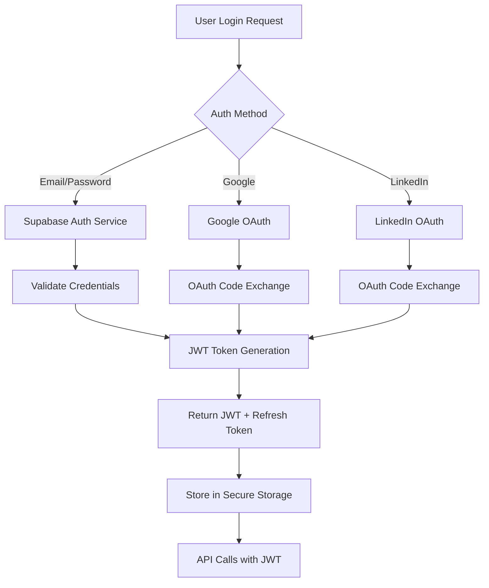

# API Security Documentation - CV-Match Platform

**Version:** 1.0
**Last Updated:** October 13, 2025
**Classification:** Internal - Restricted

---

## 🔐 Authentication Requirements

### Supabase Auth Integration

The CV-Match platform uses Supabase Authentication as the primary identity provider with support for multiple authentication methods.

#### Supported Authentication Methods

1. **Email/Password**
   - Minimum password length: 8 characters
   - Complexity requirements: At least 1 uppercase, 1 lowercase, 1 number
   - Rate limiting: 5 attempts per 15 minutes
   - Password reset via email link (valid for 24 hours)

2. **Google OAuth 2.0**
   - Redirect URI: `https://cv-match.com.br/auth/callback/google`
   - Scopes requested: `email`, `profile`
   - Token expiration: 1 hour (refresh token: 30 days)

3. **LinkedIn OAuth 2.0**
   - Redirect URI: `https://cv-match.com.br/auth/callback/linkedin`
   - Scopes requested: `r_liteprofile`, `r_emailaddress`
   - Token expiration: 1 hour (refresh token: 60 days)

#### Authentication Flow



#### JWT Token Structure

```json
{
  "aud": "authenticated",
  "exp": 1665676800,
  "sub": "12345678-1234-1234-1234-123456789012",
  "email": "user@example.com",
  "role": "authenticated",
  "app_metadata": {
    "provider": "email",
    "user_type": "candidate"
  },
  "user_metadata": {
    "full_name": "John Doe",
    "company_id": "comp_123"
  },
  "iat": 1665673200,
  "iss": "https://cv-match.supabase.co/auth/v1"
}
```

### Session Management

#### Token Validation

```python
# JWT Token Validation Middleware
from fastapi import HTTPException, status, Depends
from fastapi.security import HTTPBearer, HTTPAuthorizationCredentials
import jwt
import requests

security = HTTPBearer()

async def verify_jwt_token(credentials: HTTPAuthorizationCredentials = Depends(security)):
    """
    Verify JWT token from Supabase Auth
    """
    try:
        token = credentials.credentials

        # Verify with Supabase
        response = requests.get(
            f"{SUPABASE_URL}/auth/v1/user",
            headers={
                "Authorization": f"Bearer {token}",
                "apikey": SUPABASE_ANON_KEY
            }
        )

        if response.status_code != 200:
            raise HTTPException(
                status_code=status.HTTP_401_UNAUTHORIZED,
                detail="Invalid authentication credentials"
            )

        user_data = response.json()
        return user_data

    except Exception as e:
        raise HTTPException(
            status_code=status.HTTP_401_UNAUTHORIZED,
            detail="Token validation failed"
        )

# Usage in endpoints
@router.post("/resumes")
async def create_resume(
    request: ResumeRequest,
    current_user: dict = Depends(verify_jwt_token)
):
    # Endpoint logic with authenticated user
    pass
```

#### Token Refresh

```python
# Token Refresh Service
class TokenRefreshService:
    def __init__(self):
        self.supabase_client = create_supabase_client()

    async def refresh_token(self, refresh_token: str) -> dict:
        """
        Refresh JWT token using refresh token
        """
        try:
            # Call Supabase auth refresh endpoint
            response = requests.post(
                f"{SUPABASE_URL}/auth/v1/token?grant_type=refresh_token",
                json={"refresh_token": refresh_token},
                headers={
                    "apikey": SUPABASE_ANON_KEY,
                    "Content-Type": "application/json"
                }
            )

            if response.status_code != 200:
                raise ValueError("Invalid refresh token")

            token_data = response.json()

            return {
                "access_token": token_data["access_token"],
                "refresh_token": token_data["refresh_token"],
                "expires_in": token_data["expires_in"],
                "token_type": token_data["token_type"]
            }

        except Exception as e:
            raise ValueError(f"Token refresh failed: {str(e)}")
```

#### Session Expiration

- **Access Token:** 1 hour
- **Refresh Token:** 30 days (Google), 60 days (LinkedIn), 60 days (Email)
- **Idle Timeout:** 24 hours of inactivity
- **Absolute Timeout:** 30 days maximum session duration

---

## 🔑 Authorization Model

### Role-Based Access Control (RBAC)

#### User Roles and Permissions

```yaml
# Role Hierarchy
roles:
  candidate:
    description: "Basic job seeker"
    permissions:
      - resume:read:own
      - resume:create:own
      - resume:update:own
      - resume:delete:own
      - profile:read:own
      - profile:update:own
      - jobs:read:public
      - applications:create:own
      - applications:read:own

  premium_candidate:
    inherits: candidate
    description: "Premium job seeker with advanced features"
    permissions:
      - analytics:read:own
      - resume:export:own
      - jobs:advanced_search
      - applications:bulk_action:own

  hr_manager:
    description: "HR team member"
    permissions:
      - jobs:create:company
      - jobs:read:company
      - jobs:update:company
      - jobs:delete:company
      - applications:read:company
      - applications:update:company
      - candidates:read:public
      - candidates:search:limited
      - analytics:read:company

  hr_admin:
    inherits: hr_manager
    description: "HR team administrator"
    permissions:
      - jobs:manage:all
      - candidates:read:all
      - users:manage:company
      - company:settings:manage

  system_admin:
    description: "System administrator"
    permissions:
      - system:admin:all
      - users:manage:all
      - audit:read:all
      - security:manage:all
      - configuration:manage:all
```

#### Permission Verification Middleware

```python
# Permission-based access control
from functools import wraps
from typing import List, Set

def require_permissions(required_permissions: List[str]):
    """
    Decorator to check if user has required permissions
    """
    def decorator(func):
        @wraps(func)
        async def wrapper(*args, **kwargs):
            # Get current user from dependency
            current_user = kwargs.get('current_user')
            if not current_user:
                raise HTTPException(
                    status_code=status.HTTP_401_UNAUTHORIZED,
                    detail="Authentication required"
                )

            # Get user permissions
            user_permissions = await get_user_permissions(current_user['id'])

            # Check if user has all required permissions
            missing_permissions = []
            for permission in required_permissions:
                if not has_permission(user_permissions, permission):
                    missing_permissions.append(permission)

            if missing_permissions:
                raise HTTPException(
                    status_code=status.HTTP_403_FORBIDDEN,
                    detail=f"Insufficient permissions. Missing: {', '.join(missing_permissions)}"
                )

            return await func(*args, **kwargs)
        return wrapper
    return decorator

# Usage example
@router.post("/jobs")
@require_permissions(["jobs:create:company"])
async def create_job(
    request: CreateJobRequest,
    current_user: dict = Depends(verify_jwt_token)
):
    # Create job logic
    pass
```

### Resource Ownership Verification

#### Database-Level Row Security (RLS)

```sql
-- Resume ownership policy
CREATE POLICY "Users can manage own resumes"
    ON public.resumes
    FOR ALL
    USING (auth.uid() = user_id)
    WITH CHECK (auth.uid() = user_id);

-- Job posting ownership policy
CREATE POLICY "HR managers can manage company jobs"
    ON public.jobs
    FOR ALL
    USING (
        auth.uid() = user_id OR
        auth.uid() IN (
            SELECT user_id FROM company_users
            WHERE company_id = jobs.company_id AND role IN ('hr_manager', 'hr_admin')
        )
    );

-- Application access policy
CREATE POLICY "Users can access own applications"
    ON public.job_applications
    FOR SELECT
    USING (
        auth.uid() = candidate_id OR
        auth.uid() IN (
            SELECT user_id FROM company_users
            WHERE company_id = jobs.company_id AND role IN ('hr_manager', 'hr_admin')
        )
    );
```

#### Application-Level Ownership Check

```python
# Ownership verification service
class OwnershipService:
    def __init__(self):
        self.db_service = SupabaseDatabaseService()

    async def verify_resume_ownership(self, resume_id: str, user_id: str) -> bool:
        """
        Verify if user owns the resume
        """
        try:
            result = await self.db_service.select(
                "resumes",
                filters={"id": resume_id, "user_id": user_id}
            )
            return len(result) > 0
        except Exception:
            return False

    async def verify_job_access(self, job_id: str, user_id: str) -> bool:
        """
        Verify if user has access to job posting
        """
        try:
            # Check if user owns the job
            result = await self.db_service.select(
                "jobs",
                filters={"id": job_id, "user_id": user_id}
            )

            if len(result) > 0:
                return True

            # Check if user is HR manager for the company
            job = await self.db_service.select("jobs", filters={"id": job_id})
            if not job:
                return False

            company_id = job[0]["company_id"]

            # Check company membership
            company_user = await self.db_service.select(
                "company_users",
                filters={
                    "company_id": company_id,
                    "user_id": user_id,
                    "role": ["hr_manager", "hr_admin"]
                }
            )

            return len(company_user) > 0

        except Exception:
            return False

# Usage in endpoints
@router.get("/resumes/{resume_id}")
async def get_resume(
    resume_id: str,
    current_user: dict = Depends(verify_jwt_token)
):
    ownership_service = OwnershipService()

    if not await ownership_service.verify_resume_ownership(resume_id, current_user['id']):
        raise HTTPException(
            status_code=status.HTTP_403_FORBIDDEN,
            detail="Access denied: You don't own this resume"
        )

    # Proceed with resume retrieval
    pass
```

---

## 🚦 Rate Limiting Policies

### Rate Limiting Configuration

#### Endpoint-Specific Limits

```yaml
# Rate limiting configuration
rate_limits:
  authentication:
    login_attempts:
      window: 15m
      max_requests: 5
      strategy: "sliding_window"
    password_reset:
      window: 1h
      max_requests: 3
      strategy: "fixed_window"

  api_endpoints:
    resume_upload:
      window: 1h
      max_requests: 10
      strategy: "sliding_window"
    job_search:
      window: 1m
      max_requests: 100
      strategy: "sliding_window"
    profile_update:
      window: 1h
      max_requests: 20
      strategy: "fixed_window"
    analytics:
      window: 1h
      max_requests: 50
      strategy: "sliding_window"

  user_tiers:
    free:
      daily_requests: 1000
      api_calls_per_hour: 100
      concurrent_requests: 5
    premium:
      daily_requests: 10000
      api_calls_per_hour: 1000
      concurrent_requests: 20
    enterprise:
      daily_requests: 100000
      api_calls_per_hour: 10000
      concurrent_requests: 100
```

#### Implementation

```python
# Rate limiting middleware
from fastapi import Request, HTTPException, status
from redis import Redis
import time
from typing import Optional

class RateLimiter:
    def __init__(self, redis_client: Redis):
        self.redis = redis_client

    async def is_allowed(
        self,
        key: str,
        limit: int,
        window: int,
        strategy: str = "sliding_window"
    ) -> tuple[bool, dict]:
        """
        Check if request is allowed based on rate limit
        Returns (allowed, rate_limit_info)
        """
        current_time = int(time.time())

        if strategy == "sliding_window":
            return await self._sliding_window(key, limit, window, current_time)
        elif strategy == "fixed_window":
            return await self._fixed_window(key, limit, window, current_time)
        else:
            raise ValueError(f"Unknown rate limiting strategy: {strategy}")

    async def _sliding_window(self, key: str, limit: int, window: int, current_time: int) -> tuple[bool, dict]:
        """Sliding window rate limiting"""
        # Remove old entries
        await self.redis.zremrangebyscore(key, 0, current_time - window)

        # Count current requests
        current_requests = await self.redis.zcard(key)

        if current_requests >= limit:
            # Find oldest request to calculate retry_after
            oldest_request = await self.redis.zrange(key, 0, 0, withscores=True)
            retry_after = oldest_request[0][1] + window - current_time if oldest_request else window

            return False, {
                "limit": limit,
                "remaining": 0,
                "reset": current_time + retry_after,
                "retry_after": retry_after
            }

        # Add current request
        await self.redis.zadd(key, {str(current_time): current_time})
        await self.redis.expire(key, window)

        return True, {
            "limit": limit,
            "remaining": limit - current_requests - 1,
            "reset": current_time + window,
            "retry_after": 0
        }

# Rate limiting middleware
async def rate_limit_middleware(
    request: Request,
    call_next,
    redis_client: Redis
):
    # Get user ID from JWT if available
    user_id = None
    auth_header = request.headers.get("authorization")
    if auth_header:
        try:
            # Extract user ID from token
            user_id = await extract_user_id_from_token(auth_header)
        except:
            pass

    # Determine rate limit key and limits
    endpoint = request.url.path
    method = request.method
    rate_key = f"rate_limit:{endpoint}:{method}"

    if user_id:
        rate_key += f":user:{user_id}"
    else:
        rate_key += f":ip:{request.client.host}"

    # Get rate limit configuration for endpoint
    limit_config = get_rate_limit_config(endpoint, user_id)

    if limit_config:
        limiter = RateLimiter(redis_client)
        allowed, info = await limiter.is_allowed(
            rate_key,
            limit_config["max_requests"],
            limit_config["window_seconds"],
            limit_config["strategy"]
        )

        # Add rate limit headers
        response = await call_next(request)
        response.headers["X-RateLimit-Limit"] = str(info["limit"])
        response.headers["X-RateLimit-Remaining"] = str(info["remaining"])
        response.headers["X-RateLimit-Reset"] = str(info["reset"])

        if not allowed:
            raise HTTPException(
                status_code=status.HTTP_429_TOO_MANY_REQUESTS,
                detail="Rate limit exceeded",
                headers={
                    "X-RateLimit-Limit": str(info["limit"]),
                    "X-RateLimit-Remaining": str(info["remaining"]),
                    "X-RateLimit-Reset": str(info["reset"]),
                    "Retry-After": str(info["retry_after"])
                }
            )

        return response

    return await call_next(request)
```

### DDoS Protection

#### Infrastructure-Level Protection

```yaml
# DDoS protection configuration
ddos_protection:
  cloudflare:
    ddos_protection: true
    bot_fight_mode: true
    security_level: "high"

  nginx_rate_limiting:
    # IP-based limiting
    limit_req_zone:
      - $binary_remote_addr zone=ip_limit:10m rate=10r/s
      - $binary_remote_addr zone=auth_limit:10m rate=1r/s

    # Path-based limiting
    limit_req_zone:
      - $request_uri zone=path_limit:10m rate=100r/s

  application_level:
    # Account-based limiting
    account_limit:
      free_tier: 100r/h
      premium_tier: 1000r/h
      enterprise_tier: 10000r/h

    # API key limiting
    api_key_limit:
      basic: 1000r/h
      pro: 10000r/h
      enterprise: 100000r/h
```

#### Anomaly Detection

```python
# Anomaly detection for DDoS protection
class AnomalyDetector:
    def __init__(self, redis_client: Redis):
        self.redis = redis_client
        self.baseline_metrics = self._load_baseline_metrics()

    async def detect_anomalies(self, request: Request, user_id: Optional[str] = None) -> dict:
        """
        Detect anomalous request patterns
        """
        current_metrics = await self._collect_metrics(request, user_id)
        anomalies = []

        # Check request rate anomaly
        if await self._check_rate_anomaly(current_metrics):
            anomalies.append({
                "type": "rate_anomaly",
                "severity": "high",
                "description": "Unusually high request rate detected"
            })

        # Check geographic anomaly
        if await self._check_geographic_anomaly(request, user_id):
            anomalies.append({
                "type": "geographic_anomaly",
                "severity": "medium",
                "description": "Request from unusual geographic location"
            })

        # Check behavioral anomaly
        if await self._check_behavioral_anomaly(request, user_id):
            anomalies.append({
                "type": "behavioral_anomaly",
                "severity": "medium",
                "description": "Unusual user behavior pattern detected"
            })

        # Log anomalies
        if anomalies:
            await self._log_anomalies(request, user_id, anomalies)

        return {
            "anomalies": anomalies,
            "risk_score": self._calculate_risk_score(anomalies),
            "actions": self._determine_actions(anomalies)
        }

    async def _check_rate_anomaly(self, metrics: dict) -> bool:
        """Check for unusual request rates"""
        current_rate = metrics["requests_per_minute"]
        baseline_rate = self.baseline_metrics["avg_requests_per_minute"]

        # Flag if current rate is 3x baseline
        return current_rate > (baseline_rate * 3)

    async def _check_geographic_anomaly(self, request: Request, user_id: Optional[str]) -> bool:
        """Check for requests from unusual locations"""
        if not user_id:
            return False

        # Get user's typical locations
        user_locations = await self._get_user_locations(user_id)
        current_location = await self._get_location_from_ip(request.client.host)

        # Flag if request from new country
        return current_location not in user_locations

    async def _determine_actions(self, anomalies: list) -> list:
        """Determine appropriate actions based on anomalies"""
        actions = []

        for anomaly in anomalies:
            if anomaly["severity"] == "high":
                actions.append("temporary_block")
                actions.append("notify_security_team")
            elif anomaly["severity"] == "medium":
                actions.append("additional_verification")
                actions.append("monitor_closely")

        return list(set(actions))  # Remove duplicates
```

---

## 🛡️ Security Headers

### CORS Configuration

#### Secure CORS Policy

```yaml
# CORS configuration
cors:
  allowed_origins:
    production:
      - "https://cv-match.com.br"
      - "https://app.cv-match.com.br"
      - "https://admin.cv-match.com.br"
    staging:
      - "https://staging.cv-match.com.br"
    development:
      - "http://localhost:3000"
      - "http://localhost:8000"

  allowed_methods:
    - "GET"
    - "POST"
    - "PUT"
    - "PATCH"
    - "DELETE"
    - "OPTIONS"

  allowed_headers:
    - "Content-Type"
    - "Authorization"
    - "X-Requested-With"
    - "X-Client-Version"

  exposed_headers:
    - "X-RateLimit-Limit"
    - "X-RateLimit-Remaining"
    - "X-RateLimit-Reset"

  max_age: 86400 # 24 hours
  credentials: true
```

#### Implementation

```python
# FastAPI CORS middleware configuration
from fastapi.middleware.cors import CORSMiddleware
from fastapi import FastAPI
import os

app = FastAPI()

# Environment-based CORS configuration
environment = os.getenv("ENVIRONMENT", "development")

if environment == "production":
    allowed_origins = [
        "https://cv-match.com.br",
        "https://app.cv-match.com.br",
        "https://admin.cv-match.com.br"
    ]
elif environment == "staging":
    allowed_origins = ["https://staging.cv-match.com.br"]
else:
    allowed_origins = [
        "http://localhost:3000",
        "http://localhost:8000",
        "http://127.0.0.1:3000",
        "http://127.0.0.1:8000"
    ]

app.add_middleware(
    CORSMiddleware,
    allow_origins=allowed_origins,
    allow_credentials=True,
    allow_methods=["GET", "POST", "PUT", "PATCH", "DELETE", "OPTIONS"],
    allow_headers=[
        "Content-Type",
        "Authorization",
        "X-Requested-With",
        "X-Client-Version"
    ],
    expose_headers=[
        "X-RateLimit-Limit",
        "X-RateLimit-Remaining",
        "X-RateLimit-Reset"
    ],
    max_age=86400
)
```

### Security Headers Implementation

#### Nginx Security Headers

```nginx
# Security headers configuration
# File: /etc/nginx/conf.d/security.conf

server {
    # HSTS (HTTP Strict Transport Security)
    add_header Strict-Transport-Security "max-age=63072000; includeSubDomains; preload" always;

    # Content Security Policy (CSP)
    add_header Content-Security-Policy "
        default-src 'self';
        script-src 'self' 'unsafe-inline' https://cdn.jsdelivr.net https://js.stripe.com;
        style-src 'self' 'unsafe-inline' https://fonts.googleapis.com https://cdn.jsdelivr.net;
        font-src 'self' https://fonts.gstatic.com;
        img-src 'self' data: https: blob:;
        connect-src 'self' https://api.stripe.com https://cv-match.supabase.co;
        frame-src 'none';
        object-src 'none';
        base-uri 'self';
        form-action 'self';
        frame-ancestors 'none';
    " always;

    # Other security headers
    add_header X-Content-Type-Options nosniff always;
    add_header X-Frame-Options DENY always;
    add_header X-XSS-Protection "1; mode=block" always;
    add_header Referrer-Policy "strict-origin-when-cross-origin" always;
    add_header Permissions-Policy "geolocation=(), microphone=(), camera=()" always;

    # Remove server information
    server_tokens off;

    # Hide nginx version
    more_clear_headers Server;
    more_clear_headers X-Powered-By;

    # Secure cookies
    proxy_cookie_path / "/; Secure; HttpOnly; SameSite=Strict";

    # File upload security
    client_max_body_size 10M;
    client_body_timeout 60s;
    client_header_timeout 60s;
}
```

#### Application Security Headers

```python
# Application-level security headers middleware
from fastapi import Request, Response
from fastapi.middleware.base import BaseHTTPMiddleware

class SecurityHeadersMiddleware(BaseHTTPMiddleware):
    async def dispatch(self, request: Request, call_next):
        response = await call_next(request)

        # Security headers
        response.headers["X-Content-Type-Options"] = "nosniff"
        response.headers["X-Frame-Options"] = "DENY"
        response.headers["X-XSS-Protection"] = "1; mode=block"
        response.headers["Referrer-Policy"] = "strict-origin-when-cross-origin"
        response.headers["Permissions-Policy"] = "geolocation=(), microphone=(), camera=()"

        # Cache control for sensitive endpoints
        if request.url.path.startswith("/api/") or request.url.path.startswith("/auth/"):
            response.headers["Cache-Control"] = "no-store, no-cache, must-revalidate"
            response.headers["Pragma"] = "no-cache"
            response.headers["Expires"] = "0"

        # API-specific headers
        if request.url.path.startswith("/api/"):
            response.headers["X-API-Version"] = "1.0"
            response.headers["X-Content-Type-Options"] = "nosniff"

            # Rate limit headers (if available)
            if hasattr(request.state, 'rate_limit_info'):
                rate_info = request.state.rate_limit_info
                response.headers["X-RateLimit-Limit"] = str(rate_info["limit"])
                response.headers["X-RateLimit-Remaining"] = str(rate_info["remaining"])
                response.headers["X-RateLimit-Reset"] = str(rate_info["reset"])

        return response

# Add middleware to FastAPI app
app.add_middleware(SecurityHeadersMiddleware)
```

---

## 🔒 HTTPS Enforcement

### SSL/TLS Configuration

#### Certificate Management

```yaml
# SSL/TLS Configuration
ssl:
  certificate:
    provider: "letsencrypt"
    auto_renew: true
    renewal_threshold: 30 # days

  protocols:
    enabled:
      - "TLSv1.3"
      - "TLSv1.2"
    disabled:
      - "TLSv1.1"
      - "TLSv1.0"
      - "SSLv3"
      - "SSLv2"

  ciphers:
    preferred:
      - "ECDHE-RSA-AES256-GCM-SHA384"
      - "ECDHE-RSA-AES128-GCM-SHA256"
      - "ECDHE-RSA-AES256-SHA384"
      - "ECDHE-RSA-AES128-SHA256"
      - "ECDHE-RSA-CHACHA20-POLY1305"

    disabled:
      - "RC4"
      - "DES"
      - "3DES"
      - "MD5"
      - "SHA1"
      - "NULL"

  certificate_pinning:
    enabled: true
    backup_pins:
      - "pin-sha256=backup_certificate_hash"
      - "pin-sha256=backup_certificate_hash_2"
```

#### HTTPS Redirect Middleware

```python
# HTTPS enforcement middleware
class HTTPSRedirectMiddleware(BaseHTTPMiddleware):
    def __init__(self, app, https_only: bool = True):
        super().__init__(app)
        self.https_only = https_only

    async def dispatch(self, request: Request, call_next):
        # In production, enforce HTTPS
        if self.https_only and request.headers.get("x-forwarded-proto") != "https":
            url = request.url.replace(scheme="https")
            return RedirectResponse(url=str(url), status_code=301)

        response = await call_next(request)

        # Add HSTS header
        if request.headers.get("x-forwarded-proto") == "https":
            response.headers["Strict-Transport-Security"] = "max-age=63072000; includeSubDomains; preload"

        return response

# Environment-based HTTPS enforcement
if os.getenv("ENVIRONMENT") == "production":
    app.add_middleware(HTTPSRedirectMiddleware, https_only=True)
```

### Secure Cookie Configuration

```python
# Secure cookie settings
class SecurityConfig:
    # Cookie settings
    COOKIE_SECURE = True
    COOKIE_HTTPONLY = True
    COOKIE_SAMESITE = "strict"
    COOKIE_MAX_AGE = 3600  # 1 hour

    # Session settings
    SESSION_COOKIE_NAME = "cv_match_session"
    JWT_COOKIE_NAME = "cv_match_jwt"

    @staticmethod
    def set_secure_cookies(response: Response, token: str):
        """Set secure HTTP-only cookies"""
        response.set_cookie(
            key=SecurityConfig.JWT_COOKIE_NAME,
            value=token,
            max_age=SecurityConfig.COOKIE_MAX_AGE,
            secure=SecurityConfig.COOKIE_SECURE,
            httponly=SecurityConfig.COOKIE_HTTPONLY,
            samesite=SecurityConfig.COOKIE_SAMESITE,
            path="/"
        )

    @staticmethod
    def clear_secure_cookies(response: Response):
        """Clear secure cookies"""
        response.delete_cookie(
            key=SecurityConfig.JWT_COOKIE_NAME,
            path="/",
            secure=SecurityConfig.COOKIE_SECURE,
            httponly=SecurityConfig.COOKIE_HTTPONLY,
            samesite=SecurityConfig.COOKIE_SAMESITE
        )
```

---

## 📊 API Security Monitoring

### Security Event Logging

#### Structured Logging Configuration

```python
# Security logging service
import structlog
import json
from datetime import datetime

class SecurityLogger:
    def __init__(self):
        self.logger = structlog.get_logger("security")

    async def log_authentication_event(
        self,
        event_type: str,
        user_id: Optional[str],
        ip_address: str,
        user_agent: str,
        success: bool,
        details: Optional[dict] = None
    ):
        """Log authentication events"""
        event = {
            "event_type": "authentication",
            "action": event_type,
            "user_id": user_id,
            "ip_address": ip_address,
            "user_agent": user_agent,
            "success": success,
            "timestamp": datetime.utcnow().isoformat(),
            "details": details or {}
        }

        if success:
            self.logger.info("Authentication successful", **event)
        else:
            self.logger.warning("Authentication failed", **event)

    async def log_authorization_event(
        self,
        user_id: str,
        resource: str,
        action: str,
        granted: bool,
        reason: Optional[str] = None
    ):
        """Log authorization events"""
        event = {
            "event_type": "authorization",
            "user_id": user_id,
            "resource": resource,
            "action": action,
            "granted": granted,
            "reason": reason,
            "timestamp": datetime.utcnow().isoformat()
        }

        if granted:
            self.logger.info("Access granted", **event)
        else:
            self.logger.warning("Access denied", **event)

    async def log_security_incident(
        self,
        incident_type: str,
        severity: str,
        user_id: Optional[str],
        ip_address: str,
        details: dict
    ):
        """Log security incidents"""
        event = {
            "event_type": "security_incident",
            "incident_type": incident_type,
            "severity": severity,
            "user_id": user_id,
            "ip_address": ip_address,
            "details": details,
            "timestamp": datetime.utcnow().isoformat()
        }

        if severity in ["critical", "high"]:
            self.logger.error("Security incident", **event)
        else:
            self.logger.warning("Security incident", **event)
```

#### Real-time Monitoring

```python
# Real-time security monitoring
class SecurityMonitor:
    def __init__(self, redis_client: Redis):
        self.redis = redis_client
        self.alert_thresholds = {
            "failed_login_rate": 10,  # per minute
            "suspicious_ip_requests": 100,  # per minute
            "data_export_requests": 20,  # per hour
            "admin_actions": 50,  # per hour
        }

    async def monitor_request(self, request: Request, response: Response, user_id: Optional[str] = None):
        """Monitor API requests for security issues"""
        await self._check_failed_login_rate(request)
        await self._check_suspicious_patterns(request, user_id)
        await self._check_data_access_patterns(request, user_id)
        await self._check_admin_actions(request, user_id)

    async def _check_failed_login_rate(self, request: Request):
        """Check for high failed login rates"""
        if "/auth/login" in request.url.path and response.status_code == 401:
            ip_address = request.client.host
            key = f"failed_logins:{ip_address}"

            # Increment failed login counter
            count = await self.redis.incr(key)
            await self.redis.expire(key, 60)  # 1 minute window

            if count >= self.alert_thresholds["failed_login_rate"]:
                await self._trigger_security_alert(
                    "high_failed_login_rate",
                    "High failed login rate detected",
                    {"ip_address": ip_address, "count": count}
                )

    async def _trigger_security_alert(self, alert_type: str, message: str, details: dict):
        """Trigger security alert"""
        alert = {
            "type": alert_type,
            "message": message,
            "details": details,
            "timestamp": datetime.utcnow().isoformat(),
            "severity": self._get_alert_severity(alert_type)
        }

        # Store alert
        await self.redis.lpush("security_alerts", json.dumps(alert))
        await self.redis.ltrim("security_alerts", 0, 999)  # Keep last 1000 alerts

        # Send notification based on severity
        if alert["severity"] in ["critical", "high"]:
            await self._send_security_notification(alert)
```

### API Security Metrics

#### Key Security Metrics

```python
# Security metrics collection
class SecurityMetrics:
    def __init__(self, redis_client: Redis):
        self.redis = redis_client
        self.metrics_prefix = "security_metrics"

    async def record_authentication_attempt(self, success: bool, method: str):
        """Record authentication attempts"""
        key = f"{self.metrics_prefix}:auth:{method}"

        if success:
            await self.redis.hincrby(key, "successful", 1)
        else:
            await self.redis.hincrby(key, "failed", 1)

        await self.redis.hincrby(key, "total", 1)
        await self.redis.expire(key, 86400)  # 24 hours

    async def record_api_call(self, endpoint: str, user_id: Optional[str], status_code: int):
        """Record API calls for monitoring"""
        key = f"{self.metrics_prefix}:api:{endpoint}"

        await self.redis.hincrby(key, "total_calls", 1)

        if status_code >= 400:
            await self.redis.hincrby(key, "error_calls", 1)

        if user_id:
            user_key = f"{self.metrics_prefix}:user:{user_id}"
            await self.redis.hincrby(user_key, "api_calls", 1)
            await self.redis.expire(user_key, 86400)

        await self.redis.expire(key, 86400)

    async def get_security_dashboard(self) -> dict:
        """Get security metrics for dashboard"""
        # Authentication metrics
        auth_metrics = await self._get_auth_metrics()

        # API metrics
        api_metrics = await self._get_api_metrics()

        # Security alerts
        recent_alerts = await self._get_recent_alerts()

        # Top security events
        top_events = await self._get_top_security_events()

        return {
            "authentication": auth_metrics,
            "api_metrics": api_metrics,
            "security_alerts": recent_alerts,
            "top_events": top_events,
            "last_updated": datetime.utcnow().isoformat()
        }
```

---

## 📋 API Security Best Practices

### Input Validation

#### Request Validation

```python
# Comprehensive input validation
from pydantic import BaseModel, validator, EmailStr
import re
from typing import Optional

class ResumeUploadRequest(BaseModel):
    filename: str
    file_type: str
    file_size: int

    @validator('filename')
    def validate_filename(cls, v):
        # Sanitize filename
        if not v or len(v) > 255:
            raise ValueError("Filename is required and must be less than 255 characters")

        # Check for path traversal
        if '..' in v or '/' in v or '\\' in v:
            raise ValueError("Invalid filename")

        # Check for allowed extensions
        allowed_extensions = ['.pdf', '.doc', '.docx', '.txt']
        if not any(v.lower().endswith(ext) for ext in allowed_extensions):
            raise ValueError(f"File type not allowed. Allowed types: {', '.join(allowed_extensions)}")

        return v

    @validator('file_type')
    def validate_file_type(cls, v):
        allowed_types = ['application/pdf', 'application/msword',
                        'application/vnd.openxmlformats-officedocument.wordprocessingml.document',
                        'text/plain']
        if v not in allowed_types:
            raise ValueError("Invalid file type")
        return v

    @validator('file_size')
    def validate_file_size(cls, v):
        max_size = 10 * 1024 * 1024  # 10MB
        if v > max_size:
            raise ValueError(f"File size too large. Maximum size: {max_size // (1024*1024)}MB")
        if v <= 0:
            raise ValueError("File size must be greater than 0")
        return v

class UserRegistrationRequest(BaseModel):
    email: EmailStr
    password: str
    full_name: str
    phone: Optional[str] = None

    @validator('password')
    def validate_password(cls, v):
        if len(v) < 8:
            raise ValueError("Password must be at least 8 characters long")

        if not re.search(r'[A-Z]', v):
            raise ValueError("Password must contain at least one uppercase letter")

        if not re.search(r'[a-z]', v):
            raise ValueError("Password must contain at least one lowercase letter")

        if not re.search(r'\d', v):
            raise ValueError("Password must contain at least one digit")

        # Check for common passwords
        common_passwords = ['password', '12345678', 'qwerty', 'admin']
        if v.lower() in common_passwords:
            raise ValueError("Password is too common")

        return v

    @validator('full_name')
    def validate_full_name(cls, v):
        if not v or len(v.strip()) < 2:
            raise ValueError("Full name is required and must be at least 2 characters")

        if len(v) > 100:
            raise ValueError("Full name must be less than 100 characters")

        # Check for suspicious characters
        if re.search(r'[<>\"\'&]', v):
            raise ValueError("Full name contains invalid characters")

        return v.strip()

    @validator('phone')
    def validate_phone(cls, v):
        if v is None:
            return v

        # Remove non-digit characters
        phone_digits = re.sub(r'\D', '', v)

        # Check Brazilian phone number format
        if len(phone_digits) not in [10, 11]:
            raise ValueError("Invalid Brazilian phone number format")

        return phone_digits
```

### SQL Injection Prevention

#### Parameterized Queries

```python
# Safe database queries with parameterization
class ResumeService:
    def __init__(self):
        self.db_service = SupabaseDatabaseService()

    async def search_resumes(self, user_id: str, query: str, limit: int = 10) -> List[dict]:
        """Safely search resumes with parameterized queries"""
        try:
            # Sanitize search query
            sanitized_query = self._sanitize_search_query(query)

            # Use parameterized query
            filters = {
                "user_id": user_id,
                "search": sanitized_query,
                "limit": min(limit, 100)  # Cap at 100 results
            }

            results = await self.db_service.rpc("search_resumes", filters)
            return results

        except Exception as e:
            logger.error(f"Resume search failed: {e}")
            raise HTTPException(
                status_code=500,
                detail="Search failed due to internal error"
            )

    def _sanitize_search_query(self, query: str) -> str:
        """Sanitize search query to prevent injection"""
        if not query:
            return ""

        # Remove dangerous characters
        sanitized = re.sub(r'[;\"\'\\\\]', '', query)

        # Limit length
        if len(sanitized) > 100:
            sanitized = sanitized[:100]

        return sanitized.strip()
```

### XSS Prevention

#### Output Encoding

```python
# XSS prevention with proper output encoding
import html
import bleach
from typing import Any

class XSSProtection:
    @staticmethod
    def sanitize_html(content: str) -> str:
        """Sanitize HTML content to prevent XSS"""
        if not content:
            return ""

        # Allow safe HTML tags
        allowed_tags = ['p', 'br', 'strong', 'em', 'ul', 'ol', 'li']
        allowed_attributes = {'*': ['class']}

        # Clean HTML with bleach
        cleaned = bleach.clean(
            content,
            tags=allowed_tags,
            attributes=allowed_attributes,
            strip=True
        )

        return cleaned

    @staticmethod
    def escape_for_html(value: Any) -> str:
        """Escape values for safe HTML output"""
        if value is None:
            return ""

        # Convert to string and escape HTML
        return html.escape(str(value))

    @staticmethod
    def escape_for_json(value: Any) -> str:
        """Escape values for safe JSON output"""
        if value is None:
            return ""

        # Convert to JSON string
        json_str = json.dumps(value)

        # Escape for HTML if needed
        return html.escape(json_str)

# Usage in API responses
class ResumeResponse(BaseModel):
    id: str
    title: str
    content: str
    created_at: datetime

    @validator('content', pre=True)
    def sanitize_content(cls, v):
        return XSSProtection.sanitize_html(v)

    class Config:
        json_encoders = {
            datetime: lambda v: v.isoformat()
        }
```

---

## 🔍 API Security Testing

### Security Test Suite

#### Authentication Tests

```python
# API security tests
import pytest
from fastapi.testclient import TestClient
from app.main import app

client = TestClient(app)

class TestAuthenticationSecurity:
    def test_invalid_jwt_token(self):
        """Test API with invalid JWT token"""
        response = client.get(
            "/api/resumes",
            headers={"Authorization": "Bearer invalid_token"}
        )
        assert response.status_code == 401

    def test_missing_jwt_token(self):
        """Test API without JWT token"""
        response = client.get("/api/resumes")
        assert response.status_code == 401

    def test_expired_jwt_token(self):
        """Test API with expired JWT token"""
        expired_token = "eyJ0eXAiOiJKV1QiLCJhbGciOiJIUzI1NiJ9.expired.token"
        response = client.get(
            "/api/resumes",
            headers={"Authorization": f"Bearer {expired_token}"}
        )
        assert response.status_code == 401

    def test_brute_force_protection(self):
        """Test brute force protection on login"""
        for i in range(10):  # More than the rate limit
            response = client.post(
                "/auth/login",
                json={"email": "test@example.com", "password": "wrongpassword"}
            )

        # Should be rate limited
        assert response.status_code == 429
        assert "X-RateLimit-Remaining" in response.headers

class TestAuthorizationSecurity:
    def test_unauthorized_resource_access(self):
        """Test accessing unauthorized resources"""
        # Login as user1
        login_response = client.post(
            "/auth/login",
            json={"email": "user1@example.com", "password": "password123"}
        )
        token = login_response.json()["access_token"]

        # Try to access user2's resume
        response = client.get(
            "/api/resumes/user2_resume_id",
            headers={"Authorization": f"Bearer {token}"}
        )

        assert response.status_code == 403
        assert "Access denied" in response.json()["detail"]

class TestInputValidationSecurity:
    def test_sql_injection_attempt(self):
        """Test SQL injection attempts"""
        malicious_payloads = [
            "'; DROP TABLE resumes; --",
            "' OR '1'='1",
            "1; DELETE FROM users WHERE 't'='t",
            "' UNION SELECT * FROM users --"
        ]

        for payload in malicious_payloads:
            response = client.get(
                f"/api/search?q={payload}",
                headers={"Authorization": f"Bearer {self.get_valid_token()}"}
            )

            # Should not return server error
            assert response.status_code != 500
            # Should return safe results
            assert "DROP TABLE" not in response.text

    def test_xss_prevention(self):
        """Test XSS prevention in API responses"""
        xss_payload = "<script>alert('xss')</script>"

        response = client.post(
            "/api/resumes",
            json={"title": xss_payload, "content": "Test content"},
            headers={"Authorization": f"Bearer {self.get_valid_token()}"}
        )

        assert response.status_code == 200
        assert "<script>" not in response.json()["title"]
        assert "&lt;script&gt;" in response.json()["title"]

    def get_valid_token(self):
        """Helper method to get valid JWT token"""
        login_response = client.post(
            "/auth/login",
            json={"email": "test@example.com", "password": "password123"}
        )
        return login_response.json()["access_token"]

class TestRateLimitingSecurity:
    def test_api_rate_limiting(self):
        """Test API rate limiting"""
        token = self.get_valid_token()

        # Make rapid requests
        responses = []
        for i in range(150):  # More than rate limit
            response = client.get(
                "/api/search?q=test",
                headers={"Authorization": f"Bearer {token}"}
            )
            responses.append(response)

        # Should hit rate limit
        rate_limited_responses = [r for r in responses if r.status_code == 429]
        assert len(rate_limited_responses) > 0
        assert "X-RateLimit-Limit" in rate_limited_responses[0].headers

class TestSecureHeaders:
    def test_security_headers_present(self):
        """Test security headers are present"""
        response = client.get("/")

        # Check for security headers
        security_headers = [
            "X-Content-Type-Options",
            "X-Frame-Options",
            "X-XSS-Protection",
            "Strict-Transport-Security"
        ]

        for header in security_headers:
            assert header in response.headers

    def test_cors_configuration(self):
        """Test CORS configuration"""
        # Test preflight request
        response = client.options(
            "/api/resumes",
            headers={
                "Origin": "https://malicious-site.com",
                "Access-Control-Request-Method": "POST"
            }
        )

        # Should not allow malicious origin
        assert "Access-Control-Allow-Origin" not in response.headers

if __name__ == "__main__":
    pytest.main([__file__])
```

---

## 📞 Security Contacts

### Security Team

- **Security Lead:** security@cv-match.com.br
- **API Security Team:** api-security@cv-match.com.br
- **Incident Response:** security@cv-match.com.br

### External Security Resources

- **Bug Bounty Program:** security@cv-match.com.br
- **Security Researcher Contact:** research@cv-match.com.br
- **Vulnerability Disclosure:** https://cv-match.com.br/security

### Regulatory Contacts

- **DPO (Data Protection Officer):** dpo@cv-match.com.br
- **ANPD (Data Protection Authority):** autoridadenacional@pdpt.gov.br

---

**Document Classification:** Internal - Restricted
**Distribution:** Development Team, Security Team, System Administrators
**Review Required:** Quarterly or after security incidents
**Approved by:** Security Committee

_This API security documentation must be kept up-to-date and reviewed regularly to ensure continued effectiveness against evolving security threats._
