# 🎨 CV-Match UI/UX Strategy & User Flow Architecture

**Date:** October 12, 2025
**Version:** 1.0
**Status:** Strategy Proposal

---

## 📋 Table of Contents

1. [Current State Analysis](#current-state-analysis)
2. [Product Architecture Strategy](#product-architecture-strategy)
3. [User Personas & Journey Maps](#user-personas--journey-maps)
4. [Proposed User Flows](#proposed-user-flows)
5. [Conversion Optimization](#conversion-optimization)
6. [Authentication & Monetization Strategy](#authentication--monetization-strategy)
7. [Implementation Roadmap](#implementation-roadmap)

---

## 🔍 Current State Analysis

### What We Have:

✅ **Pricing Model**

- Free tier: 5 credits (actually 3 in code)
- Basic: R$14.90 (10 credits)
- Pro: R$29.90 (50 credits) - Most popular
- Enterprise: R$99.90 (200 credits)

✅ **Core Features**

- AI-powered resume optimization
- ATS compatibility checking
- Job description matching
- Brazilian market focus (LGPD, PIX, local content)

✅ **Key Pages**

- Landing page
- `/optimize` - The optimization workflow (multi-step)
- `/pricing` - Pricing tiers
- `/dashboard` - User dashboard (protected)
- Authentication pages

### 🚨 Problems Identified:

1. **Confused User Flow**
   - `/optimize` tries to be both a lead gen funnel AND a protected feature
   - Users upload resume → fill job details → THEN get asked to pay/signup
   - This creates friction at the conversion point

2. **Unclear Value Proposition Journey**
   - Users invest time (upload + fill form) before seeing any value
   - No preview or "taste" of what optimization looks like
   - Authentication gate appears too late in the journey

3. **Dashboard Underutilization**
   - Dashboard exists but isn't the main hub
   - Users can go directly to `/optimize` bypassing dashboard
   - No clear "logged in" vs "logged out" experience

4. **Freemium Model Confusion**
   - Free tier exists but users don't know about it until pricing page
   - No clear onboarding to free trial
   - Conversion from free → paid unclear

---

## 🎯 Product Architecture Strategy

### Recommended Architecture: **Freemium SaaS with Product-Led Growth**

```
┌─────────────────────────────────────────────────────────────────┐
│                        UNAUTHENTICATED                          │
│                                                                 │
│  Landing Page → Learn → Pricing → Sign Up (with free tier)    │
│       ↓                                                         │
│  Demo/Preview (Show, don't tell)                              │
│       ↓                                                         │
│  Social Proof + CTA                                            │
└─────────────────────────────────────────────────────────────────┘
                              ↓
                         [Sign Up]
                              ↓
┌─────────────────────────────────────────────────────────────────┐
│                         AUTHENTICATED                           │
│                                                                 │
│  Onboarding Flow → Dashboard (Main Hub) → Optimize Resume     │
│       ↓                    ↓                      ↓             │
│  Quick Start     Analytics & History        Credit Usage      │
│                                                                 │
│  Free Tier: 3-5 optimizations to prove value                  │
│  Upgrade CTAs: Strategic placement after value delivery        │
└─────────────────────────────────────────────────────────────────┘
```

---

## 👥 User Personas & Journey Maps

### Persona 1: "Job Seeker João" 🎓

**Profile:**

- 25-35 years old
- Looking for tech/corporate jobs
- Applying to 5-10 jobs per week
- Pain: Resumes not passing ATS
- Budget conscious but willing to pay for results

**Current Journey (Problematic):**

```
Google "otimizar currículo IA"
→ Lands on CV-Match
→ Goes to /optimize
→ Uploads resume
→ Fills job details
→ 😤 FRICTION: Asked to pay
→ 40% abandon here
```

**Ideal Journey:**

```
Google "otimizar currículo IA"
→ Lands on CV-Match
→ Sees before/after example + social proof
→ CTA: "Otimize Grátis" (3 credits)
→ Signs up in 30 seconds (email + Google OAuth)
→ Onboarding: Quick 3-step tutorial
→ Dashboard: "Start your first optimization"
→ Optimize flow (authenticated, no payment friction)
→ Gets result + match score
→ 💡 AHA MOMENT: "This actually works!"
→ Uses 2nd credit
→ On 3rd credit: Soft upgrade nudge
→ After using all 3: Hard paywall with discount
→ Converts to paid (Basic or Pro)
```

### Persona 2: "Recruiter Rita" 💼

**Profile:**

- 30-45 years old
- HR professional or recruiter
- Needs to optimize multiple resumes
- Company budget available
- Wants bulk features

**Journey:**

```
Corporate research
→ Lands on pricing page
→ Sees Enterprise tier
→ Contacts sales / Direct signup
→ Dashboard with team features
→ Bulk optimization workflows
```

---

## 🔄 Proposed User Flows

### Flow 1: **Unauthenticated Landing → Free Signup** (Recommended)


**Key Changes:**

1. ✅ Authentication happens BEFORE optimization
2. ✅ Free tier is the default entry point
3. ✅ Users see value (free credits) immediately
4. ✅ Dashboard becomes the central hub

---

### Flow 2: **Authenticated Optimization Workflow**


**Key Changes:**

1. ✅ Credit check happens BEFORE starting work (no wasted effort)
2. ✅ Clear upgrade path with context
3. ✅ Smooth loop back to dashboard

---

### Flow 3: **Credit Exhaustion → Conversion**

```mermaid
graph TD
    A[User on Last Free Credit] --> B[Start Optimization]
    B --> C[Interstitial Screen]
    C --> D["⚠️ This is your last free optimization"]
    D --> E[Continue Optimization]
    E --> F[Processing]
    F --> G[Results]

    G --> H[Post-Result Upgrade Prompt]
    H --> I{"🎉 Loved the results?"}
    I --> J[See Upgrade Options]
    J --> K[Pricing Comparison]
    K --> L{User Choice}

    L -->|Basic R$14.90| M[Stripe Checkout]
    L -->|Pro R$29.90| M
    L -->|Not Now| N[Dashboard - No Credits]

    M --> O[Payment Success]
    O --> P[Dashboard - Credits Added]

    N --> Q[Persistent Upgrade Banner]
```



**Psychological Triggers:**

- ✅ Warning before last credit (creates urgency)
- ✅ Show upgrade AFTER delivering value (not before)
- ✅ Social proof in upgrade modal ("Join 5,000+ users")
- ✅ Discount for immediate upgrade (20% off if upgrade now)

---

## 📈 Conversion Optimization Strategy

### Stage 1: Awareness & Acquisition

**Goal:** Get users to sign up for free

**Tactics:**

1. **Landing Page Optimization**
   - Hero: "Optimize your resume with AI - Free trial included"
   - Before/after visual example (blurred real resume)
   - Social proof: "10,000+ resumes optimized"
   - Single clear CTA: "Start Free Trial"

2. **Reduce Friction**
   - Google OAuth (1-click signup)
   - No credit card required for free tier
   - Progressive profiling (collect info gradually)

3. **SEO & Content Marketing**
   - Blog: "Como passar pelo ATS" (How to pass ATS)
   - Tools: Free resume checker (leads to signup)
   - Comparison pages: "CV-Match vs Manual Optimization"

### Stage 2: Activation (AHA Moment)

**Goal:** Get users to complete their first optimization

**Metrics to Track:**

- Time to first optimization: Target < 5 minutes
- Completion rate: Target > 60%
- Satisfaction with first result: Target > 4.5/5

**Tactics:**

1. **Onboarding Flow**

   ```
   Step 1: Welcome screen (skip option)
   Step 2: Quick tutorial (30 seconds)
   Step 3: "Start your first optimization" CTA
   ```

2. **Pre-loaded Example**
   - Option to use sample resume + job description
   - "Try it with our example first"

3. **Immediate Gratification**
   - Show progress during processing
   - Gamify with match score
   - Celebrate the result

### Stage 3: Engagement & Retention

**Goal:** Get users to use multiple credits

**Tactics:**

1. **Email Drip Campaign**
   - Day 1: Welcome + Quick Start Guide
   - Day 3: "You have 2 credits left"
   - Day 7: "Users who optimize 3x get hired 40% faster"
   - Day 14: Case study + upgrade offer

2. **In-App Engagement**
   - Dashboard widgets showing progress
   - "Resume health score" for uploaded resumes
   - Comparison with past optimizations

3. **Value Reinforcement**
   - After each optimization: Show improvement metrics
   - Weekly digest: "Your match scores this week"

### Stage 4: Monetization

**Goal:** Convert free users to paid

**Conversion Triggers:**

1. **Natural Exhaustion Point**
   - After 3rd free credit: Upgrade screen
   - "You've optimized 3 resumes! Upgrade to keep going"

2. **Feature Gating**
   - Free tier: Basic optimization only
   - Paid tier: Advanced features (cover letter, LinkedIn optimization)
   - Show locked features with tooltips

3. **Time-Based Offers**
   - "Upgrade within 24h and get 20% off"
   - "Limited time: Pro plan at Basic price"

4. **Social Proof in Upgrade Modal**
   - "Join 2,000+ professionals with Pro plan"
   - Testimonials from paid users
   - Success rate statistics

**Pricing Page Strategy:**

- Show FREE tier prominently (not hidden)
- Highlight "Most Popular" (Pro plan)
- Annual discount (2 months free)
- Money-back guarantee badge
- Chat support widget

### Stage 5: Retention & Expansion

**Goal:** Keep paid users and increase LTV

**Tactics:**

1. **Usage Monitoring**
   - Low usage alert: "You have unused credits"
   - High usage: "Upgrade to unlimited"

2. **Expansion Revenue**
   - Add-ons: Cover letter optimization
   - Credits don't expire (encourages purchase)
   - Referral program (give 2 credits, get 2 credits)

3. **Retention Mechanisms**
   - Monthly optimization limit resets (creates habit)
   - History & analytics (sunk cost)
   - "Your improved resume led to X interviews" tracking

---

## 🔐 Authentication & Monetization Strategy

### Recommended Approach: **Hybrid Model**

#### Public Pages (No Auth Required):

- `/` - Landing page
- `/pricing` - Pricing information
- `/features` - Feature showcase
- `/blog/*` - Content marketing
- `/demo` - Interactive demo (NEW - Recommended)

#### Protected Pages (Auth Required):

- `/dashboard` - Main hub
- `/optimize` - **MOVE THIS TO PROTECTED**
- `/history` - Past optimizations
- `/settings` - User settings
- `/results/*` - Optimization results

#### Authentication Flow:

```typescript
// middleware.ts enhancement
export default async function middleware(req: NextRequest) {
  // 1. Handle i18n (existing)
  const response = nextIntlMiddleware(req);

  // 2. Check if protected route
  const protectedPaths = [
    "/dashboard",
    "/optimize",
    "/history",
    "/settings",
    "/results",
  ];
  const path = req.nextUrl.pathname;
  const isProtected = protectedPaths.some((p) => path.includes(p));

  if (isProtected) {
    // 3. Check authentication
    const supabase = createMiddlewareClient({ req, res: response });
    const {
      data: { session },
    } = await supabase.auth.getSession();

    if (!session) {
      // 4. Redirect to signup with return URL
      const locale = path.split("/")[1]; // pt-br or en
      const signupUrl = `/${locale}/auth/signup?redirect=${encodeURIComponent(path)}`;
      return NextResponse.redirect(new URL(signupUrl, req.url));
    }

    // 5. Check credit limits for /optimize
    if (path.includes("/optimize")) {
      const hasCredits = await checkUserCredits(session.user.id);
      if (!hasCredits) {
        return NextResponse.redirect(
          new URL(`/${locale}/pricing?reason=no_credits`, req.url),
        );
      }
    }
  }

  return response;
}
```

---

## 🎁 Freemium vs Paywall Strategy

### Option A: **Freemium (Recommended for CV-Match)**

**Structure:**

```
Free Tier (3-5 credits)
↓
Basic Paid (10 credits) - R$14.90
↓
Pro Paid (50 credits) - R$29.90 [MOST POPULAR]
↓
Enterprise (200 credits) - R$99.90
```

**Why Freemium?**
✅ Lower barrier to entry
✅ Product-led growth
✅ Viral potential (referrals)
✅ Larger user base for upsell
✅ Competitive advantage over manual services

**Free Tier Strategy:**

- 3 free credits (enough to prove value)
- Full feature access (not limited features)
- Credits reset monthly? **NO** (creates pressure to buy)
- Watermark? **NO** (unprofessional)

---

### Option B: **Freemium with Feature Gating**

**Free Tier:**

- 5 optimizations per month
- Basic optimization only
- PDF download only
- Email support

**Paid Tiers - Unlock:**

- Advanced AI optimization
- Multiple format exports (.docx, .pdf, .txt)
- Cover letter generation
- LinkedIn profile optimization
- Priority processing
- Phone support
- No branding

---

### Option C: **Hard Paywall with Free Demo** (Not Recommended)

**Why NOT recommended:**
❌ Higher user acquisition cost
❌ Slower growth
❌ Harder to prove value before purchase
❌ Less competitive vs free alternatives

---

## 🚀 Implementation Roadmap

### Phase 1: **Foundation & Quick Wins** (Week 1-2)

**Priority Changes:**

1. ✅ Move `/optimize` to protected route
2. ✅ Implement middleware auth checks
3. ✅ Add "Sign Up Free" CTA to landing page
4. ✅ Show free credit count in dashboard
5. ✅ Create upgrade modal for when credits run out

**Files to Modify:**

- `middleware.ts` - Add auth checks
- `/app/[locale]/optimize/page.tsx` - Remove internal auth logic
- `/app/[locale]/page.tsx` - Landing page CTAs
- `/app/[locale]/dashboard/page.tsx` - Prominent "Start Optimization" CTA

---

### Phase 2: **Onboarding & First-Time UX** (Week 3-4)

**New Features:**

1. Create `/app/[locale]/onboarding/page.tsx`
   - 3-step guided tour
   - Optional (skip button)
   - Sets `onboarding_completed` flag

2. First-time user experience
   - Show tooltips in dashboard
   - Pre-populate example resume option
   - Checklist widget

3. Email campaign setup
   - Welcome email
   - Credit usage reminders
   - Upgrade prompts

---

### Phase 3: **Conversion Optimization** (Week 5-6)

**A/B Tests to Run:**

1. Free tier size: 3 vs 5 credits
2. Upgrade timing: After 2nd vs 3rd optimization
3. Upgrade discount: 10% vs 20% vs No discount
4. CTA copy: "Start Free" vs "Try Now Free" vs "Optimize Free"

**Analytics to Track:**

- Signup conversion rate
- Time to first optimization
- Credit exhaustion rate
- Free → Paid conversion rate
- CAC (Customer Acquisition Cost)
- LTV (Lifetime Value)
- Churn rate

**Tools Needed:**

- Google Analytics 4 + custom events
- Hotjar or Microsoft Clarity (heatmaps)
- PostHog or Amplitude (product analytics)
- Stripe webhooks for revenue tracking

---

### Phase 4: **Retention & Growth** (Week 7-8)

**Features:**

1. Referral program
   - Give 2 credits, get 2 credits
   - Social sharing after results

2. Usage analytics dashboard
   - "Your resume journey"
   - Success metrics
   - Interview tracking (optional input)

3. Content marketing hub
   - Blog integration
   - Free resume tips
   - Job search guides

4. Mobile optimization
   - Responsive design audit
   - Mobile-first optimization flow
   - PWA capabilities

---

## 📊 Success Metrics & KPIs

### North Star Metric: **Successful Optimizations per Month**

**Supporting Metrics:**

| Metric                      | Current | Target (3mo) | Target (6mo) |
| --------------------------- | ------- | ------------ | ------------ |
| Monthly Signups             | TBD     | 1,000        | 5,000        |
| Signup → First Optimization | TBD     | 60%          | 75%          |
| Free → Paid Conversion      | TBD     | 8%           | 15%          |
| Average Credits Used (Free) | TBD     | 2.5/3        | 3/3          |
| Monthly Recurring Revenue   | TBD     | R$10k        | R$50k        |
| User Retention (30d)        | TBD     | 40%          | 60%          |
| NPS Score                   | TBD     | 40           | 60           |

**Funnel Metrics:**

```
1000 Visitors
↓ 20% (Signup)
200 Signups
↓ 60% (First Optimization)
120 Active Users
↓ 15% (Paid Conversion)
18 Paying Customers
↓ R$29.90 (Avg)
R$538 MRR per 1000 visitors
```

---

## 🎯 Recommended Decision: **Freemium with 3 Free Credits**

### Why This Works Best:

1. **Low Friction Entry**
   - Users can try before buying
   - No credit card required
   - Competitive advantage

2. **Prove Value First**
   - 3 credits = 3 chances to see results
   - Enough to build trust
   - Not too many to delay monetization

3. **Natural Conversion Path**
   - After 3 uses, user understands value
   - Credit exhaustion = conversion trigger
   - Upgrade prompt has context

4. **Scalable Growth**
   - Product-led growth
   - Viral potential (referrals)
   - Lower CAC over time

5. **Market Fit**
   - Brazilian market = price sensitive
   - Free tier reduces perceived risk
   - Freemium is proven in SaaS

---

## 🛠️ Action Items for Implementation

### Immediate (This Week):

- [ ] Update middleware with auth protection for `/optimize`
- [ ] Create sign-up flow with free credit allocation
- [ ] Add credit counter to dashboard
- [ ] Create upgrade modal component

### Short Term (Next 2 Weeks):

- [ ] Build onboarding flow
- [ ] Implement email campaign system
- [ ] Add analytics tracking
- [ ] Create A/B test framework

### Medium Term (Next Month):

- [ ] Launch referral program
- [ ] Build usage analytics dashboard
- [ ] Optimize mobile experience
- [ ] Content marketing strategy

### Long Term (Next Quarter):

- [ ] Advanced features for paid tiers
- [ ] API for enterprise customers
- [ ] International expansion
- [ ] Mobile app

---

## 💡 Key Takeaways

1. **Authentication BEFORE optimization** - Reduce abandonment
2. **Free tier as default entry** - Lower barrier, higher volume
3. **Dashboard as central hub** - All workflows start here
4. **3 free credits** - Enough to prove value, not too many
5. **Upgrade at the right moment** - After value is proven
6. **Track everything** - Data-driven optimization
7. **Iterate fast** - A/B test assumptions

---

## 📞 Next Steps

1. **Review this strategy** with team
2. **Prioritize changes** based on impact/effort
3. **Set up tracking** before making changes
4. **Start with Phase 1** quick wins
5. **Monitor metrics** weekly
6. **Iterate based on data**

---

**Questions to Answer:**

1. What's the actual free credit count? (Code says 3, pricing says 5)
2. What's the current conversion rate baseline?
3. What analytics tools are already implemented?
4. What's the current monthly traffic?
5. What's the target CAC and LTV?

---

**Version Control:**

- v1.0 (2025-10-12) - Initial strategy document
- Next review: After Phase 1 implementation

---

_This document is a living strategy guide. Update as you learn from user behavior and A/B tests._
