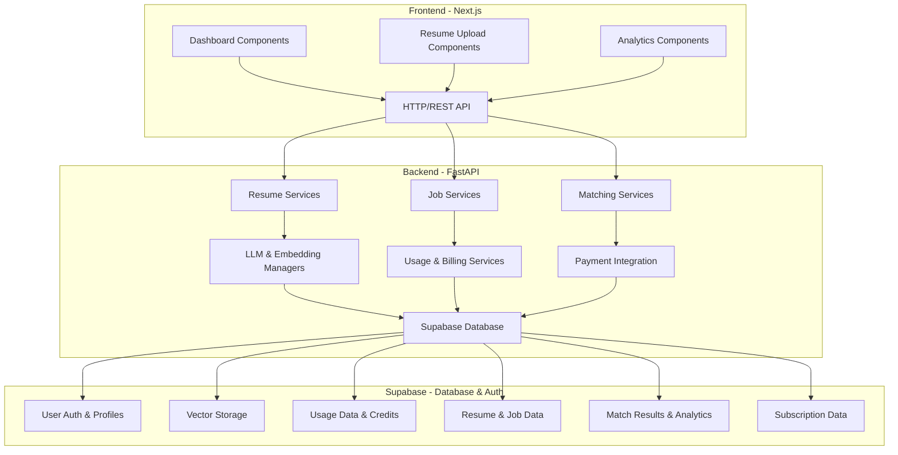
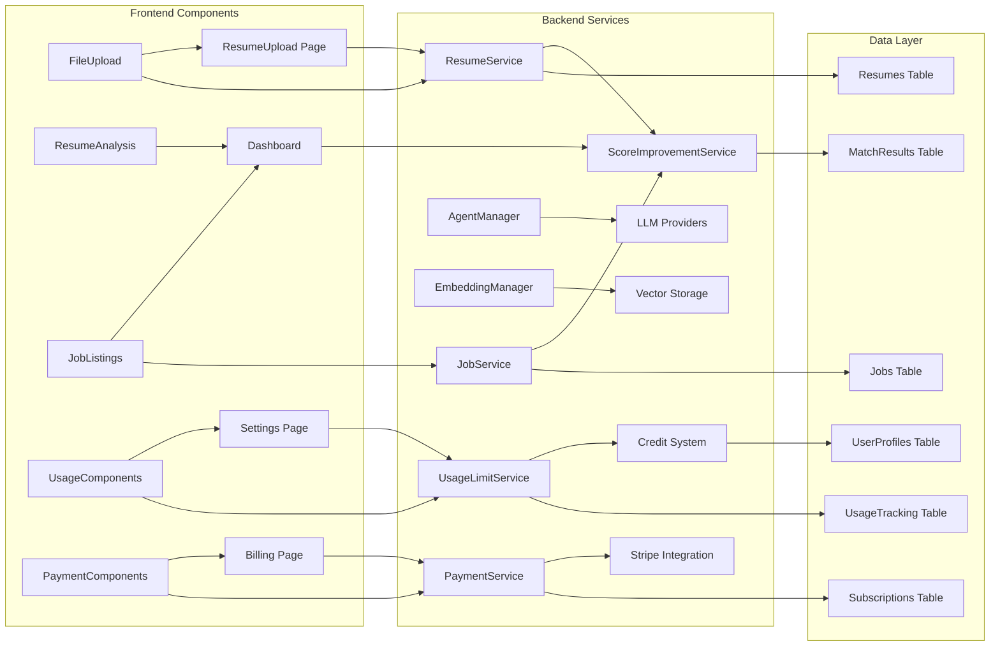
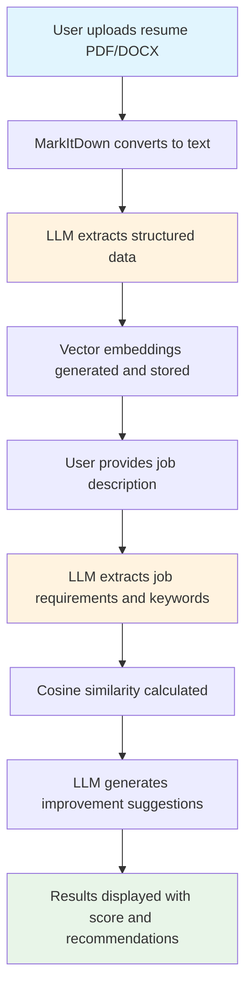
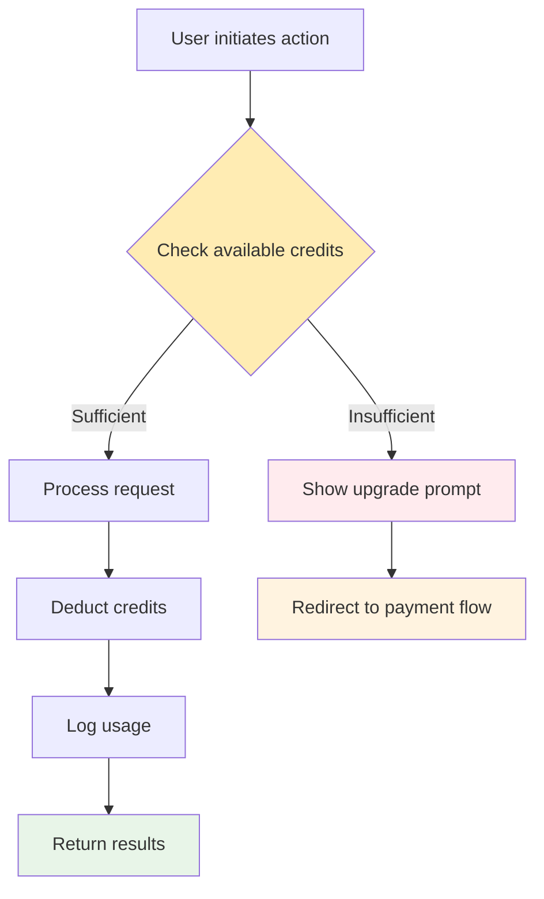
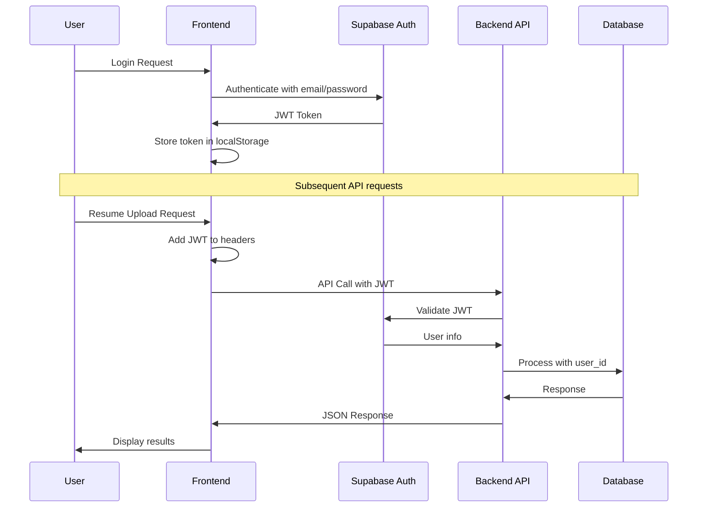
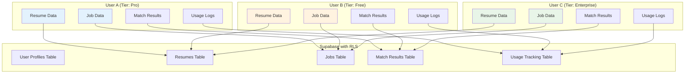
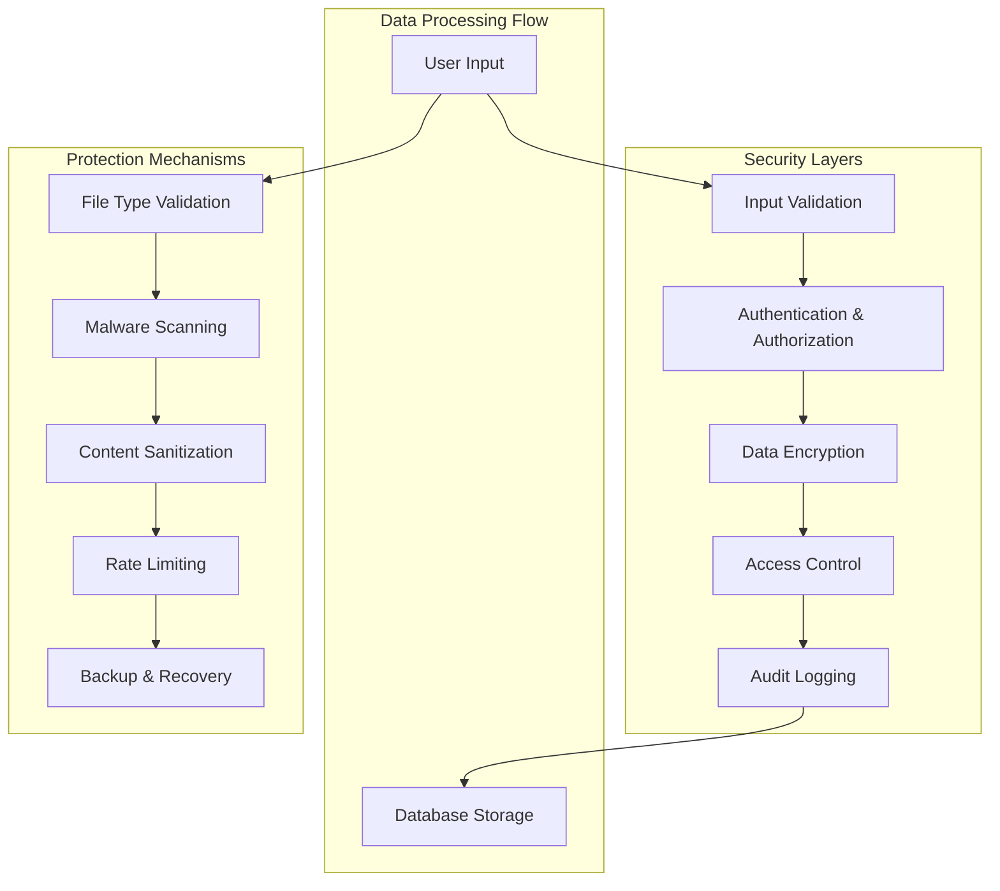
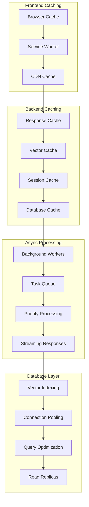

# CV-Match Architecture Overview

## System Architecture

The CV-Match platform is built on a modern, scalable architecture that combines the proven Resume-Matcher core functionality with a robust FastAPI/Next.js boilerplate.

## Component Architecture

### Core Component Relationships

## Core Components

### Frontend (Next.js + TypeScript)

#### **UI Components** (from Resume-Matcher)
- **FileUpload Component**: Advanced drag-drop file upload with PDF/DOCX support
- **ResumeAnalysis Component**: Interactive score display with improvement suggestions
- **Dashboard Components**: Complete UI for job listings and resume management
- **Usage Components**: Credit tracking and subscription management UI
- **Payment Components**: Stripe integration for billing

#### **Pages & Routes**
- `/dashboard` - Main dashboard with resume and job management
- `/upload` - Resume upload interface
- `/jobs` - Job description input and analysis
- `/analytics` - Usage analytics and insights
- `/settings` - Account and subscription management

### Backend (FastAPI + Python)

#### **Core Services** (from Resume-Matcher)
1. **ResumeService**:
   - PDF/DOCX parsing with MarkItDown
   - Structured data extraction using LLM
   - Keyword extraction and processing

2. **JobService**:
   - Job description parsing and structuring
   - Extract job requirements and keywords
   - Store processed job data

3. **ScoreImprovementService**:
   - Cosine similarity calculation between resumes and jobs
   - LLM-powered improvement suggestions
   - Real-time streaming responses
   - Advanced retry logic with validation

#### **AI & Infrastructure Services**
1. **AgentManager**: Multi-provider LLM abstraction (OpenAI, OpenRouter, Ollama)
2. **EmbeddingManager**: Vector embeddings with multiple providers
3. **UsageLimitService**: Credit-based usage tracking and validation
4. **PaymentService**: Stripe integration for subscription management

### Database Layer (Supabase)

#### **Core Tables**
- **resumes**: Raw resume content and metadata
- **processed_resumes**: Structured resume data (skills, experience, etc.)
- **jobs**: Job descriptions and requirements
- **processed_jobs**: Structured job data
- **match_results**: Matching scores and improvement suggestions

#### **SaaS Infrastructure Tables**
- **user_profiles**: Subscription tiers and credit management
- **usage_tracking**: Detailed usage logs and credit consumption
- **subscriptions**: Stripe subscription data

## Data Flow

### Resume Upload and Analysis Flow

### Credit Usage Flow

## Technology Stack

### Frontend
- **Next.js 15+**: React framework with App Router
- **TypeScript**: Type-safe development
- **Tailwind CSS**: Utility-first styling
- **Shadcn/ui**: Professional component library
- **Lucide React**: Icon library

### Backend
- **FastAPI**: Modern Python web framework
- **Pydantic**: Data validation and settings
- **SQLAlchemy**: Python SQL toolkit and ORM
- **MarkItDown**: Document parsing library
- **NumPy**: Numerical computing for similarity calculations

### Database & Infrastructure
- **Supabase**: PostgreSQL database with real-time features
- **pgvector**: Vector similarity search
- **Stripe**: Payment processing
- **OpenAI/OpenRouter**: LLM providers
- **Docker**: Containerization

## Security Architecture

### Authentication & Authorization Flow

### Multi-tenancy Data Isolation

### Data Protection Layers

**Security Features:**
- **Supabase Auth**: User authentication with JWT tokens
- **Row Level Security (RLS)**: Database-level access control
- **Multi-tenancy**: User data isolation with per-user permissions
- **API Rate Limiting**: Prevent abuse and manage costs by subscription tier
- **File Validation**: Malicious file detection and scanning
- **Content Sanitization**: Clean and validate all user inputs
- **Secure File Storage**: Isolated file storage per user with access controls
- **Data Encryption**: Encryption at rest and in transit with TLS 1.3+

## Performance Optimizations

### Performance Architecture

### Caching Strategy
- **Response Caching**: Cache LLM responses when appropriate (TTL: 1 hour)
- **Vector Cache**: Cache frequently used embeddings (Redis)
- **User Session Cache**: Store user preferences and recent activity
- **CDN Caching**: Static assets and UI components delivered via CDN

### Async Processing
- **Background Tasks**: Heavy processing moved to background workers (Celery/Redis)
- **Streaming Responses**: Real-time progress updates for long-running tasks
- **Queue Management**: Prioritize processing based on subscription tier
- **Result Caching**: Store processing results to avoid re-computation

### Database Optimization
- **Vector Indexing**: Optimized similarity search with pgvector (HNSW index)
- **Connection Pooling**: Efficient database connection management (pgbouncer)
- **Query Optimization**: Indexed queries for common operations
- **Read Replicas**: Separate read database for analytics and reporting

## Scalability Considerations

### Horizontal Scaling
- **Load Balancing**: Multiple backend instances
- **Database Read Replicas**: Read scaling for analytics
- **CDN Integration**: Static asset delivery

### Resource Management
- **Rate Limiting**: Per-user and per-tier rate limits
- **Resource Quotas**: Fair usage enforcement
- **Auto-scaling**: Dynamic resource allocation

## Monitoring & Analytics

### Application Monitoring
- **Health Checks**: API endpoint monitoring
- **Performance Metrics**: Response times and throughput
- **Error Tracking**: Comprehensive error logging and alerting
- **Usage Analytics**: User behavior and feature adoption

### Business Metrics
- **Conversion Rates**: Free to paid conversions
- **User Engagement**: Active users and session duration
- **Revenue Tracking**: Subscription revenue and churn
- **Feature Usage**: Most/least used features

## Development Workflow

### Local Development
- **Hot Reload**: Fast development with automatic updates
- **Database Migrations**: Schema versioning and deployment
- **Environment Management**: Consistent development environments
- **Testing Suite**: Unit, integration, and end-to-end tests

### Deployment Pipeline
- **CI/CD**: Automated testing and deployment
- **Staging Environment**: Production-like testing environment
- **Blue-Green Deployments**: Zero-downtime deployments
- **Rollback Capability**: Quick recovery from issues

## Future Architecture Enhancements

### AI/ML Improvements
- **Custom Models**: Fine-tuned models for specific industries
- **Batch Processing**: Bulk analysis capabilities
- **Advanced Analytics**: Predictive insights and recommendations
- **Multi-modal AI**: Image and video resume analysis

### Enterprise Features
- **API Access**: Programmatic access for enterprise customers
- **SSO Integration**: Single sign-on for corporate customers
- **Advanced Analytics**: Custom reports and data export
- **White-labeling**: Custom branding for B2B customers

This architecture provides a solid foundation for a scalable, maintainable, and feature-rich CV matching SaaS platform that can grow from a simple matching tool to a comprehensive talent optimization platform.
