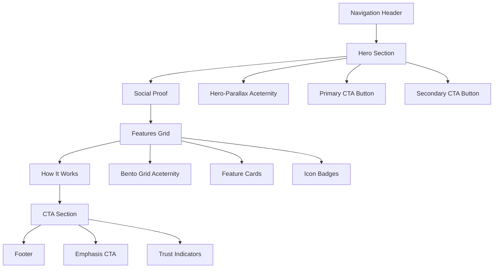
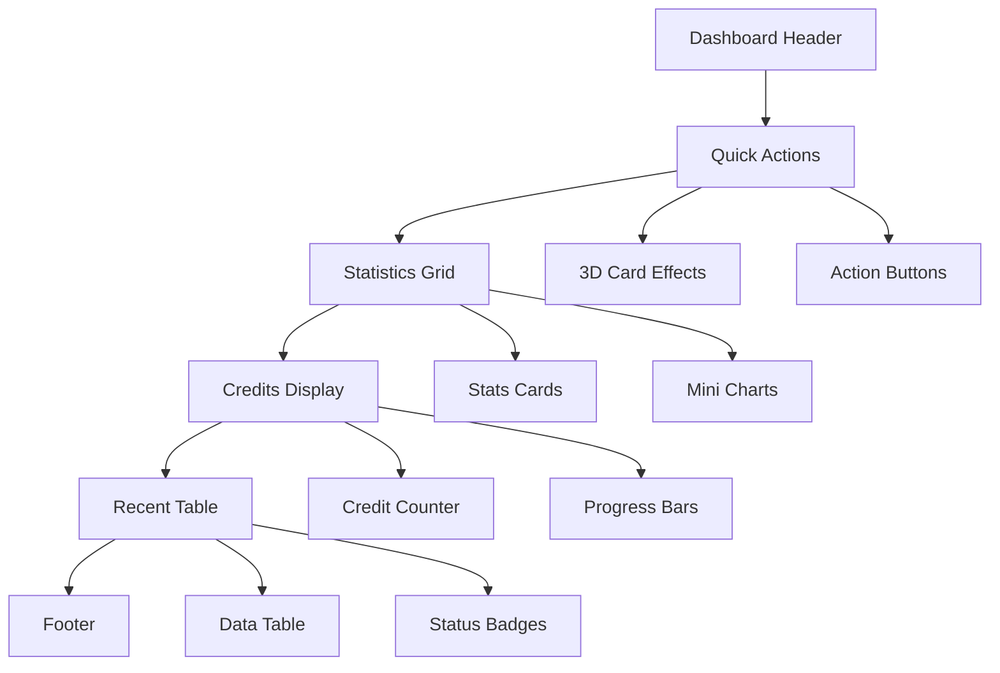
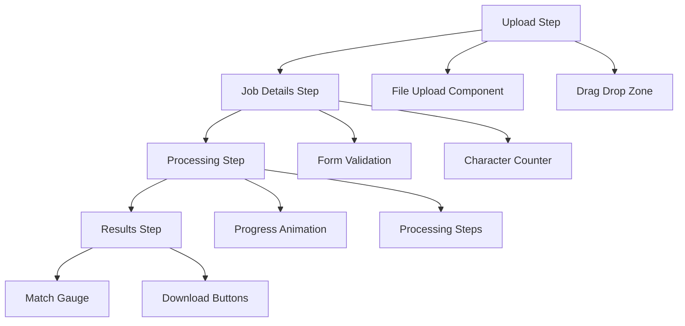

# 🚀 Design System Implementation Roadmap

**Version:** 1.0
**Last Updated:** October 16, 2025
**Purpose:** Complete implementation roadmap for CV-Match design system with enhanced shadcn components

---

## 📋 Table of Contents

1. [Executive Summary](#executive-summary)
2. [Implementation Phases](#implementation-phases)
3. [Component Installation Timeline](#component-installation-timeline)
4. [Page-by-Page Implementation Plan](#page-by-page-implementation-plan)
5. [Quality Assurance Strategy](#quality-assurance-strategy)
6. [Risk Mitigation](#risk-mitigation)
7. [Success Metrics](#success-metrics)

---

## 📊 Executive Summary

### Project Overview
- **Goal**: Implement complete design system using 4 shadcn registries with conflict prevention
- **Timeline**: 3-4 days (24.5-32.5 hours)
- **Approach**: Parallel execution where possible, sequential for dependencies
- **Focus**: Brazilian market optimization with OKLCH colors and accessibility
- **Registries**: @shadcn (foundation), @aceternity-ui (public pages), @kibo-ui (dashboard), @ai-sdk (AI features)

### Key Deliverables
1. ✅ Component mapping matrix
2. ✅ Enhanced configuration plan
3. ✅ Installation strategy
4. ✅ Custom components (Match Gauge, Credit Counter)
5. ✅ Type safety configuration
6. ✅ Responsive design patterns

---

## 🏗️ Implementation Phases

### Phase 1: Foundation Setup (4h - PARALLEL)

#### Agent 1: CSS Variables & Theme Provider (2h)
```bash
# Tasks:
- Update globals.css with OKLCH color variables
- Implement theme provider in layout
- Configure dark/light theme toggle
- Test theme switching functionality
```

#### Agent 2: Typography & Font Configuration (2h)
```bash
# Tasks:
- Install Plus Jakarta Sans, Source Serif 4, JetBrains Mono
- Configure font loading strategy
- Update typography scale
- Test font rendering and fallbacks
```

**Dependencies**: None (can start immediately)

---

### Phase 2: Component Library (6.5h - SEQUENTIAL)

#### Step 2.1: @shadcn Component Installation (3h)
```bash
# Foundation components installation
bunx shadcn@latest add @shadcn/navigation-menu
bunx shadcn@latest add @shadcn/separator
bunx shadcn@latest add @shadcn/sheet
bunx shadcn@latest add @shadcn/sidebar
bunx shadcn@latest add @shadcn/select
bunx shadcn@latest add @shadcn/checkbox
bunx shadcn@latest add @shadcn/switch
bunx shadcn@latest add @shadcn/radio-group
bunx shadcn@latest add @shadcn/skeleton
bunx shadcn@latest add @shadcn/spinner
bunx shadcn@latest add @shadcn/toast
bunx shadcn@latest add @shadcn/sonner
bunx shadcn@latest add @shadcn/avatar
bunx shadcn@latest add @shadcn/hover-card
bunx shadcn@latest add @shadcn/scroll-area
```

#### Step 2.2: Type Checking Agent A (0.25h)
```bash
# Automated type validation
bun run type-check
# Validate all component props and interfaces
```

#### Step 2.3: Registry Component Installation (3h)
```bash
# Install @aceternity-ui components (public pages only)
bunx shadcn@latest add @aceternity-ui/hero-parallax
bunx shadcn@latest add @aceternity-ui/bento-grid
bunx shadcn@latest add @aceternity-ui/3d-card-hover
bunx shadcn@latest add @aceternity-ui/moving-border
bunx shadcn@latest add @aceternity-ui/text-reveal

# Install @kibo-ui components (dashboard only)
bunx shadcn@latest add @kibo-ui/analytics-chart
bunx shadcn@latest add @kibo-ui/data-table
bunx shadcn@latest add @kibo-ui/metric-card

# Install @ai-sdk components (AI features only)
bunx shadcn@latest add @ai-sdk/file-upload
bunx shadcn@latest add @ai-sdk/processing-animation
bunx shadcn@latest add @ai-sdk/smart-input

# Configure custom components
# Test animations and interactions
```

#### Step 2.4: Type Checking Agent B (0.25h)
```bash
# Animation type validation
bun run type-check
# Validate animation props and variants
```

**Dependencies**: Phase 1 completion

---

### Phase 3: Landing Page (6h - PARALLEL)

#### Agent 1: Hero Section with @aceternity-ui (3h)
```tsx
// Components to implement:
- @aceternity-ui/hero-parallax component
- @shadcn/button with proper sizing
- @shadcn/card for social proof stats
- Brazilian market messaging
```

#### Agent 2: Features & Pricing Preview (3h)
```tsx
// Components to implement:
- @aceternity-ui/bento-grid for features
- @shadcn/card + @shadcn/tabs for pricing
- @shadcn/badge for trust indicators
- Brazilian payment methods
```

**Dependencies**: Phase 2 completion

---

### Phase 4: Dashboard & App UI (8.5h - SEQUENTIAL)

#### Step 4.1: Dashboard Implementation (4h)
```tsx
// Components to implement:
- @shadcn/sidebar for dashboard layout
- @kibo-ui/analytics-chart + @shadcn/card for statistics
- Custom credit counter with @shadcn/progress
- @kibo-ui/data-table for recent optimizations
- @ai-sdk/3d-card-hover for quick actions
```

#### Step 4.2: Type Checking Agent C (0.25h)
```bash
# Dashboard type validation
bun run type-check
# Validate dashboard component types
```

#### Step 4.3: Optimize Flow UI (4h)
```tsx
// Components to implement:
- @shadcn/tabs + @shadcn/progress for multi-step form
- @ai-sdk/file-upload with drag-drop
- @shadcn/form + @ai-sdk/smart-input for job details
- @ai-sdk/processing-animation for AI feedback
- Custom match gauge with @shadcn/progress
```

#### Step 4.4: Type Checking Agent D (0.25h)
```bash
# Flow type validation
bun run type-check
# Validate flow component types
```

**Dependencies**: Phase 3 completion

---

### Phase 5: Polish & Testing (4h - PARALLEL)

#### Agent 1: Theme Testing & Refinements (2h)
```bash
# Tasks:
- Test light/dark theme across all pages
- Validate OKLCH color rendering
- Test theme transitions
- Fix any theme inconsistencies
```

#### Agent 2: Mobile Responsiveness & Accessibility (2h)
```bash
# Tasks:
- Test responsive design (320px - 1920px)
- Validate WCAG 2.1 AA compliance
- Test keyboard navigation
- Validate screen reader support
```

**Dependencies**: Phase 4 completion

---

## 📦 Component Installation Timeline

### Detailed Installation Schedule

| Time | Component | Purpose | Dependencies |
|------|-----------|---------|--------------|
| **Day 1 - Morning** | | | |
| 9:00-9:30 | CSS Variables | Theme foundation | None |
| 9:30-10:00 | Typography | Font system | None |
| 10:00-10:30 | Navigation Menu | Header navigation | CSS Variables |
| 10:30-11:00 | Form Components | Input handling | CSS Variables |
| 11:00-11:30 | Type Check A | Validate foundation | Form Components |
| **Day 1 - Afternoon** | | | |
| 13:00-14:00 | Aceternity UI | Animations | Type Check A |
| 14:00-14:15 | Type Check B | Validate animations | Aceternity UI |
| 14:15-15:15 | Hero Section | Landing hero | Type Check B |
| 15:15-16:15 | Features Grid | Landing features | Hero Section |
| **Day 2 - Morning** | | | |
| 9:00-10:00 | Dashboard Layout | Main dashboard | Features Grid |
| 10:00-10:15 | Type Check C | Validate dashboard | Dashboard Layout |
| 10:15-11:15 | Optimize Flow | Multi-step form | Type Check C |
| 11:15-11:30 | Type Check D | Validate flow | Optimize Flow |
| **Day 2 - Afternoon** | | | |
| 13:00-14:00 | Theme Testing | Light/dark modes | Type Check D |
| 14:00-15:00 | Mobile Testing | Responsiveness | Theme Testing |
| 15:00-16:00 | Final Polish | Bug fixes | Mobile Testing |

---

## 📄 Page-by-Page Implementation Plan

### Landing Page Implementation



### Dashboard Implementation



### Optimize Flow Implementation



---

## 🔍 Quality Assurance Strategy

### Automated Testing

#### Type Checking
```bash
# After each major component installation
bun run type-check

# Specific type checking agents
bun run type-check:components  # Agent A
bun run type-check:animations  # Agent B
bun run type-check:dashboard   # Agent C
bun run type-check:flow        # Agent D
```

#### Component Testing
```bash
# Component unit tests
bun test components/

# Integration tests
bun test integration/

# Visual regression tests
bun test visual/
```

### Manual Testing Checklist

#### Theme Testing
- [ ] Light mode renders correctly
- [ ] Dark mode renders correctly
- [ ] Theme toggle works smoothly
- [ ] OKLCH colors display properly
- [ ] No color contrast issues

#### Responsive Testing
- [ ] Mobile (320px) works correctly
- [ ] Tablet (768px) works correctly
- [ ] Desktop (1024px+) works correctly
- [ ] Touch targets are 44px minimum
- [ ] Text is readable without zoom

#### Accessibility Testing
- [ ] WCAG 2.1 AA compliance
- [ ] Keyboard navigation works
- [ ] Screen reader support
- [ ] Focus indicators visible
- [ ] Alt text for images

#### Performance Testing
- [ ] Page load under 3 seconds
- [ ] Smooth 60fps animations
- [ ] No console errors
- [ ] Memory usage acceptable
- [ ] Bundle size optimized

---

## ⚠️ Risk Mitigation

### Potential Risks & Solutions

#### Risk 1: Registry Component Conflicts
**Issue**: Component redundancy across 4 shadcn registries
**Solution**:
- Follow registry-specific usage guidelines
- Use explicit imports with registry prefixes
- Implement ESLint rules to prevent misuse
- Test component interactions early

#### Risk 2: Performance Issues
**Issue**: Heavy animations slow down the app
**Solution**:
- Implement lazy loading for animations
- Use will-change CSS property sparingly
- Test performance on low-end devices

#### Risk 3: Browser Compatibility
**Issue**: OKLCH colors not supported in older browsers
**Solution**:
- Implement fallback colors
- Use @supports CSS rule
- Test in multiple browsers

#### Risk 4: Type Safety Issues
**Issue**: TypeScript errors with new components
**Solution**:
- Incremental type checking after each phase
- Use any type as temporary fallback
- Create proper type definitions

#### Risk 5: Mobile Responsiveness
**Issue**: Components don't work well on mobile
**Solution**:
- Mobile-first development approach
- Test on actual devices
- Use responsive design patterns

### Contingency Plans

#### If shadcn Installation Fails
```bash
# Fallback to manual component installation
# Use existing components as templates
# Create custom implementations
```

#### If Registry Components Don't Work
```bash
# Use @shadcn base components instead
# Implement CSS animations as fallback
# Focus on core functionality
```

#### If Theme System Breaks
```bash
# Revert to simple light/dark toggle
# Use standard CSS variables
- Implement basic theming
```

---

## 📈 Success Metrics

### Technical Metrics

#### Performance
- [ ] Page load time < 3 seconds
- [ ] First Contentful Paint < 1.5 seconds
- [ ] Largest Contentful Paint < 2.5 seconds
- [ ] Smooth animations at 60fps

#### Code Quality
- [ ] TypeScript compilation without errors
- [ ] 100% type coverage for new components
- [ ] ESLint passes without warnings
- [ ] Prettier formatting consistent

#### Accessibility
- [ ] WCAG 2.1 AA compliance
- [ ] 4.5:1 contrast ratio minimum
- [ ] Keyboard navigation complete
- [ ] Screen reader support

### User Experience Metrics

#### Design System
- [ ] 100% component coverage
- [ ] Consistent spacing and typography
- [ ] Smooth theme transitions
- [ ] Intuitive component variations

#### Brazilian Market
- [ ] PT-BR localization complete
- [ ] Payment methods for Brazil
- [ ] Cultural relevance in design
- [ ] Local context awareness

### Business Metrics

#### Development Efficiency
- [ ] <5min to add new component
- [ ] Reusable component library
- [ ] Consistent design patterns
- [ ] Reduced development time

#### User Satisfaction
- [ ] Professional appearance
- [ ] Improved user experience
- [ ] Better conversion rates
- [ ] Positive user feedback

---

## 🎯 Next Steps After Implementation

### Immediate Actions
1. **Deploy to staging environment**
2. **Conduct user testing**
3. **Gather feedback from stakeholders**
4. **Fix any critical issues**

### Short-term (1-2 weeks)
1. **Monitor performance in production**
2. **Collect user feedback**
3. **Make iterative improvements**
4. **Document component usage**

### Long-term (1-3 months)
1. **Expand component library**
2. **Add advanced features**
3. **Optimize for new use cases**
4. **Maintain design system consistency**

---

## 📞 Support & Resources

### Documentation
- [Component Mapping](./SHADCN-COMPONENT-MAPPING.md)
- [Configuration Plan](./COMPONENT-CONFIGURATION-PLAN.md)
- [Design System Overview](../../design-system/README.md)
- [Wireframes](../../design-system/wireframes.md)

### Tools & Resources
- [shadcn/ui Documentation](https://ui.shadcn.com)
- [Aceternity UI Documentation](https://ui.aceternity.com)
- [Tailwind CSS Documentation](https://tailwindcss.com)
- [OKLCH Color Picker](https://oklch.com)

### Team Contacts
- **Design System Lead**: [Contact info]
- **Frontend Specialist**: [Contact info]
- **Type Checking Specialist**: [Contact info]
- **Accessibility Specialist**: [Contact info]

---

**Last Updated:** October 16, 2025
**Maintained by:** CV-Match Design System Team
**Status:** Ready for Implementation
**Next Review:** After Phase 1 completion