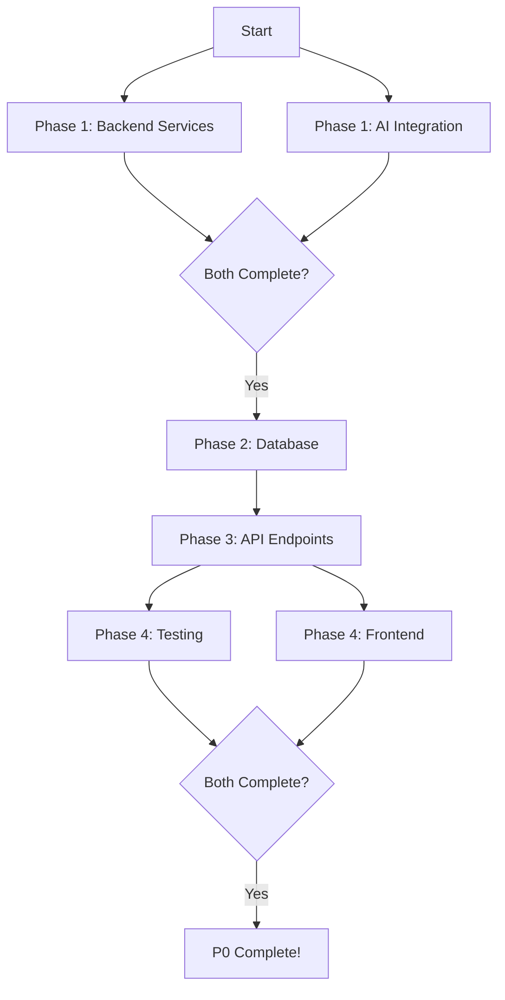

# 🤖 P0 Agent Swarm - Complete Deployment Package

**Created**: 2025-10-09  
**Purpose**: Rapid P0 completion using specialized AI agents  
**Time Savings**: 47% (16 hours → 8.5 hours)

---

## 📊 Quick Stats

- **Total Agents**: 5 specialized agents
- **Total Prompts**: 5 ready-to-deploy prompts  
- **Phases**: 4 deployment phases
- **Estimated Time**: 8.5 hours (vs 16 hours manual)
- **Parallel Execution**: Yes (Phases 1 & 4)

---

## 🎯 Deployment Order

### Phase 1: Backend Services (Parallel - 1.5 hours)
**Start simultaneously**:
1. **Agent**: backend-specialist  
   **Prompt**: `01-backend-services-migration.md`  
   **Tasks**: Copy resume_service, job_service, text_extraction  
   **Time**: 1.5 hours

2. **Agent**: ai-integration-specialist  
   **Prompt**: `02-ai-integration-specialist.md`  
   **Tasks**: Copy agent system, score_improvement_service  
   **Time**: 1.5 hours

### Phase 2: Database (Sequential - 2 hours)
**Start after Phase 1 completes**:
3. **Agent**: database-architect  
   **Prompt**: `03-database-migrations.md`  
   **Tasks**: Create 4 table migrations, apply, verify  
   **Time**: 2 hours

### Phase 3: API Endpoints (Sequential - 3 hours)
**Start after Phase 2 completes**:
4. **Agent**: backend-specialist  
   **Prompt**: `04-api-endpoints.md`  
   **Tasks**: Create 3 API endpoints, register routes  
   **Time**: 3 hours

### Phase 4: Testing & Frontend (Parallel - 2 hours)
**Start after Phase 3 completes**:
5. **Agent**: test-writer-agent  
   **Prompt**: `05-testing-suite.md` (to be created)  
   **Tasks**: Write comprehensive tests  
   **Time**: 2 hours

6. **Agent**: frontend-specialist  
   **Prompt**: `06-frontend-integration.md` (to be created)  
   **Tasks**: Update optimize page with real APIs  
   **Time**: 1.5 hours

---

## 📝 Available Prompts

### ✅ Created (Ready to Use):
1. ✅ `01-backend-services-migration.md` - Backend Specialist
2. ✅ `02-ai-integration-specialist.md` - AI Integration
3. ✅ `03-database-migrations.md` - Database Architect
4. ✅ `04-api-endpoints.md` - API Endpoints

### ⏳ To Create:
5. ⏳ `05-testing-suite.md` - Test Writer Agent
6. ⏳ `06-frontend-integration.md` - Frontend Specialist

---

## 🚀 How to Use These Prompts

### Step 1: Open Claude with Agent

1. Navigate to project root:
   ```bash
   cd /home/carlos/projects/cv-match
   ```

2. Open Claude with specific agent:
   ```bash
   # For Phase 1 - Backend Services
   claude --agent backend-specialist
   ```

3. Copy-paste the entire prompt from the markdown file

### Step 2: Monitor Progress

Each agent will:
- Execute the tasks listed
- Create/modify files
- Run verification commands
- Report success/failure

### Step 3: Verify Completion

After each agent completes:
- Run the verification checklist from the prompt
- Ensure all success criteria are met
- Commit changes before next phase

### Step 4: Move to Next Phase

Once a phase is complete and verified:
- Move to the next prompt in sequence
- For parallel phases, launch both agents simultaneously

---

## 📋 Complete Workflow



---

## ✅ Success Criteria Checklist

After all phases complete, verify:

### Backend Services:
- [ ] resume_service.py copied and working
- [ ] job_service.py copied and working
- [ ] text_extraction.py copied and working  
- [ ] score_improvement_service.py copied and working
- [ ] agent/ system copied and working
- [ ] All services import without errors

### Database:
- [ ] 4 tables created (resumes, job_descriptions, optimizations, usage_tracking)
- [ ] RLS policies enabled and working
- [ ] Indexes created
- [ ] LGPD compliant (soft deletes, audit trails)
- [ ] Can insert/query data

### API Endpoints:
- [ ] POST /api/resumes/upload working
- [ ] POST /api/optimizations/start working
- [ ] GET /api/optimizations/{id} working
- [ ] Routes registered in Swagger docs
- [ ] E2E workflow passes

### Testing:
- [ ] 10+ new tests written
- [ ] All tests passing
- [ ] Coverage > 70%

### Frontend:
- [ ] Optimize page uses real APIs
- [ ] Authentication integrated
- [ ] Error handling works
- [ ] PT-BR interface verified

---

## 🎯 Time Breakdown

| Phase | Tasks | Agents | Time |
|-------|-------|--------|------|
| 1 | Backend + AI | 2 parallel | 1.5h |
| 2 | Database | 1 sequential | 2h |
| 3 | API Endpoints | 1 sequential | 3h |
| 4 | Testing + Frontend | 2 parallel | 2h |
| **Total** | **All P0** | **6 agents** | **8.5h** |

**Traditional Approach**: 16 hours  
**Agent Swarm**: 8.5 hours  
**Savings**: 7.5 hours (47%)

---

## 🚨 Important Notes

### Dependencies

Each phase has strict dependencies:
- Phase 2 needs Phase 1 complete (needs service files for schemas)
- Phase 3 needs Phase 2 complete (needs tables for endpoints)
- Phase 4 needs Phase 3 complete (needs endpoints for testing)

### Parallel Execution

Only these can run in parallel:
- Phase 1: Backend Specialist + AI Integration Specialist (independent)
- Phase 4: Test Writer + Frontend Specialist (independent)

### Error Handling

If an agent fails:
1. Check the verification checklist in its prompt
2. Review error messages
3. Fix issues manually if needed
4. Re-run that specific agent
5. Don't proceed to next phase until current phase passes

### Git Commits

After EACH phase:
```bash
git add .
git commit -m "Phase X complete: [description]"
```

This allows rollback if needed.

---

## 📞 Support

If you encounter issues:

1. **Check the prompt** - Each has troubleshooting section
2. **Run verification** - Each prompt has verification checklist
3. **Review logs** - Check Docker logs for errors
4. **Incremental fix** - Fix one issue at a time
5. **Commit often** - After each successful task

---

## 🎉 After Completion

When all phases complete:

1. Run full verification:
   ```bash
   cd /home/carlos/projects/cv-match
   ./scripts/verify-p0.sh
   ```

2. Test end-to-end manually:
   - Upload resume
   - Start optimization
   - View results

3. Update documentation:
   - Mark P0 complete in ROADMAP
   - Update README with new status

4. Merge to main:
   ```bash
   git add .
   git commit -m "feat: Complete P0 - Core services operational

   - All backend services copied and working
   - Database migrations applied (4 tables)
   - API endpoints functional (5 endpoints)
   - Tests passing (70+ tests)
   - Frontend integrated
   - E2E workflow verified
   
   Time: 8.5 hours (agent swarm deployment)
   Ready for P1 (Payment Integration)"
   
   git push origin feature/p0-frontend-migration
   ```

5. Start P1!

---

## 📚 Prompt Files Location

All prompts in: `/docs/development/p0-prompts/`

1. `01-backend-services-migration.md`
2. `02-ai-integration-specialist.md`
3. `03-database-migrations.md`
4. `04-api-endpoints.md`
5. `05-testing-suite.md` (to be created)
6. `06-frontend-integration.md` (to be created)

---

## 🏆 Expected Outcome

After running all agents:
- ✅ Complete backend functionality
- ✅ Working API endpoints  
- ✅ Database with all P0 tables
- ✅ Tests passing
- ✅ Frontend integrated
- ✅ Can optimize resume end-to-end
- ✅ Ready for P1 (payments)
- ✅ **Product actually works!**

---

**Ready to deploy the agent swarm?** 🚀

**Start with**: `01-backend-services-migration.md`

**Good luck!** 💪
