# Políticas de Proteção de Dados - CV-Match Platform

**Versão:** 1.0
**Data de Vigência:** 13 de Outubro de 2025
**Próxima Revisão:** 13 de Outubro de 2026
**Classificação:** Confidencial

---

## 🎯 Visão Geral

Este documento estabelece as políticas abrangentes de proteção de dados da CV-Match, em conformidade com a Lei Geral de Proteção de Dados (LGPD) - Lei nº 13.709/2018 e outras regulamentações aplicáveis de proteção de dados.

---

## 🇧🇷 Fundamentos Legais e Regulatórios

### Legislação Aplicável

#### Leis Brasileiras

1. **Lei Geral de Proteção de Dados (LGPD)** - Lei nº 13.709/2018
2. **Constituição Federal** - Artigo 5º, incisos X e XII
3. **Constituição Federal** - Artigo 3º, inciso IV (Igualdade e não discriminação)
4. **Lei nº 9.029/1995** - Proibição de discriminação empregatícia
5. **Lei nº 12.288/2010** - Estatuto da Igualdade Racial
6. **Lei nº 7.853/1989** - Apoio às pessoas portadoras de deficiência

#### Regulamentações Complementares

1. **Resolução CD/ANPD nº 1/2021** - Critérios de segurança
2. **Resolução CD/ANPD nº 2/2022** - Padronização para comunicação de incidentes
3. **Medida Provisória nº 959/2020** - Regulamentação do trabalho remoto

### Autoridade Nacional de Proteção de Dados (ANPD)

#### Informações de Contato

- **Órgão:** Autoridade Nacional de Proteção de Dados
- **Endereço:** Esplanada dos Ministérios, Bloco R, 4º Andar, Brasília - DF
- **Email:** autoridadenacional@pdpt.gov.br
- **Website:** https://www.gov.br/anpd
- **Telefone:** +55 61 2026-1000

#### Obrigações perante a ANPD

- **Notificação de violação:** 72 horas após descoberta
- **Relatórios de impacto:** Quando necessário
- **Cooperação com investigações:** Obrigatória
- **Atendimento a determinações:** Imediato

---

## 📊 Categorias de Dados Pessoais

### Classificação de Dados

#### Dados Pessoais (Artigo 5º, I)

```yaml
dados_pessoais:
  identificacao:
    - nome_completo
    - cpf
    - rg
    - email
    - telefone
    - endereco
    - data_nascimento

  profissionais:
    - curriculo
    - experiencia_profissional
    - formacao_academica
    - habilidades_tecnicas
    - certificacoes
    - idiomas

  de_uso:
    - ip_address
    - user_agent
    - logs_acesso
    - geolocalizacao_aproximada
    - dispositivo_utilizado
```

#### Dados Sensíveis (Artigo 5º, II)

```yaml
dados_sensíveis:
  origem_racial_etnica:
    - raca_autodeclarada
    - etnia_autodeclarada

  religiao:
    - religiao_autodeclarada (quando informado)

  opiniao_politica:
    - orientacao_politica (quando informada)

  saude:
    - condicoes_de_saude (quando relevantes para vagas)
    - deficiencias (quando voluntariamente informado)

  dados_geneticos:
    - nao_coletados

  dados_biometricos:
    - nao_coletados

  vida_sexual:
    - nao_coletados
```

### Mapeamento de Fluxo de Dados

#### Fluxo de Dados do Candidato

```mermaid
graph TD
    A[Cadastro Inicial] --> B[Dados de Identificação]
    B --> C[Upload de Currículo]
    C --> D[Extração de Texto]
    D --> E[Detecção de PII]
    E --> F{Contém PII?}
    F -->|Sim| G[Mascaramento]
    F -->|Não| H[Armazenamento]
    G --> H
    H --> I[Análise de Matching]
    I --> J[Recomendações de Vagas]
    J --> K[Aplicações]
    K --> L[Feedback]
```



#### Fluxo de Dados da Empresa

```mermaid
graph TD
    A[Cadastro Empresa] --> B[Dados da Empresa]
    B --> C[Validação CNPJ]
    C --> D[Criação de Vagas]
    D --> E[Descrição de Vagas]
    E --> F[Publicação]
    F --> G[Recebimento de Candidaturas]
    G --> H[Análise de Candidatos]
    H --> I[Contato com Candidatos]
    I --> J[Processo Seletivo]
```



---

## ⚖️ Bases Legais para Tratamento

### Bases Legais Utilizadas (Artigo 7º)

#### 1. Consentimento (Inciso I)

```yaml
consentimento:
  quando_utilizado:
    - dados_sensíveis
    - comunicacoes_marketing
    - compartilhamento_terceiros
    - pesquisas_opiniao

  requisitos:
    - livre
    - informado
    - inequívoco
    - específico_para_finalidade
    - pode_ser_revogado

  metodos_obtencao:
    - checkbox_aceite_expresso
    - termo_consentimento_separado
    - confirmacao_email
    - aceite_digital
```

#### 2. Execução de Contrato (Inciso V)

```yaml
execucao_contrato:
  quando_utilizado:
    - dados_necessarios_prestacao_servicos
    - informacoes_contato
    - dados_profissionais
    - logs_acesso

  finalidades:
    - conexao_profissional
    - analise_compatibilidade
    - melhoria_servicos
    - suporte_ao_usuario

  exemplos:
    - email_para_contato
    - telefone_para_recrutamento
    - curriculo_para_matching
```

#### 3. Legítimo Interesse (Inciso IX)

```yaml
legitimo_interesse:
  quando_utilizado:
    - analise_tendencias_mercado
    - melhoria_algoritmos
    - prevencao_fraudes
    - seguranca_plataforma

  requisitos:
    - teste_adequacao_necessidade
    - balanceamento_interesses
    - direitos_titular_respeitados
    - transparencia

  exemplos:
    - deteccao_padroes_anormais
    - analise_agregada_anonimizada
    - protecao_contra_ataques
```

### Teste de Legítimo Interesse

```python
# Legitimate interest assessment framework
class LegitimateInterestAssessment:
    def __init__(self):
        self.assessment_criteria = {
            "purpose_legitimacy": self._assess_purpose_legitimacy,
            "necessity_test": self._assess_necessity,
            "balancing_test": self._assess_balancing,
            "safeguards": self._assess_safeguards
        }

    async def assess_legitimate_interest(self, processing_purpose: dict) -> dict:
        """Comprehensive legitimate interest assessment"""
        assessment_results = {}

        for criterion, assessment_func in self.assessment_criteria.items():
            assessment_results[criterion] = await assessment_func(processing_purpose)

        # Overall recommendation
        assessment_results["recommendation"] = self._make_recommendation(assessment_results)
        assessment_results["risk_level"] = self._calculate_risk_level(assessment_results)

        return assessment_results

    async def _assess_balancing(self, purpose: dict) -> dict:
        """Balance company interests against individual rights"""
        company_interests = purpose.get("company_interests", [])
        individual_impact = purpose.get("individual_impact", {})

        scoring = {
            "company_interests_score": self._score_company_interests(company_interests),
            "individual_impact_score": self._score_individual_impact(individual_impact)
        }

        # Calculate balance
        balance_score = scoring["company_interests_score"] - scoring["individual_impact_score"]

        return {
            **scoring,
            "balance_score": balance_score,
            "balanced": balance_score > 0,
            "mitigation_needed": balance_score < 2
        }
```

---

## 🛡️ Medidas Técnicas de Segurança

### Criptografia

#### Criptografia em Repouso

```yaml
criptografia_repouso:
  databases:
    algoritmo: "AES-256"
    modo: "XTS"
    gestao_chaves: "AWS KMS / HashiCorp Vault"
    rotacao_chaves: "automatica_90_dias"

  armazenamento_arquivos:
    algoritmo: "AES-256-GCM"
    compressao: "antes_criptografia"
    integridade: "HMAC-SHA256"

  backups:
    criptografia: "AES-256-CBC"
    chave_separada: "true"
    armazenamento_chave: "offline"
```

#### Criptografia em Trânsito

```yaml
criptografia_transito:
  protocolos:
    - "TLS 1.3"
    - "TLS 1.2 (fallback)"

  suites_criptograficas:
    preferenciais:
      - "TLS_AES_256_GCM_SHA384"
      - "TLS_CHACHA20_POLY1305_SHA256"
      - "TLS_AES_128_GCM_SHA256"

  certificacao:
    autoridade: "Let's Encrypt / GlobalSign"
    validade: "90_dias"
    renovacao: "automatica_30_dias_antes"
```

### Controle de Acesso

#### Modelo RBAC (Role-Based Access Control)

```yaml
rbac:
  roles:
    candidato:
      permissions:
        - "profile:read:own"
        - "profile:update:own"
        - "resume:create:own"
        - "resume:read:own"
        - "resume:update:own"
        - "resume:delete:own"
        - "jobs:read:public"
        - "applications:create:own"
        - "applications:read:own"

    candidato_premium:
      inherits: "candidato"
      permissions:
        - "analytics:read:own"
        - "resume:export:own"
        - "jobs:advanced_search"

    hr_manager:
      permissions:
        - "jobs:create:company"
        - "jobs:read:company"
        - "jobs:update:company"
        - "jobs:delete:company"
        - "applications:read:company"
        - "candidates:search:limited"
        - "analytics:read:company"

    system_admin:
      permissions:
        - "system:admin:all"
        - "users:manage:all"
        - "audit:read:all"
        - "security:manage:all"
        - "configuration:manage:all"

  permission_granularity:
    - "resource:action:scope"
    - "read:write:delete"
    - "own:company:all"
```

#### Autenticação Multifator (MFA)

```python
# MFA implementation
class MultiFactorAuthService:
    def __init__(self):
        self.totp_service = TOTPService()
        self.sms_service = SMSService()
        self.email_service = EmailService()

    async def enable_mfa(self, user_id: str, method: str) -> dict:
        """Enable MFA for user"""
        available_methods = ["totp", "sms", "email"]

        if method not in available_methods:
            raise ValueError(f"Unsupported MFA method: {method}")

        # Generate MFA secrets
        if method == "totp":
            secret = self.totp_service.generate_secret()
            qr_code = self.totp_service.generate_qr_code(secret, user_id)

            return {
                "method": method,
                "secret": secret,
                "qr_code": qr_code,
                "backup_codes": self._generate_backup_codes()
            }

        elif method == "sms":
            # Send verification SMS
            await self.sms_service.send_verification(user_id)
            return {"method": method, "verification_sent": True}

        elif method == "email":
            # Send verification email
            await self.email_service.send_verification(user_id)
            return {"method": method, "verification_sent": True}

    async def verify_mfa(self, user_id: str, code: str, method: str) -> bool:
        """Verify MFA code"""
        if method == "totp":
            return self.totp_service.verify_code(user_id, code)
        elif method == "sms":
            return await self.sms_service.verify_code(user_id, code)
        elif method == "email":
            return await self.email_service.verify_code(user_id, code)

        return False
```

### Detecção e Prevenção de PII

#### Sistema de Detecção de PII

```python
# PII Detection System (already implemented - 516 lines)
from app.services.security.pii_detection_service import PIIDetectionService

# Enhanced detection with Brazilian patterns
class BrazilianPIIDetection(PIIDetectionService):
    def __init__(self):
        super().__init__()
        self.brazilian_patterns = {
            "cpf": r"\b\d{3}\.?\d{3}\.?\d{3}-?\d{2}\b",
            "cnpj": r"\b\d{2}\.?\d{3}\.?\d{3}/?\d{4}-?\d{2}\b",
            "rg": r"\b\d{2}\.?\d{3}\.?\d{3}-?[A-Z0-9]\b",
            "telefone_br": r"\(?\d{2}\)?\s?\d{4,5}-?\d{4}",
            "cep": r"\b\d{5}-?\d{3}\b",
            "inscricao_estadual": r"\b\d{3}\.?\d{3}\.?\d{3}\.?\d{3}\b"
        }

    async def scan_document(self, content: str) -> PIIDetectionResult:
        """Scan document for Brazilian PII patterns"""
        result = await super().scan_document(content)

        # Additional Brazilian-specific detection
        for pattern_name, pattern in self.brazilian_patterns.items():
            matches = re.findall(pattern, content, re.IGNORECASE)
            if matches:
                result.detected_instances.extend([
                    PIIDetectedInstance(
                        type=PIIType[pattern_name.upper()],
                        value=match,
                        start_position=content.find(match),
                        confidence_score=0.95
                    ) for match in matches
                ])

        return result

    async def mask_pii(self, content: str, pii_instances: List[PIIDetectedInstance]) -> str:
        """Mask detected PII with Brazilian rules"""
        masked_content = content

        # Sort instances by position in reverse order to maintain indices
        sorted_instances = sorted(pii_instances, key=lambda x: x.start_position, reverse=True)

        for instance in sorted_instances:
            if instance.type == PIIType.CPF:
                # Mask CPF: 123.456.789-01 -> 123.***.789-**
                masked_value = self._mask_cpf(instance.value)
            elif instance.type == PIIType.CNPJ:
                # Mask CNPJ: 12.345.678/0001-95 -> **.***.***/****-**
                masked_value = self._mask_cnpj(instance.value)
            elif instance.type == PIIType.EMAIL:
                # Mask email: joao.silva@email.com -> j***.s*****@email.com
                masked_value = self._mask_email(instance.value)
            elif instance.type == PIIType.TELEFONE:
                # Mask phone: (11) 98765-4321 -> (**) *****-****
                masked_value = self._mask_phone(instance.value)
            else:
                masked_value = "*" * len(instance.value)

            # Replace in content
            start = instance.start_position
            end = start + len(instance.value)
            masked_content = masked_content[:start] + masked_value + masked_content[end:]

        return masked_content
```

### Segurança em Camadas

#### Defense in Depth Strategy

```yaml
security_layers:
  network_security:
    firewall:
      - "iptables com regras restritivas"
      - "WAF (Web Application Firewall)"
      - "DDoS protection"

    segmentacao:
      - "VLANs separadas para cada serviço"
      - "Banco de dados em rede isolada"
      - "Acesso admin via VPN"

  application_security:
    validacao_entrada:
      - "Pydantic models para validação"
      - "Sanitização de HTML"
      - "SQL injection prevention"

    autenticacao:
      - "JWT tokens com validação"
      - "MFA para contas críticas"
      - "Rate limiting por usuário"

    autorizacao:
      - "RBAC com granularidade fina"
      - "Resource ownership verification"
      - "Database-level RLS policies"

  data_security:
    criptografia:
      - "AES-256 para dados em repouso"
      - "TLS 1.3 para dados em trânsito"
      - "Gerenciamento seguro de chaves"

    controle_acesso:
      - "Princípio do menor privilégio"
      - "Acesso baseado em necessidade"
      - "Logs de acesso auditáveis"

  monitoring_security:
    deteccao:
      - "SIEM para correlação de eventos"
      - "Análise comportamental de usuários"
      - "Alertas automatizados"

    resposta:
      - "SOAR para automação de resposta"
      - "Playbooks de resposta a incidentes"
      - "Integração com equipes de segurança"
```

---

## 📋 Gestão do Ciclo de Vida dos Dados

### Coleta de Dados

#### Princípios de Coleta Mínima

```yaml
coleta_minima:
  principios:
    - "coletar_apenas_o_necessario"
    - "finalidade_especifica_definida"
    - "consentimento_obrigatorio_dados_sensiveis"
    - "transparencia_sobre_coleta"

  categorias_coletadas:
    essenciais:
      - "email"
      - "senha"
      - "nome_completo"

    opcionais:
      - "telefone"
      - "endereco"
      - "linkedin_profile"

    sensíveis:
      - "somente_consentimento_expresso"
      - "finalidade_especifica"
      - "separacao_obrigatoria"

  verificacao_consentimento:
    - "checkbox_obrigatorio"
    - "termo_esclarecedor"
    - "facil_revogacao"
    - "registro_consentimento"
```

#### Formulários de Coleta

```python
# Data collection form validation
class DataCollectionForm(BaseModel):
    # Essential fields (always required)
    email: EmailStr
    password: SecretStr
    full_name: str

    # Optional fields (with explicit consent)
    phone: Optional[str] = None
    address: Optional[str] = None
    linkedin_profile: Optional[HttpUrl] = None

    # Sensitive fields (require explicit consent)
    ethnicity: Optional[str] = None
    gender: Optional[str] = None
    disability: Optional[str] = None

    # Consent fields
    data_processing_consent: bool = False
    marketing_consent: bool = False
    analytics_consent: bool = False

    @validator('full_name')
    def validate_name(cls, v):
        if len(v.strip()) < 2:
            raise ValueError('Nome deve ter pelo menos 2 caracteres')
        if len(v) > 100:
            raise ValueError('Nome deve ter menos de 100 caracteres')
        return v.strip()

    @validator('phone')
    def validate_phone(cls, v):
        if v is None:
            return v

        # Validate Brazilian phone format
        phone_digits = re.sub(r'\D', '', v)
        if len(phone_digits) not in [10, 11]:
            raise ValueError('Telefone inválido')
        return phone_digits

    @validator('ethnicity', 'gender', 'disability')
    def validate_sensitive_fields(cls, v, field):
        if v is not None:
            # Log that sensitive data was provided
            logger.info(f"Sensitive data provided: {field.name}")
        return v
```

### Armazenamento e Processamento

#### Políticas de Retenção

```sql
-- Data retention policies implementation
CREATE TABLE data_retention_policies (
    id UUID PRIMARY KEY DEFAULT gen_random_uuid(),
    data_category VARCHAR(50) NOT NULL,
    retention_months INTEGER NOT NULL,
    legal_basis TEXT NOT NULL,
    requires_consent BOOLEAN DEFAULT FALSE,
    automatic_deletion BOOLEAN DEFAULT TRUE,
    created_at TIMESTAMPTZ DEFAULT now(),
    updated_at TIMESTAMPTZ DEFAULT now()
);

-- Insert retention policies
INSERT INTO data_retention_policies (data_category, retention_months, legal_basis) VALUES
('user_profile', 60, 'execution_contract'),
('resume_data', 60, 'legitimate_interest'),
('job_applications', 24, 'execution_contract'),
('audit_logs', 72, 'legal_requirement'),
('pii_detection_logs', 72, 'legal_requirement'),
('analytics_data', 12, 'legitimate_interest'),
('consent_records', 60, 'legal_requirement');

-- Automated cleanup function
CREATE OR REPLACE FUNCTION cleanup_expired_data()
RETURNS TABLE(table_name TEXT, records_deleted INTEGER) AS $$
DECLARE
    policy_record RECORD;
    delete_count INTEGER;
BEGIN
    FOR policy_record IN SELECT * FROM data_retention_policies WHERE automatic_deletion = TRUE LOOP
        -- Dynamic cleanup based on policy
        EXECUTE format(
            'WITH deleted AS (
                DELETE FROM %I
                WHERE created_at < now() - interval ''%s months''
                RETURNING id
            )
            SELECT count(*) FROM deleted',
            policy_record.data_category,
            policy_record.retention_months
        ) INTO delete_count;

        RETURN NEXT (
            policy_record.data_category,
            COALESCE(delete_count, 0)
        );

        -- Log cleanup activity
        INSERT INTO retention_cleanup_log (
            table_name, records_deleted, policy_id, cleanup_date
        ) VALUES (
            policy_record.data_category,
            COALESCE(delete_count, 0),
            policy_record.id,
            now()
        );
    END LOOP;
END;
$$ LANGUAGE plpgsql SECURITY DEFINER;
```

#### Processamento Seguro

```python
# Secure data processing service
class SecureDataProcessor:
    def __init__(self):
        self.pii_detector = BrazilianPIIDetection()
        self.encryption_service = EncryptionService()

    async def process_resume_upload(
        self,
        file_content: bytes,
        filename: str,
        user_id: str,
        processing_consent: bool
    ) -> dict:
        """Process resume upload with security controls"""

        if not processing_consent:
            raise ValueError("Processing consent is required")

        # Extract text from document
        extracted_text = await self._extract_text(file_content)

        # Detect PII
        pii_result = await self.pii_detector.scan_document(extracted_text)

        if pii_result.has_pii:
            logger.warning(
                f"PII detected in resume from user {user_id}: "
                f"types={[t.value for t in pii_result.pii_types_found]}"
            )

            # Mask PII before processing
            masked_text = await self.pii_detector.mask_pii(extracted_text, pii_result.detected_instances)
            processed_text = masked_text

            # Log PII detection for compliance
            await self._log_pii_detection(user_id, filename, pii_result)
        else:
            processed_text = extracted_text

        # Encrypt sensitive data before storage
        encrypted_content = await self.encryption_service.encrypt_data(processed_text)

        # Store securely
        storage_result = await self._store_processed_resume(
            user_id=user_id,
            filename=filename,
            encrypted_content=encrypted_content,
            has_pii=pii_result.has_pii,
            pii_types=pii_result.pii_types_found if pii_result.has_pii else None
        )

        return {
            "resume_id": storage_result["id"],
            "processed": True,
            "pii_detected": pii_result.has_pii,
            "pii_types": [t.value for t in pii_result.pii_types_found] if pii_result.has_pii else None
        }
```

### Compartilhamento e Transferência

#### Políticas de Compartilhamento

```yaml
compartilhamento_dados:
  permitted_sharing:
    com_empresas:
      finalidade: "processo_seletivo"
      dados: "curriculo_mascarado"
      consentimento: "obrigatorio"
      duration: "durante_processo_seletivo"

    com_prestadores_servicos:
      finalidade: "execucao_servicos"
      dados: "estritamente_necessario"
      contrato: "DPA_obrigatorio"
      security: "mesmo_nivel_seguranca"

    com_autoridades:
      finalidade: "cumprimento_legal"
      dados: "apenas_ exigido_por_lei"
      procedimento: "formal_documentado"

  prohibited_sharing:
    - "venda_dados_terceiros"
    - "compartilhamento_sem_consentimento"
    - "transferencia_sem_protecao"
    - "uso_finalidades_diversas"

  transferencia_internacional:
    permitido: "apenas_com_salvaguardas"
    mecanismos:
      - "clausulas_contratuais_padrao"
      - "binding_corporate_rules"
      - "decisao_adequacao_anpd"
```

#### Análise de Transferência Internacional

```python
# International data transfer assessment
class DataTransferAssessment:
    def __init__(self):
        self.approved_mechanisms = [
            "standard_contractual_clauses",
            "binding_corporate_rules",
            "adequacy_decision",
            "explicit_consent"
        ]

    async def assess_international_transfer(
        self,
        destination_country: str,
        data_categories: List[str],
        transfer_purpose: str,
        mechanism: str
    ) -> dict:
        """Assess international data transfer compliance"""

        # Check if mechanism is approved
        if mechanism not in self.approved_mechanisms:
            return {
                "permitted": False,
                "reason": f"Transfer mechanism {mechanism} not approved"
            }

        # Check data sensitivity
        sensitive_data = self._check_sensitive_data(data_categories)

        # Check destination country adequacy
        country_adequacy = await self._check_country_adequacy(destination_country)

        # Risk assessment
        risk_score = self._calculate_transfer_risk(
            destination_country,
            sensitive_data,
            transfer_purpose
        )

        # Generate recommendations
        recommendations = []
        if risk_score > 7:
            recommendations.append("Additional safeguards required")
        if sensitive_data:
            recommendations.append("Explicit consent recommended")

        return {
            "permitted": risk_score < 8 and mechanism in self.approved_mechanisms,
            "risk_score": risk_score,
            "country_adequacy": country_adequacy,
            "sensitive_data": sensitive_data,
            "recommendations": recommendations,
            "additional_safeguards": self._recommend_safeguards(risk_score)
        }
```

### Eliminação de Dados

#### Direito ao Esquecimento (Artigo 12)

```python
# Right to be forgotten implementation
class RightToBeForgottenService:
    def __init__(self):
        self.db_service = SupabaseDatabaseService()
        self.audit_service = AuditService()

    async def process_deletion_request(
        self,
        user_id: str,
        deletion_reason: str,
        legal_basis: str = "user_request_art_12"
    ) -> dict:
        """Process user data deletion request per LGPD Article 12"""

        # Create deletion request record
        request_id = await self._create_deletion_request(user_id, deletion_reason, legal_basis)

        try:
            # Phase 1: Immediate deletion where possible
            immediate_results = await self._immediate_deletion(user_id)

            # Phase 2: Anonymization where retention is required
            anonymization_results = await self._anonymize_data(user_id)

            # Phase 3: Mark for future deletion where legal hold applies
            future_deletion_results = await self._mark_for_future_deletion(user_id)

            # Compile results
            deletion_results = {
                "request_id": request_id,
                "immediate_deletion": immediate_results,
                "anonymization": anonymization_results,
                "future_deletion": future_deletion_results,
                "completion_date": datetime.utcnow()
            }

            # Log completion
            await self.audit_service.log_deletion_completion(deletion_results)

            return deletion_results

        except Exception as e:
            # Log error
            await self.audit_service.log_deletion_error(request_id, str(e))
            raise

    async def _immediate_deletion(self, user_id: str) -> dict:
        """Delete data that can be immediately removed"""
        deletion_results = {}

        # Tables for immediate deletion
        tables_to_delete = [
            'user_sessions',
            'login_attempts',
            'user_preferences',
            'search_history',
            'email_notifications'
        ]

        for table in tables_to_delete:
            try:
                result = await self.db_service.delete(table, {"user_id": user_id})
                deletion_results[table] = {
                    "status": "success",
                    "records_deleted": result.get("deleted_count", 0)
                }
            except Exception as e:
                deletion_results[table] = {
                    "status": "error",
                    "error": str(e)
                }

        return deletion_results

    async def _anonymize_data(self, user_id: str) -> dict:
        """Anonymize data that must be retained for legal purposes"""
        anonymization_results = {}

        # Generate anonymous user ID
        anonymous_id = f"anon_{uuid.uuid4().hex[:16]}"

        # Tables for anonymization
        tables_to_anonymize = [
            {'table': 'resumes', 'fields': ['user_id', 'full_name', 'email', 'phone']},
            {'table': 'job_applications', 'fields': ['candidate_id', 'email', 'phone']},
            {'table': 'analytics_events', 'fields': ['user_id']}
        ]

        for table_info in tables_to_anonymize:
            table = table_info['table']
            fields = table_info['fields']

            try:
                # Update with anonymous data
                update_data = {}
                for field in fields:
                    if field == 'user_id' or field == 'candidate_id':
                        update_data[field] = anonymous_id
                    else:
                        update_data[field] = f"anonymized_{uuid.uuid4().hex[:8]}"

                result = await self.db_service.update(table, {"user_id": user_id}, update_data)

                anonymization_results[table] = {
                    "status": "success",
                    "records_anonymized": result.get("updated_count", 0),
                    "anonymous_id": anonymous_id
                }
            except Exception as e:
                anonymization_results[table] = {
                    "status": "error",
                    "error": str(e)
                }

        return anonymization_results
```

---

## 📊 Gestão de Consentimento

### Sistema de Gerenciamento de Consentimento

#### Captura de Consentimento

```python
# Consent management system
class ConsentManagementService:
    def __init__(self):
        self.db_service = SupabaseDatabaseService()
        self.audit_service = AuditService()

    async def capture_consent(
        self,
        user_id: str,
        consent_type: str,
        consent_data: dict,
        ip_address: str,
        user_agent: str
    ) -> dict:
        """Capture and store user consent"""

        consent_record = {
            "user_id": user_id,
            "consent_type": consent_type,
            "consent_given": consent_data.get("consent_given", False),
            "purpose": consent_data.get("purpose"),
            "legal_basis": consent_data.get("legal_basis", "consent"),
            "data_categories": consent_data.get("data_categories", []),
            "retention_period": consent_data.get("retention_period"),
            "third_party_sharing": consent_data.get("third_party_sharing", False),
            "ip_address": ip_address,
            "user_agent": user_agent,
            "timestamp": datetime.utcnow(),
            "version": consent_data.get("version", "1.0"),
            "language": consent_data.get("language", "pt-BR")
        }

        # Store consent record
        stored_consent = await self.db_service.create("lgpd_consent", consent_record)

        # Log consent capture
        await self.audit_service.log_consent_capture(stored_consent)

        return stored_consent

    async def check_consent_validity(
        self,
        user_id: str,
        consent_type: str,
        purpose: str
    ) -> dict:
        """Check if user has valid consent for specific purpose"""

        # Get latest consent record
        latest_consent = await self.db_service.select(
            "lgpd_consent",
            filters={
                "user_id": user_id,
                "consent_type": consent_type,
                "purpose": purpose,
                "consent_given": True
            },
            order_by="timestamp",
            limit=1
        )

        if not latest_consent:
            return {
                "has_consent": False,
                "reason": "No consent record found"
            }

        consent = latest_consent[0]

        # Check if consent has expired
        if consent.get("expires_at") and consent["expires_at"] < datetime.utcnow():
            return {
                "has_consent": False,
                "reason": "Consent has expired",
                "expired_at": consent["expires_at"]
            }

        # Check if consent has been withdrawn
        if consent.get("withdrawn_at"):
            return {
                "has_consent": False,
                "reason": "Consent has been withdrawn",
                "withdrawn_at": consent["withdrawn_at"]
            }

        return {
            "has_consent": True,
            "consent_id": consent["id"],
            "granted_at": consent["timestamp"],
            "version": consent["version"]
        }
```

#### Revogação de Consentimento

```python
# Consent withdrawal system
class ConsentWithdrawalService:
    def __init__(self):
        self.db_service = SupabaseDatabaseService()
        self.data_processor = SecureDataProcessor()
        self.notification_service = NotificationService()

    async def withdraw_consent(
        self,
        user_id: str,
        consent_id: str,
        withdrawal_reason: Optional[str] = None
    ) -> dict:
        """Process consent withdrawal request"""

        # Verify consent belongs to user
        consent = await self._verify_consent_ownership(user_id, consent_id)
        if not consent:
            raise ValueError("Consent not found or doesn't belong to user")

        # Update consent record
        withdrawal_data = {
            "consent_given": False,
            "withdrawn_at": datetime.utcnow(),
            "withdrawal_reason": withdrawal_reason,
            "withdrawal_ip_address": "current_ip",  # Should be passed as parameter
            "withdrawal_user_agent": "current_ua"   # Should be passed as parameter
        }

        await self.db_service.update("lgpd_consent", consent_id, withdrawal_data)

        # Process data removal based on withdrawal
        processing_result = await self._process_consent_withdrawal(consent, user_id)

        # Send confirmation to user
        await self.notification_service.send_withdrawal_confirmation(user_id, consent_id)

        return {
            "consent_id": consent_id,
            "withdrawal_processed": True,
            "data_processed": processing_result,
            "withdrawn_at": withdrawal_data["withdrawn_at"]
        }

    async def _process_consent_withdrawal(self, consent: dict, user_id: str) -> dict:
        """Process data removal based on consent withdrawal"""

        processing_actions = []

        # Based on consent type, take appropriate actions
        consent_type = consent["consent_type"]
        purpose = consent["purpose"]

        if consent_type == "data_processing" and purpose == "marketing":
            # Remove from marketing lists
            await self._remove_from_marketing_lists(user_id)
            processing_actions.append("removed_from_marketing")

        elif consent_type == "data_processing" and purpose == "analytics":
            # Stop analytics processing
            await self._stop_analytics_processing(user_id)
            processing_actions.append("analytics_stopped")

        elif consent_type == "data_sharing":
            # Stop data sharing with third parties
            await self._stop_third_party_sharing(user_id)
            processing_actions.append("third_party_sharing_stopped")

        elif consent_type == "general_consent":
            # Initiate full data removal process
            await self.data_processor.initiate_data_removal(user_id)
            processing_actions.append("data_removal_initiated")

        return {
            "actions_taken": processing_actions,
            "processing_date": datetime.utcnow()
        }
```

---

## 📈 Monitoramento e Auditoria

### Sistema de Auditoria Contínua

#### Logs de Auditoria

```sql
-- Audit logging infrastructure
CREATE TABLE audit_log (
    id UUID PRIMARY KEY DEFAULT gen_random_uuid(),
    event_type VARCHAR(50) NOT NULL,
    action VARCHAR(100) NOT NULL,
    table_name VARCHAR(100),
    record_id VARCHAR(100),
    user_id UUID,
    user_email VARCHAR(255),
    ip_address INET,
    user_agent TEXT,
    old_values JSONB,
    new_values JSONB,
    success BOOLEAN DEFAULT TRUE,
    error_message TEXT,
    created_at TIMESTAMPTZ DEFAULT now()
);

-- Audit trigger function
CREATE OR REPLACE FUNCTION audit_trigger_function()
RETURNS TRIGGER AS $$
BEGIN
    IF TG_OP = 'INSERT' THEN
        INSERT INTO audit_log (
            event_type, action, table_name, record_id,
            user_id, new_values, success
        ) VALUES (
            TG_TABLE_NAME, 'INSERT', TG_TABLE_NAME, NEW.id,
            NEW.user_id, row_to_json(NEW), TRUE
        );
        RETURN NEW;
    ELSIF TG_OP = 'UPDATE' THEN
        INSERT INTO audit_log (
            event_type, action, table_name, record_id,
            user_id, old_values, new_values, success
        ) VALUES (
            TG_TABLE_NAME, 'UPDATE', TG_TABLE_NAME, NEW.id,
            NEW.user_id, row_to_json(OLD), row_to_json(NEW), TRUE
        );
        RETURN NEW;
    ELSIF TG_OP = 'DELETE' THEN
        INSERT INTO audit_log (
            event_type, action, table_name, record_id,
            user_id, old_values, success
        ) VALUES (
            TG_TABLE_NAME, 'DELETE', TG_TABLE_NAME, OLD.id,
            OLD.user_id, row_to_json(OLD), TRUE
        );
        RETURN OLD;
    END IF;
    RETURN NULL;
END;
$$ LANGUAGE plpgsql SECURITY DEFINER;

-- Apply triggers to sensitive tables
CREATE TRIGGER audit_resumes_trigger
    AFTER INSERT OR UPDATE OR DELETE ON public.resumes
    FOR EACH ROW EXECUTE FUNCTION audit_trigger_function();

CREATE TRIGGER audit_users_trigger
    AFTER INSERT OR UPDATE OR DELETE ON public.users
    FOR EACH ROW EXECUTE FUNCTION audit_trigger_function();

CREATE TRIGGER audit_job_applications_trigger
    AFTER INSERT OR UPDATE OR DELETE ON public.job_applications
    FOR EACH ROW EXECUTE FUNCTION audit_trigger_function();
```

#### Monitoramento de Privacidade

```python
# Privacy monitoring service
class PrivacyMonitoringService:
    def __init__(self):
        self.metrics_collector = MetricsCollector()
        self.alert_service = AlertService()

    async def monitor_privacy_compliance(self) -> dict:
        """Monitor real-time privacy compliance metrics"""

        monitoring_results = {
            "consent_compliance": await self._monitor_consent_compliance(),
            "data_retention_compliance": await self._monitor_retention_compliance(),
            "access_pattern_analysis": await self._analyze_access_patterns(),
            "data_processing_monitoring": await self._monitor_data_processing(),
            "third_party_sharing_monitoring": await self._monitor_third_party_sharing()
        }

        # Check for compliance issues
        compliance_score = self._calculate_compliance_score(monitoring_results)

        if compliance_score < 90:
            await self.alert_service.send_privacy_alert(monitoring_results)

        return {
            **monitoring_results,
            "overall_compliance_score": compliance_score,
            "monitoring_timestamp": datetime.utcnow()
        }

    async def _monitor_consent_compliance(self) -> dict:
        """Monitor consent management compliance"""

        # Check for expired consents
        expired_consents = await self.db_service.select(
            "lgpd_consent",
            filters={
                "consent_given": True,
                "expires_at": {"lt": datetime.utcnow()}
            }
        )

        # Check for processing without consent
        processing_without_consent = await self._check_processing_without_consent()

        return {
            "expired_consents_count": len(expired_consents),
            "processing_without_consent_count": len(processing_without_consent),
            "consent_compliance_rate": self._calculate_consent_compliance_rate(),
            "recommendations": self._generate_consent_recommendations(expired_consents)
        }

    async def _analyze_access_patterns(self) -> dict:
        """Analyze data access patterns for anomalies"""

        # Get recent access logs
        recent_access = await self.db_service.select(
            "audit_log",
            filters={
                "created_at": {"gt": datetime.utcnow() - timedelta(hours=24)}
            }
        )

        # Analyze patterns
        patterns = {
            "unusual_access_times": self._detect_unusual_access_times(recent_access),
            "bulk_data_access": self._detect_bulk_data_access(recent_access),
            "privileged_access_frequency": self._analyze_privileged_access(recent_access),
            "cross_border_access": self._detect_cross_border_access(recent_access)
        }

        # Calculate anomaly score
        anomaly_score = self._calculate_access_anomaly_score(patterns)

        return {
            **patterns,
            "anomaly_score": anomaly_score,
            "requires_investigation": anomaly_score > 7
        }
```

### Relatórios de Impacto à Proteção de Dados (DPIA)

#### Framework de DPIA

```python
# Data Protection Impact Assessment framework
class DPIAService:
    def __init__(self):
        self.risk_assessor = RiskAssessmentService()
        self.legal_advisor = LegalAdvisoryService()

    async def conduct_dpia(
        self,
        processing_activity: dict,
        stakeholder_input: Optional[dict] = None
    ) -> dict:
        """Conduct comprehensive Data Protection Impact Assessment"""

        dpia_report = {
            "processing_activity": processing_activity,
            "assessment_date": datetime.utcnow(),
            "assessor": "DPO Team",
            "sections": {}
        }

        # Section 1: Processing Description
        dpia_report["sections"]["processing_description"] = await self._describe_processing(processing_activity)

        # Section 2: Necessity and Proportionality
        dpia_report["sections"]["necessity_assessment"] = await self._assess_necessity_proportionality(processing_activity)

        # Section 3: Risk Assessment
        dpia_report["sections"]["risk_assessment"] = await self.risk_assessor.assess_privacy_risks(processing_activity)

        # Section 4: Consultation with Stakeholders
        if stakeholder_input:
            dpia_report["sections"]["stakeholder_consultation"] = stakeholder_input

        # Section 5: Legal Compliance
        dpia_report["sections"]["legal_compliance"] = await self.legal_advisor.assess_legal_compliance(processing_activity)

        # Section 6: Security Measures
        dpia_report["sections"]["security_measures"] = await self._assess_security_measures(processing_activity)

        # Section 7: Recommendations
        dpia_report["sections"]["recommendations"] = await self._generate_recommendations(dpia_report)

        # Overall risk determination
        dpia_report["overall_risk_level"] = self._determine_overall_risk(dpia_report)
        dpia_report["processing_recommended"] = dpia_report["overall_risk_level"] != "high"

        return dpia_report

    async def _assess_necessity_proportionality(self, processing: dict) -> dict:
        """Assess if processing is necessary and proportionate"""

        assessment = {
            "purpose_specification": {
                "is_specific": self._check_purpose_specificity(processing["purpose"]),
                "is_explicit": self._check_purpose_explicitness(processing["purpose"]),
                "is_legitimate": self._check_purpose_legitimacy(processing["purpose"])
            },
            "data_minimisation": {
                "data_collected": processing["data_categories"],
                "is_minimal": self._check_data_minimisation(processing),
                "unnecessary_data": self._identify_unnecessary_data(processing)
            },
            "storage_limitation": {
                "retention_period": processing.get("retention_period"),
                "is_appropriate": self._check_retention_appropriateness(processing),
                "deletion_planned": processing.get("auto_delete", False)
            },
            "proportionality_score": 0
        }

        # Calculate proportionality score
        assessment["proportionality_score"] = self._calculate_proportionality_score(assessment)
        assessment["is_proportionate"] = assessment["proportionality_score"] >= 7

        return assessment
```

---

## 📞 Contatos e Responsabilidades

### Encarregado de Proteção de Dados (DPO)

#### Contato do DPO

- **Nome:** [Nome do DPO]
- **Email:** dpo@cv-match.com.br
- **Telefone:** 0800-123-4567
- **Horário de Atendimento:** Seg-Sex, 9h-18h
- **Endereço:** [Endereço do DPO]

#### Responsabilidades do DPO

1. **Orientar funcionários e contratados** sobre práticas de proteção de dados
2. **Receber comunicações** da ANPD e dos titulares
3. **Prestar esclarecimentos** e adotar providências
4. **Realizar auditorias** internas de conformidade
5. **Elaborar relatórios** de impacto à proteção de dados
6. **Manter registros** das atividades de tratamento

### Comitê de Privacidade

#### Estrutura do Comitê

- **Presidente:** Chief Privacy Officer
- **Membros:** Representantes de Engenharia, Jurídico, Produto, Operações
- **Reuniões:** Mensais
- **Quórum:** Mínimo 4 membros

#### Responsabilidades do Comitê

- Aprovar políticas de privacidade
- Revisar DPIAs significativas
- Decidir sobre novas atividades de tratamento
- Supervisionar programa de conformidade
- Aprovar treinamento e conscientização

### Contatos de Emergência

#### Violações de Dados

- **Equipe de Resposta:** security@cv-match.com.br
- **Telefone de Emergência:** +55 11 9999-9999
- **SLA:** Resposta em 1 hora

#### Direitos dos Titulares

- **Solicitações:** direitos@cv-match.com.br
- **Telefone:** 0800-123-4567
- **Prazo de Resposta:** 15 dias corridos

#### Autoridades Regulatórias

- **ANPD:** autoridadenacional@pdpt.gov.br
- **Ministério da Justiça:** https://www.gov.br/mj
- **Procon:** [Contato local do Procon]

---

## 📚 Referências e Recursos

### Legislação e Regulamentação

1. **Lei nº 13.709/2018** - Lei Geral de Proteção de Dados
2. **Resolução CD/ANPD nº 1/2021** - Critérios de segurança
3. **Constituição Federal** - Artigos 5º e 3º
4. **Lei nº 9.029/1995** - Proibição de discriminação

### Padrões e Frameworks

1. **ISO/IEC 27701** - Sistema de Gestão de Privacidade
2. **ISO/IEC 27001** - Sistema de Gestão de Segurança
3. **NIST Privacy Framework** - Framework de Privacidade
4. **GDPR** - Referência internacional

### Treinamento e Certificação

1. **Certificação LGPD** - ANPD认可
2. **CIPP/E** - Certified Information Privacy Professional/Europe
3. **CISSP** - Certified Information Systems Security Professional
4. **CIPM** - Certified Information Privacy Manager

---

**Documento Classificação:** Confidencial
**Distribuição:** Equipe de Privacidade, Desenvolvimento, Jurídico, Gerenciamento
**Revisão Necessária:** Anual ou após mudanças significativas
**Aprovado por:** Comitê de Privacidade

**Versão:** 1.0
**Data de Criação:** 13 de Outubro de 2025
**Próxima Revisão:** 13 de Outubro de 2026

_Este documento deve ser revisado regularmente para garantir conformidade contínua com a legislação e melhores práticas de proteção de dados._
