# Plano de Resposta a Incidentes de Segurança - CV-Match

**Versão:** 1.0
**Data de Vigência:** 13 de Outubro de 2025
**Próxima Revisão:** 13 de Outubro de 2026
**Classificação:** Confidencial

---

## 🎯 Visão Geral

Este documento estabelece o plano abrangente de resposta a incidentes de segurança da CV-Match, descrevendo procedimentos, responsabilidades e protocolos para lidar com violações de segurança e incidentes que possam afetar dados pessoais e a continuidade dos negócios.

---

## 🚨 Classificação de Incidentes

### Critérios de Classificação

#### **Críticos (P0) - Resposta Imediata (1 hora)**

- **Vazamento de dados afetando 100+ usuários**
- **Acesso não autorizado a dados sensíveis**
- **Ransomware ou exploração ativa de vulnerabilidades**
- **Paralisação completa dos serviços**
- **Violação que exige notificação à ANPD (72 horas)**

#### **Altos (P1) - Resposta em 4 horas**

- **Vazamento de dados de único usuário**
- **Atividade suspeita detectada**
- **Detecção de malware**
- **Bypass de controles de segurança**
- **Comprometimento de conta administrativa**

#### **Médios (P2) - Resposta em 24 horas**

- **Aumento de tentativas de login falhas**
- **Erros de configuração de segurança**
- **Violações menores de política**
- **Falha em ferramentas de segurança**
- **Acesso não autorizado a sistemas não críticos**

#### **Baixos (P3) - Resposta em 72 horas**

- **Atualizações de documentação**
- **Vulnerabilidades não críticas**
- **Tarefas rotineiras de segurança**
- **Requisitos de treinamento**
- **Alertas de baixo risco**

### Matriz de Decisão

```mermaid
graph TD
    A[Incidente Detectado] --> B{Tipo de Incidente}
    B -->|Dados Pessoais| C{Número de Usuários}
    B -->|Sistema| D{Impacto Operacional}
    B -->|Rede| E{Escopo}

    C -->|100+| F[Crítico - P0]
    C -->|1-99| G[Alto - P1]
    C -->|0| H[Médio - P2]

    D -->|Paralisação Total| F
    D -->|Degração Significativa| G
    D -->|Impacto Mínimo| I[Baixo - P3]

    E -->|Múltiplos Sistemas| F
    E -->|Sistema Único| G
    E -->|Componente Isolado| H
```



---

## 👥 Equipe de Resposta a Incidentes

### Estrutura da Equipe

#### **Comandante de Incidente (IC)**

- **Responsabilidade:** Coordenação geral do incidente
- **Autoridade:** Decisões finais sobre resposta
- **Contato:** +55 11 9999-9999
- **Backup:** +55 11 8888-8888

#### **Líder Técnico (TL)**

- **Responsabilidade:** Investigação técnica e contenção
- **Especialidades:** Forense digital, análise de malware
- **Contato:** +55 11 7777-7777
- **Backup:** +55 11 6666-6666

#### **Líder de Comunicações (CL)**

- **Responsabilidade:** Comunicações com stakeholders
- **Especialidades:** Comunicação de crise, relações públicas
- **Contato:** +55 11 5555-5555
- **Backup:** +55 11 4444-4444

#### **Conselho Jurídico (LC)**

- **Responsabilidade:** Conformidade LGPD, notificações regulatórias
- **Especialidades:** Lei de proteção de dados brasileira
- **Contato:** legal@cv-match.com.br
- **Telefone:** +55 11 3333-3333

#### **Especialista em Privacidade (DPO)**

- **Responsabilidade:** Avaliação de impacto à proteção de dados
- **Especialidades:** LGPD, direitos dos titulares
- **Contato:** dpo@cv-match.com.br
- **Telefone:** 0800-123-4567

### Matriz de Contato

| Papel | Nome Principal | Contato Principal     | Backup            | Contato Backup               |
| ----- | -------------- | --------------------- | ----------------- | ---------------------------- |
| IC    | [Nome IC]      | +55 11 9999-9999      | [Nome Backup IC]  | +55 11 8888-8888             |
| TL    | [Nome TL]      | +55 11 7777-7777      | [Nome Backup TL]  | +55 11 6666-6666             |
| CL    | [Nome CL]      | +55 11 5555-5555      | [Nome Backup CL]  | +55 11 4444-4444             |
| LC    | [Nome LC]      | legal@cv-match.com.br | [Nome Backup LC]  | backup-legal@cv-match.com.br |
| DPO   | [Nome DPO]     | dpo@cv-match.com.br   | [Nome Backup DPO] | backup-dpo@cv-match.com.br   |

---

## ⏱️ Procedimentos de Resposta

### Fase 1: Detecção e Avaliação (0-2 horas)

#### **1.1 Detecção de Incidentes**

**Fontes de Detecção:**

```bash
# Alertas automatizados
- Falhas de autenticação em massa
- Acesso anormal a dados sensíveis
- Anomalias de tráfego de rede
- Alertas de sistemas de segurança
- Relatórios de usuários
- Monitoramento de logs em tempo real
```

**Sistemas de Monitoramento:**

```yaml
monitoring_systems:
  siem:
    - Splunk Enterprise Security
    - ELK Stack with Security Rules

  network_monitoring:
    - Wireshark for deep packet inspection
    - NetFlow analytics
    - Intrusion Detection Systems (IDS)

  application_monitoring:
    - OWASP ZAP for web application security
    - Application Performance Monitoring (APM)
    - Custom security dashboards

  log_analysis:
    - Real-time log aggregation
    - Machine learning anomaly detection
    - Automated correlation rules
```

#### **1.2 Avaliação Inicial**

**Checklist de Avaliação Inicial:**

```python
# Incident assessment script
class IncidentAssessment:
    def __init__(self):
        self.assessment_criteria = {
            "data_type": self._assess_data_type,
            "affected_users": self._count_affected_users,
            "business_impact": self._assess_business_impact,
            "legal_implications": self._assess_legal_implications,
            "technical_severity": self._assess_technical_severity
        }

    def assess_incident(self, incident_data: dict) -> dict:
        """Comprehensive incident assessment"""
        results = {}

        for criterion, assessment_func in self.assessment_criteria.items():
            results[criterion] = assessment_func(incident_data)

        # Calculate overall severity
        results["overall_severity"] = self._calculate_overall_severity(results)
        results["recommended_response_time"] = self._get_response_time(results["overall_severity"])

        return results

    def _assess_data_type(self, data: dict) -> dict:
        """Assess type of data involved"""
        sensitive_data_types = [
            "cpf", "rg", "email", "phone", "address",
            "health_data", "biometric_data", "financial_data"
        ]

        involved_data = data.get("data_types", [])
        is_sensitive = any(data_type in involved_data for data_type in sensitive_data_types)

        return {
            "data_types": involved_data,
            "is_sensitive": is_sensitive,
            "lgpd_applicable": True,
            "risk_level": "high" if is_sensitive else "medium"
        }
```

**Critérios de Priorização:**

1. **Segurança de Dados Pessoais** (LGPD)
2. **Impacto Operacional**
3. **Reputação da Empresa**
4. **Requisitos Legais**
5. **Impacto Financeiro**

#### **1.3 Classificação do Incidente**

**Processo de Classificação:**

```markdown
1. **Identificar Tipo de Dados**
   - [ ] Dados pessoais (nome, email)
   - [ ] Dados sensíveis (saúde, biometria)
   - [ ] Dados financeiros
   - [ ] Propriedade intelectual

2. **Quantificar Impacto**
   - [ ] Número de usuários afetados
   - [ ] Volume de dados comprometidos
   - [ ] Sistemas afetados

3. **Avaliar Risco Legal**
   - [ ] Obrigação de notificação à ANPD
   - [ ] Violação de direitos dos titulares
   - [ ] Potencial de multas regulatórias

4. **Determinar Severidade**
   - [ ] Crítico (P0) - Resposta imediata
   - [ ] Alto (P1) - Resposta em 4 horas
   - [ ] Médio (P2) - Resposta em 24 horas
   - [ ] Baixo (P3) - Resposta em 72 horas
```

### Fase 2: Contenção (2-24 horas)

#### **2.1 Ações Imediatas de Contenção**

**Isolamento de Sistemas:**

```bash
#!/bin/bash
# Script de contenção imediata
# File: /opt/security/scripts/immediate_containment.sh

set -euo pipefail

INCIDENT_ID=$1
AFFECTED_SYSTEMS=$2

echo "Iniciando contenção para incidente: $INCIDENT_ID"

# 1. Isolar sistemas afetados
for system in $AFFECTED_SYSTEMS; do
    echo "Isolando sistema: $system"

    # Bloquear tráfego de entrada
    iptables -A INPUT -s 0/0 -d $system -j DROP

    # Parar serviços críticos
    systemctl stop cv-match-app@$system

    # Desabilitar contas comprometidas
    if [ "$system" == "database" ]; then
        psql -U postgres -d cv_match -c "UPDATE users SET active = false WHERE compromised = true;"
    fi

    echo "Sistema $system isolado com sucesso"
done

# 2. Preservar evidências
echo "Preservando evidências..."
/opt/security/scripts/preserve_evidence.sh $INCIDENT_ID

# 3. Ativar modo de emergência
echo "Ativando modo de emergência..."
curl -X POST http://emergency-system/activate \
     -H "Content-Type: application/json" \
     -d '{"incident_id": "'$INCIDENT_ID'", "severity": "critical"}'

echo "Contenção inicial concluída"
```

**Bloqueio de Contas Comprometidas:**

```python
# Account blocking service
class AccountSecurityService:
    def __init__(self):
        self.db_service = SupabaseDatabaseService()
        self.auth_service = SupabaseAuthService()

    async def block_compromised_accounts(self, incident_id: str, account_ids: List[str]):
        """Block compromised accounts"""
        for account_id in account_ids:
            try:
                # Disable account in auth system
                await self.auth_service.update_user(
                    account_id,
                    {"app_metadata": {"banned": True, "reason": f"incident_{incident_id}"}}
                )

                # Update database record
                await self.db_service.update(
                    "users",
                    account_id,
                    {
                        "status": "blocked",
                        "blocked_at": datetime.utcnow(),
                        "block_reason": f"security_incident_{incident_id}"
                    }
                )

                # Revoke all active sessions
                await self.auth_service.revoke_user_sessions(account_id)

                # Log account blocking
                await self._log_security_event(
                    "account_blocked",
                    account_id,
                    {"incident_id": incident_id, "reason": "compromise_detected"}
                )

            except Exception as e:
                logger.error(f"Failed to block account {account_id}: {e}")

    async def temporary_password_reset(self, user_ids: List[str]):
        """Force password reset for affected users"""
        for user_id in user_ids:
            try:
                # Generate temporary password
                temp_password = generate_secure_password()

                # Reset password
                await self.auth_service.admin_update_user(
                    user_id,
                    {"password": temp_password, "password_reset_required": True}
                )

                # Send notification
                await self._send_password_reset_notification(user_id, temp_password)

            except Exception as e:
                logger.error(f"Failed to reset password for user {user_id}: {e}")
```

#### **2.2 Análise Forense**

**Coleta de Evidências:**

```bash
#!/bin/bash
# Script de coleta de evidências forenses
# File: /opt/security/scripts/collect_forensics.sh

INCIDENT_ID=$1
EVIDENCE_DIR="/forensics/incident_$INCIDENT_ID"
mkdir -p $EVIDENCE_DIR

echo "Coletando evidências para incidente: $INCIDENT_ID"

# 1. Coletar logs do sistema
collect_system_logs() {
    echo "Coletando logs do sistema..."

    # System logs
    journalctl --since "1 hour ago" > $EVIDENCE_DIR/system_logs.txt

    # Application logs
    cp /var/log/cv-match/*.log $EVIDENCE_DIR/app_logs/

    # Web server logs
    cp /var/log/nginx/*.log $EVIDENCE_DIR/nginx_logs/

    # Database logs
    cp /var/log/postgresql/*.log $EVIDENCE_DIR/db_logs/
}

# 2. Coletar informações de rede
collect_network_info() {
    echo "Coletando informações de rede..."

    # Active connections
    netstat -tuln > $EVIDENCE_DIR/network_connections.txt

    # ARP table
    arp -a > $EVIDENCE_DIR/arp_table.txt

    # Route table
    route -n > $EVIDENCE_DIR/route_table.txt

    # Firewall rules
    iptables -L -n > $EVIDENCE_DIR/firewall_rules.txt
}

# 3. Coletar snapshot de sistema
collect_system_snapshot() {
    echo "Coletando snapshot do sistema..."

    # Running processes
    ps aux > $EVIDENCE_DIR/processes.txt

    # Open files
    lsof > $EVIDENCE_DIR/open_files.txt

    # System information
    uname -a > $EVIDENCE_DIR/system_info.txt

    # Disk usage
    df -h > $EVIDENCE_DIR/disk_usage.txt

    # Memory usage
    free -m > $EVIDENCE_DIR/memory_usage.txt
}

# 4. Coletar informações de segurança
collect_security_info() {
    echo "Coletando informações de segurança..."

    # User accounts
    cat /etc/passwd > $EVIDENCE_DIR/user_accounts.txt

    # Group information
    cat /etc/group > $EVIDENCE_DIR/group_info.txt

    # sudo access
    cat /etc/sudoers > $EVIDENCE_DIR/sudo_access.txt

    # SSH keys
    ls -la ~/.ssh/ > $EVIDENCE_DIR/ssh_keys.txt
}

# 5. Coletar database state
collect_database_state() {
    echo "Coletando estado do banco de dados..."

    # Active connections
    psql -U postgres -d cv_match -c "SELECT * FROM pg_stat_activity;" > $EVIDENCE_DIR/db_connections.txt

    # Recent transactions
    psql -U postgres -d cv_match -c "SELECT * FROM audit_log WHERE created_at > NOW() - INTERVAL '24 hours';" > $EVIDENCE_DIR/recent_transactions.txt

    # User access log
    psql -U postgres -d cv_match -c "SELECT * FROM user_access_log WHERE created_at > NOW() - INTERVAL '24 hours';" > $EVIDENCE_DIR/user_access.txt
}

# 6. Calcular hashes para integridade
calculate_hashes() {
    echo "Calculando hashes de integridade..."

    find $EVIDENCE_DIR -type f -exec sha256sum {} \; > $EVIDENCE_DIR/evidence_hashes.txt
}

# Executar coleta
collect_system_logs
collect_network_info
collect_system_snapshot
collect_security_info
collect_database_state
calculate_hashes

echo "Coleta de evidências concluída: $EVIDENCE_DIR"

# Criar arquivo de metadados
cat > $EVIDENCE_DIR/metadata.txt << EOF
Incident ID: $INCIDENT_ID
Collection Date: $(date)
Collected By: $(whoami)
System: $(hostname)
Total Files: $(find $EVIDENCE_DIR -type f | wc -l)
Total Size: $(du -sh $EVIDENCE_DIR | cut -f1)
EOF

echo "Metadados salvos em $EVIDENCE_DIR/metadata.txt"
```

**Análise de Malware:**

```python
# Malware analysis service
class MalwareAnalysisService:
    def __init__(self):
        self.scan_engines = [
            ClamAVEngine(),
            YaraRulesEngine(),
            CustomHeuristicsEngine()
        ]

    async def analyze_suspicious_files(self, file_paths: List[str]) -> dict:
        """Analyze suspicious files for malware"""
        results = {
            "scanned_files": len(file_paths),
            "malicious_files": [],
            "suspicious_files": [],
            "clean_files": [],
            "scan_results": {}
        }

        for file_path in file_paths:
            file_result = await self._scan_file(file_path)
            results["scan_results"][file_path] = file_result

            if file_result["is_malicious"]:
                results["malicious_files"].append(file_path)
            elif file_result["is_suspicious"]:
                results["suspicious_files"].append(file_path)
            else:
                results["clean_files"].append(file_path)

        return results

    async def _scan_file(self, file_path: str) -> dict:
        """Scan single file with multiple engines"""
        scan_results = []
        is_malicious = False
        is_suspicious = False

        for engine in self.scan_engines:
            try:
                result = await engine.scan(file_path)
                scan_results.append({
                    "engine": engine.name,
                    "result": result,
                    "confidence": result.get("confidence", 0)
                })

                if result.get("is_malicious", False):
                    is_malicious = True
                elif result.get("is_suspicious", False):
                    is_suspicious = True

            except Exception as e:
                scan_results.append({
                    "engine": engine.name,
                    "error": str(e),
                    "confidence": 0
                })

        return {
            "file_path": file_path,
            "scan_results": scan_results,
            "is_malicious": is_malicious,
            "is_suspicious": is_suspicious,
            "file_hash": await self._calculate_file_hash(file_path),
            "file_size": os.path.getsize(file_path)
        }
```

### Fase 3: Investigação (24-72 horas)

#### **3.1 Análise de Causa Raiz**

**Metodologia de Análise:**

```python
# Root cause analysis framework
class RootCauseAnalysis:
    def __init__(self):
        self.analysis_methods = [
            "5 Whys Analysis",
            "Fishbone Diagram",
            "Timeline Reconstruction",
            "Asset Correlation"
        ]

    async def analyze_incident(self, incident_data: dict) -> dict:
        """Comprehensive root cause analysis"""
        analysis_results = {
            "timeline": await self._reconstruct_timeline(incident_data),
            "attack_vector": await self._identify_attack_vector(incident_data),
            "vulnerabilities": await self._identify_vulnerabilities(incident_data),
            "affected_assets": await self._map_affected_assets(incident_data),
            "impact_assessment": await self._assess_impact(incident_data),
            "recommendations": []
        }

        # Generate recommendations
        analysis_results["recommendations"] = await self._generate_recommendations(analysis_results)

        return analysis_results

    async def _reconstruct_timeline(self, incident_data: dict) -> List[dict]:
        """Reconstruct detailed incident timeline"""
        timeline = []

        # Collect logs from multiple sources
        logs = await self._collect_logs(
            start_time=incident_data["start_time"],
            end_time=incident_data["detection_time"]
        )

        # Correlate events
        correlated_events = await self._correlate_events(logs)

        # Build timeline
        for event in sorted(correlated_events, key=lambda x: x["timestamp"]):
            timeline.append({
                "timestamp": event["timestamp"],
                "event_type": event["type"],
                "description": event["description"],
                "source": event["source"],
                "severity": event.get("severity", "unknown")
            })

        return timeline

    async def _identify_attack_vector(self, incident_data: dict) -> dict:
        """Identify primary attack vector"""
        common_vectors = [
            "phishing",
            "sql_injection",
            "cross_site_scripting",
            "credential_stuffing",
            "malware",
            "social_engineering",
            "misconfiguration",
            "vulnerability_exploitation"
        ]

        # Analyze evidence for each vector
        vector_scores = {}
        for vector in common_vectors:
            score = await self._analyze_vector_evidence(incident_data, vector)
            vector_scores[vector] = score

        # Identify most likely vector
        likely_vector = max(vector_scores, key=vector_scores.get)

        return {
            "primary_vector": likely_vector,
            "confidence": vector_scores[likely_vector],
            "all_vectors": vector_scores,
            "evidence": await self._collect_vector_evidence(incident_data, likely_vector)
        }
```

#### **3.2 Avaliação de Impacto**

**Avaliação de Impacto em Dados Pessoais:**

```python
# Data breach impact assessment
class DataBreachImpactAssessment:
    def __init__(self):
        self.impact_factors = {
            "data_sensitivity": self._assess_data_sensitivity,
            "affected_volume": self._assess_affected_volume,
            "accessibility": self._assess_data_accessibility,
            "misuse_potential": self._assess_misuse_potential,
            "legal_risk": self._assess_legal_risk
        }

    async def assess_breach_impact(self, breach_data: dict) -> dict:
        """Assess comprehensive impact of data breach"""
        impact_assessment = {}

        # Assess each impact factor
        for factor, assessment_func in self.impact_factors.items():
            impact_assessment[factor] = await assessment_func(breach_data)

        # Calculate overall risk score
        impact_assessment["overall_risk_score"] = self._calculate_risk_score(impact_assessment)
        impact_assessment["lgpd_notification_required"] = self._check_lgpd_notification(impact_assessment)

        # Generate impact report
        impact_assessment["impact_report"] = await self._generate_impact_report(impact_assessment)

        return impact_assessment

    async def _assess_data_sensitivity(self, breach_data: dict) -> dict:
        """Assess sensitivity of breached data"""
        data_categories = breach_data.get("data_categories", [])

        sensitivity_scores = {
            "email": 2,
            "name": 2,
            "phone": 3,
            "cpf": 5,
            "health_data": 5,
            "biometric_data": 5,
            "financial_data": 4,
            "address": 3
        }

        total_score = sum(sensitivity_scores.get(cat, 1) for cat in data_categories)
        max_possible = len(data_categories) * 5

        sensitivity_level = "low"
        if total_score > max_possible * 0.8:
            sensitivity_level = "critical"
        elif total_score > max_possible * 0.6:
            sensitivity_level = "high"
        elif total_score > max_possible * 0.3:
            sensitivity_level = "medium"

        return {
            "data_categories": data_categories,
            "sensitivity_score": total_score,
            "max_possible": max_possible,
            "sensitivity_level": sensitivity_level,
            "has_sensitive_data": any(cat in ["cpf", "health_data", "biometric_data"] for cat in data_categories)
        }

    def _check_lgpd_notification(self, impact_assessment: dict) -> dict:
        """Check if LGPD notification is required"""
        notification_required = True  # Default to notify

        # Check exemption conditions
        exemptions = [
            impact_assessment["data_sensitivity"]["sensitivity_level"] == "low",
            impact_assessment["affected_volume"]["affected_users"] < 1,
            not impact_assessment["data_sensitivity"]["has_sensitive_data"]
        ]

        if all(exemptions):
            notification_required = False

        return {
            "notification_required": notification_required,
            "notification_deadline": "72 hours",
            "regulatory_body": "ANPD",
            "exemptions": exemptions
        }
```

### Fase 4: Erradicação e Recuperação (72+ horas)

#### **4.1 Remoção de Ameaças**

**Limpeza de Sistemas:**

```bash
#!/bin/bash
# System remediation script
# File: /opt/security/scripts/system_remediation.sh

INCIDENT_ID=$1
AFFECTED_SYSTEMS=$2

echo "Iniciando remediação para incidente: $INCIDENT_ID"

# 1. Atualizar sistemas
update_systems() {
    echo "Atualizando sistemas..."

    for system in $AFFECTED_SYSTEMS; do
        echo "Atualizando sistema: $system"

        # Update package lists
        apt-get update

        # Upgrade packages
        apt-get upgrade -y

        # Install security updates
        apt-get install --only-upgrade $(apt-get -s upgrade | awk -v ORS=" " '/^Inst.*security/ {print $2}')

        echo "Sistema $system atualizado"
    done
}

# 2. Remover malware
remove_malware() {
    echo "Removendo malware..."

    # Scan with multiple tools
    clamscan -r / --bell -i --exclude-dir=/sys/ --exclude-dir=/proc/ --log=/var/log/clamav/remediation_scan.log

    # Remove identified threats
    if [ -f "/var/log/clamav/remediation_scan.log" ]; then
        threats=$(grep "FOUND" /var/log/clamav/remediation_scan.log | awk '{print $1}')

        for threat in $threats; do
            echo "Removendo ameaça: $threat"
            rm -f "$threat"
        done
    fi
}

# 3. Reconfigurar segurança
reconfigure_security() {
    echo "Reconfigurando segurança..."

    # Reset passwords
    passwd -d root  # Require password change on next login

    # Update firewall rules
    /opt/security/scripts/update_firewall.sh

    # Restart services with secure configuration
    systemctl restart nginx
    systemctl restart postgresql
    systemctl restart cv-match-app

    # Generate new SSL certificates
    /opt/security/scripts/regenerate_certs.sh
}

# 4. Validar sistema
validate_system() {
    echo "Validando segurança do sistema..."

    # Run security scan
    /opt/security/scripts/security_scan.sh

    # Test services
    /opt/security/scripts/test_services.sh

    # Verify integrity
    /opt/security/scripts/verify_integrity.sh
}

# Executar remediação
update_systems
remove_malware
reconfigure_security
validate_system

echo "Remediação concluída para incidente: $INCIDENT_ID"
```

#### **4.2 Restauração de Serviços**

**Procedimento de Restauração Gradual:**

```python
# Gradual service restoration service
class ServiceRestorationService:
    def __init__(self):
        self.service_dependencies = {
            "database": [],
            "auth_service": ["database"],
            "resume_service": ["database", "auth_service"],
            "job_service": ["database", "auth_service"],
            "web_app": ["auth_service", "resume_service", "job_service"]
        }

    async def restore_services(self, incident_id: str) -> dict:
        """Gradually restore services after incident"""
        restoration_plan = await self._create_restoration_plan()
        restoration_results = {}

        for service in restoration_plan:
            try:
                result = await self._restore_service(service, incident_id)
                restoration_results[service] = result

                # Wait and verify before next service
                await asyncio.sleep(30)
                verification = await self._verify_service_health(service)

                if not verification["healthy"]:
                    raise Exception(f"Service {service} failed health check")

            except Exception as e:
                restoration_results[service] = {
                    "status": "failed",
                    "error": str(e)
                }
                break  # Stop restoration on failure

        return restoration_results

    async def _restore_service(self, service: str, incident_id: str) -> dict:
        """Restore individual service"""
        restoration_steps = [
            f"Starting {service}",
            f"Verifying {service} configuration",
            f"Testing {service} functionality",
            f"Enabling {service} monitoring"
        ]

        for step in restoration_steps:
            try:
                await self._execute_restoration_step(service, step)
                await self._log_restoration_event(service, step, "success", incident_id)
            except Exception as e:
                await self._log_restoration_event(service, step, "error", incident_id, str(e))
                raise

        return {
            "status": "success",
            "steps_completed": restoration_steps,
            "restored_at": datetime.utcnow()
        }
```

### Fase 5: Pós-Incidente

#### **5.1 Documentação**

**Relatório de Incidente:**

```python
# Incident report generator
class IncidentReportGenerator:
    def __init__(self):
        self.report_template = self._load_report_template()

    async def generate_incident_report(self, incident_data: dict) -> dict:
        """Generate comprehensive incident report"""
        report = {
            "executive_summary": await self._generate_executive_summary(incident_data),
            "incident_details": await self._generate_incident_details(incident_data),
            "timeline": await self._generate_detailed_timeline(incident_data),
            "impact_analysis": await self._generate_impact_analysis(incident_data),
            "root_cause_analysis": await self._generate_rca_section(incident_data),
            "lessons_learned": await self._generate_lessons_learned(incident_data),
            "recommendations": await self._generate_recommendations(incident_data),
            "appendices": await self._generate_appendices(incident_data)
        }

        return report

    async def _generate_executive_summary(self, incident_data: dict) -> dict:
        """Generate executive summary for management"""
        return {
            "incident_overview": {
                "incident_id": incident_data["id"],
                "severity": incident_data["severity"],
                "duration": incident_data["duration"],
                "affected_users": incident_data["affected_users"],
                "data_types": incident_data["data_categories"]
            },
            "business_impact": {
                "service_disruption": incident_data["service_impact"],
                "customer_impact": incident_data["customer_impact"],
                "financial_impact": incident_data["financial_impact"],
                "reputational_impact": incident_data["reputational_impact"]
            },
            "response_summary": {
                "detection_time": incident_data["detection_time"],
                "containment_time": incident_data["containment_time"],
                "resolution_time": incident_data["resolution_time"],
                "team_involved": incident_data["response_team"]
            },
            "key_takeaways": await self._generate_key_takeaways(incident_data)
        }

    async def _generate_recommendations(self, incident_data: dict) -> List[dict]:
        """Generate actionable recommendations"""
        recommendations = []

        # Technical recommendations
        tech_recommendations = await self._generate_technical_recommendations(incident_data)
        recommendations.extend(tech_recommendations)

        # Process recommendations
        process_recommendations = await self._generate_process_recommendations(incident_data)
        recommendations.extend(process_recommendations)

        # Training recommendations
        training_recommendations = await self._generate_training_recommendations(incident_data)
        recommendations.extend(training_recommendations)

        # Security improvements
        security_recommendations = await self._generate_security_recommendations(incident_data)
        recommendations.extend(security_recommendations)

        return recommendations
```

#### **5.2 Lições Aprendidas**

**Análise de Lições Aprendidas:**

```python
# Lessons learned analysis
class LessonsLearnedAnalysis:
    def __init__(self):
        self.analysis_categories = [
            "detection_capabilities",
            "response_procedures",
            "communication_processes",
            "technical_controls",
            "training_awareness",
            "documentation"
        ]

    async def analyze_lessons_learned(self, incident_data: dict) -> dict:
        """Analyze lessons learned from incident"""
        analysis_results = {}

        for category in self.analysis_categories:
            analysis_results[category] = await self._analyze_category(incident_data, category)

        # Generate improvement plan
        analysis_results["improvement_plan"] = await self._generate_improvement_plan(analysis_results)

        return analysis_results

    async def _analyze_category(self, incident_data: dict, category: str) -> dict:
        """Analyze specific category for lessons learned"""
        category_analysis = {
            "what_worked_well": [],
            "what_didnt_work": [],
            "improvement_opportunities": [],
            "action_items": []
        }

        # Analyze based on incident data
        if category == "detection_capabilities":
            category_analysis.update(await self._analyze_detection(incident_data))
        elif category == "response_procedures":
            category_analysis.update(await self._analyze_response(incident_data))
        elif category == "communication_processes":
            category_analysis.update(await self._analyze_communication(incident_data))

        return category_analysis

    async def _generate_improvement_plan(self, analysis_results: dict) -> dict:
        """Generate actionable improvement plan"""
        improvement_plan = {
            "short_term_actions": [],  # 1-3 months
            "medium_term_actions": [],  # 3-6 months
            "long_term_actions": [],  # 6+ months
            "required_resources": [],
            "success_metrics": [],
            "implementation_timeline": {}
        }

        for category, analysis in analysis_results.items():
            if category == "improvement_plan":
                continue

            for action_item in analysis["action_items"]:
                priority = action_item.get("priority", "medium")

                if priority == "critical":
                    improvement_plan["short_term_actions"].append(action_item)
                elif priority == "high":
                    improvement_plan["medium_term_actions"].append(action_item)
                else:
                    improvement_plan["long_term_actions"].append(action_item)

        return improvement_plan
```

---

## 📋 Procedimentos de Comunicação

### Templates de Comunicação

#### Notificação à ANPD (Português)

```markdown
Assunto: Notificação de Violação de Dados Pessoais - CV-Match Tecnologia Ltda.

À
Autoridade Nacional de Proteção de Dados (ANPD)
Autoridade Nacional de Proteção de Dados
Esplanada dos Ministérios, Bloco R, 4º Andar
Brasília - DF, CEP: 70064-900

Prezados(as) Senhores(as),

1. IDENTIFICAÇÃO DO CONTROLADOR
   Razão Social: CV-Match Tecnologia Ltda.
   CNPJ: [Número do CNPJ]
   Endereço: [Endereço completo]
   Contato DPO: dpo@cv-match.com.br | 0800-123-4567

2. DESCRIÇÃO DA NATUREZA DA VIOLAÇÃO
   Data de detecção: [Data de detecção]
   Data de ocorrência: [Data de ocorrência, se conhecida]
   Tipo de violação: [Tipo: acesso não autorizado, ransomware, etc.]
   Descrição detalhada: [Descrição completa do incidente]

3. CATEGORIAS DE DADOS AFETADOS

- Dados de identificação: [Sim/Não] - [Especificação]
- Dados sensíveis: [Sim/Não] - [Especificação]
- Outras categorias: [Especificação]

4. TITULARES AFETADOS
   Número estimado de titulares: [Número]
   Grupos afetados: [Candidatos, Empresas, etc.]
   Regiões geográficas: [Se aplicável]

5. CONSEQUÊNCIAS POTENCIAIS
   Riscos para os titulares: [Descrição dos riscos]
   Medidas de mitigação adotadas: [Descrição]

6. MEDIDAS ADOTADAS
   Medidas técnicas:

- [Descrição das medidas técnicas implementadas]
- [Datas de implementação]

Medidas administrativas:

- [Descrição das medidas administrativas]
- [Responsáveis]

7. MEDIDAS RECOMENDADAS AOS TITULARES
   [Recomendações específicas para proteção dos dados]

8. INFORMAÇÕES ADICIONAIS
   Contato para mais informações:
   DPO: [Nome do DPO]
   Email: dpo@cv-match.com.br
   Telefone: 0800-123-4567

Declaramos que todas as informações prestadas são verdadeiras e que comprometemo-nos a fornecer informações complementares se solicitado.

Atenciosamente,

[Nome do Representante Legal]
[Cargo]
CV-Match Tecnologia Ltda.

[Data]
```

#### Notificação aos Usuários (Português)

```markdown
Assunto: 🚨 Notificação Importante sobre Segurança de Dados - CV-Match

Prezado(a) [Nome do Usuário],

Escrevemos para informá-lo sobre um incidente de segurança que pode ter afetado seus dados pessoais em nossa plataforma.

O QUE ACONTECEU?
Em [Data], identificamos uma atividade incomum em nossos sistemas que resultou em acesso não autorizado a informações de usuários.

QUAIS DADOS FORAM AFETADOS?
Investigamos o incidente e confirmamos que as seguintes informações podem ter sido acessadas:

- [Lista de tipos de dados afetados]

QUAIS DADOS NÃO FORAM AFETADOS?

- [Lista de dados que permaneceram seguros]
- Senhas armazenadas com criptografia forte

O QUE ESTAMOS FAZENDO?

1. Contenção imediata do incidente
2. Investigação forense detalhada
3. Implementação de medidas de segurança adicionais
4. Cooperação com autoridades competentes

O QUE VOCÊ DEVE FAZER?

1. Alterar sua senha imediatamente
2. Monitorar suas contas bancárias
3. Cuidado com emails suspeitos
4. Entrar em contato se notar atividades suspeitas

MAIS INFORMAÇÕES
Para dúvidas e suporte:
Email: support@cv-match.com.br
Telefone: 0800-123-4567
Horário de atendimento: Seg-Sex, 9h-18h

Nosso Encarregado de Proteção de Dados está disponível para:
Email: dpo@cv-match.com.br

Pedimos desculpas por este incidente e reforçamos nosso compromisso com a segurança de seus dados.

Atenciosamente,
Equipe de Segurança da CV-Match
```

### Cronograma de Comunicação

#### Fase 1: Detecção (0-2 horas)

- **Interno:** Notificar equipe de resposta a incidentes
- **Interno:** Acionar gerenciamento de crise
- **Externo:** Não (contenção prioritária)

#### Fase 2: Contenção (2-24 horas)

- **Interno:** Status updates para executivos
- **Interno:** Preparar comunicação externa
- **Externo:** Ainda não (investigação em andamento)

#### Fase 3: Investigação (24-48 horas)

- **ANPD:** Notificação em 72 horas (se aplicável)
- **Usuários:** Comunicação após avaliação de impacto
- **Imprensa:** Se incidente significativo

#### Fase 4: Recuperação (48+ horas)

- **Todos:** Updates regulares
- **Usuários:** Detalhes de recuperação
- **Stakeholders:** Relatório completo

---

## 📊 Indicadores e Métricas

### KPIs de Resposta a Incidentes

#### Métricas de Tempo

- **MTTD (Mean Time to Detect):** Tempo médio para detecção
- **MTTR (Mean Time to Respond):** Tempo médio para resposta
- **MTTC (Mean Time to Contain):** Tempo médio para contenção
- **MTTR (Mean Time to Recover):** Tempo médio para recuperação

#### Métricas de Eficácia

- **Taxa de detecção de incidentes**
- **Percentual de incidentes contidos no SLA**
- \*\*Taxa de recorrência de incidentes
- \*\*Satisfação do usuário com resposta

#### Métricas de Qualidade

- **Precisão da classificação de severidade**
- \*\*Completude da documentação
- \*\*Eficácia das recomendações implementadas

### Dashboard de Monitoramento

```python
# Incident response metrics dashboard
class IncidentResponseDashboard:
    def __init__(self):
        self.metrics_service = MetricsService()

    async def get_dashboard_data(self) -> dict:
        """Get real-time dashboard data"""
        return {
            "current_incidents": await self._get_current_incidents(),
            "response_metrics": await self._get_response_metrics(),
            "trend_analysis": await self._get_trend_analysis(),
            "team_performance": await self._get_team_performance(),
            "system_health": await self._get_system_health()
        }

    async def _get_response_metrics(self) -> dict:
        """Get key response metrics"""
        metrics = {
            "mtdt": await self.metrics_service.calculate_mtdt(),
            "mttr": await self.metrics_service.calculate_mttr(),
            "mttc": await self.metrics_service.calculate_mttc(),
            "sla_compliance": await self.metrics_service.calculate_sla_compliance()
        }

        # Compare with targets
        targets = {
            "mtdt_target": 60,  # minutes
            "mttr_target": 240,  # minutes
            "mttc_target": 480,  # minutes
            "sla_target": 95  # percentage
        }

        for metric, value in metrics.items():
            target = targets.get(f"{metric}_target", 0)
            metrics[f"{metric}_status"] = "good" if value <= target else "needs_improvement"

        return metrics
```

---

## 📚 Recursos e Ferramentas

### Ferramentas de Resposta a Incidentes

#### Software Essencial

- **SIEM:** Splunk Enterprise Security, ELK Stack
- **Forense:** Volatility, FTK Imager, Autopsy
- **Análise de Malware:** IDA Pro, Ghidra, YARA
- **Rede:** Wireshark, Nmap, Metasploit
- **Documentação:** Confluence, JIRA Service Management

#### Scripts e Playbooks

```bash
# Playbook collection structure
/opt/security/playbooks/
├── malware_detection/
│   ├── scan_system.sh
│   ├── isolate_host.sh
│   └── analyze_malware.py
├── data_breach/
│   ├── assess_impact.py
│   ├── notify_users.py
│   └── generate_report.py
├── network_security/
│   ├── block_ip.sh
│   ├── monitor_traffic.sh
│   └── analyze_logs.py
└── communication/
    ├── notify_team.sh
    ├── prepare_template.py
    └── send_alert.py
```

### Treinamento e Simulações

#### Programa de Treinamento

- **Treinamento Básico:** 4 horas trimestrais
- **Simulações de Incidentes:** Mensais
- **Certificações:** Anuais
- **Workshops Especializados:** Semestrais

#### Cenários de Simulação

1. **Ransomware em Servidores Críticos**
2. **Vazamento de Dados de Clientes**
3. **Ataque de Phishing em Massa**
4. **Comprometimento de Contas Administrativas**
5. **DDoS em Serviços Online**

---

## 📞 Contatos de Emergência

### Equipe de Resposta a Incidentes (24/7)

- **Incident Commander:** +55 11 9999-9999
- **Technical Lead:** +55 11 8888-8888
- **Security Team:** security@cv-match.com.br

### Contatos Externos

- **ANPD:** autoridadenacional@pdpt.gov.br
- **Autoridades Policiais:** Delegacia de Crimes Cibernéticos
- **Forense Digital:** forensics@cybersec.com.br
- **Assessoria Jurídica:** legal@cv-match.com.br

### Hotlines de Segurança

- **Segurança da Informação:** 0800-SECURITY
- **Report de Vulnerabilidades:** bugbounty@cv-match.com.br
- **Emergência de Sistema:** +55 11 7777-7777

---

**Documento Classificação:** Confidencial
**Distribuição:** Equipe de Resposta a Incidentes, Gerenciamento, Conselho de Administração
**Revisão Necessária:** Semestral ou após incidentes significativos
**Aprovado por:** Comitê de Segurança

_Este plano de resposta a incidentes deve ser testado regularmente e atualizado conforme necessário para garantir sua eficácia contínua._

**Versão:** 1.0
**Data de Criação:** 13 de Outubro de 2025
**Próxima Revisão:** 13 de Abril de 2026
