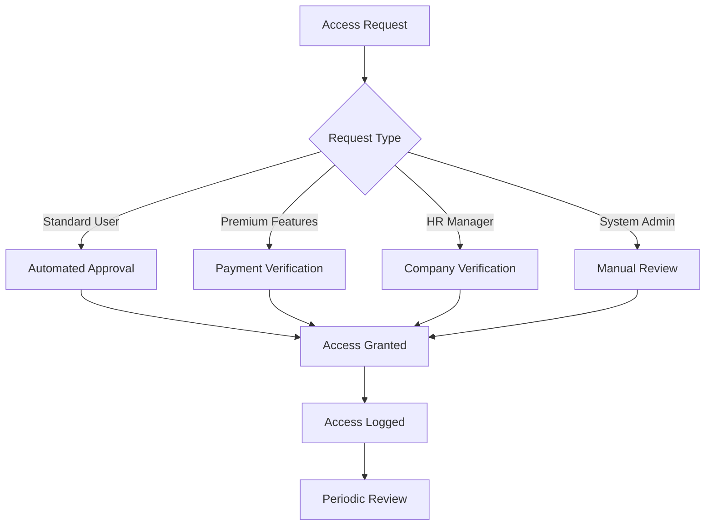

# Security Procedures - CV-Match Platform

**Version:** 1.0
**Effective Date:** October 13, 2025
**Review Date:** October 13, 2026
**Classification:** Confidential

---

## 🎯 Overview

This document outlines comprehensive security procedures for the CV-Match platform, ensuring protection of user data, system integrity, and compliance with Brazilian data protection laws (LGPD).

---

## 🚨 Incident Response Plan

### Incident Classification

#### Critical (P0) - Immediate Response (1 hour)

- Data breach affecting 100+ users
- System-wide unauthorized access
- Ransomware or active exploitation
- LGPD violation requiring ANPD notification

#### High (P1) - Response within 4 hours

- Single user data breach
- Suspicious system activity
- Malware detection
- Security control bypass

#### Medium (P2) - Response within 24 hours

- Failed login attempts spike
- Configuration errors
- Minor policy violations
- Security tool failures

#### Low (P3) - Response within 72 hours

- Documentation updates
- Non-critical vulnerabilities
- Routine security tasks
- Training requirements

### Response Team Roles

#### Incident Commander (IC)

- **Responsibility:** Overall incident coordination
- **Authority:** Decision-making authority
- **Contact:** +55 11 9999-9999

#### Technical Lead (TL)

- **Responsibility:** Technical investigation and containment
- **Skills:** System administration, forensics
- **Contact:** +55 11 8888-8888

#### Communications Lead (CL)

- **Responsibility:** Stakeholder notifications
- **Skills:** Crisis communication, legal coordination
- **Contact:** +55 11 7777-7777

#### Legal Counsel (LC)

- **Responsibility:** LGPD compliance, regulatory notifications
- **Skills:** Brazilian data protection law
- **Contact:** legal@cv-match.com.br

### Response Procedures

#### Phase 1: Detection & Assessment (0-2 hours)

1. **Incident Detection**
   - Automated monitoring alerts
   - User reports
   - Security tool notifications
   - Anomaly detection

2. **Initial Assessment**

   ```bash
   # Immediate containment script
   /opt/security/scripts/contain-incident.sh --incident-id $INCIDENT_ID
   ```

3. **Classification**
   - Assign severity level
   - Determine scope
   - Estimate impact

#### Phase 2: Containment (2-24 hours)

1. **Immediate Actions**
   - Isolate affected systems
   - Disable compromised accounts
   - Preserve evidence
   - Document timeline

2. **Technical Containment**

   ```bash
   # System isolation commands
   iptables -A INPUT -s $SUSPICIOUS_IP -j DROP
   systemctl stop compromised-service
   ```

3. **Data Protection**
   - Backup critical data
   - Secure evidence chain
   - Validate integrity

#### Phase 3: Investigation (24-72 hours)

1. **Forensic Analysis**
   - System logs analysis
   - Network traffic review
   - User activity reconstruction
   - Vulnerability assessment

2. **Impact Assessment**
   - Data types affected
   - Number of users impacted
   - Compliance violations
   - Financial impact

#### Phase 4: Eradication & Recovery (72+ hours)

1. **System Cleanup**
   - Remove malware
   - Patch vulnerabilities
   - Rebuild systems
   - Update configurations

2. **Service Restoration**
   - Gradual service recovery
   - Continuous monitoring
   - Performance validation
   - User communication

#### Phase 5: Post-Incident Activities

1. **Documentation**
   - Detailed incident report
   - Timeline reconstruction
   - Lessons learned
   - Improvement recommendations

2. **LGPD Requirements**
   - ANPD notification (72 hours)
   - User notifications (if required)
   - Data protection impact assessment
   - Documentation retention

### Communication Procedures

#### ANPD Notification Template

```markdown
To: autoridadenacional@pdpt.gov.br
Subject: Notificação de Violação de Dados - CV-Match

Data da violação: [DATE]
Tipo de violação: [TYPE]
Dados afetados: [CATEGORIES]
Número de titulares: [COUNT]
Medidas adotadas: [MEASURES]
Contato: security@cv-match.com.br
```

#### User Notification Template (Portuguese)

```markdown
Assunto: Notificação de Segurança de Dados - CV-Match

Prezado(a) usuário(a),

Em [DATE], identificamos uma violação de segurança que pode ter afetado seus dados.

Dados potencialmente afetados:

- [LIST OF DATA TYPES]

Medidas que tomamos:

- [PROTECTION MEASURES]

Recomendações:

- [USER ACTIONS]

Para mais informações, entre em contato:
Email: dpo@cv-match.com.br
Telefone: 0800-123-4567

Atenciosamente,
Equipe de Segurança CV-Match
```

---

## 🔍 Security Monitoring Procedures

### Real-time Monitoring Setup

#### System Monitoring

```bash
# Security monitoring configuration
# File: /etc/security/monitoring.conf

[LOG_COLLECTION]
auth_logs = /var/log/auth.log
access_logs = /var/log/nginx/access.log
error_logs = /var/log/nginx/error.log
application_logs = /var/log/cv-match/

[ALERT_THRESHOLDS]
failed_login_rate = 10/minute
data_export_rate = 100/hour
api_error_rate = 5%
disk_usage = 85%
memory_usage = 90%

[NOTIFICATION_CHANNELS]
email = security@cv-match.com.br
slack = #security-alerts
sms = +551199998888
```

#### Database Monitoring

```sql
-- Database security monitoring views
CREATE OR REPLACE VIEW security_events AS
SELECT
    event_time,
    user_id,
    action,
    table_name,
    ip_address,
    user_agent
FROM audit_log
WHERE event_time > NOW() - INTERVAL '24 hours'
ORDER BY event_time DESC;

-- Suspicious activity detection
SELECT
    user_id,
    COUNT(*) as access_count,
    MIN(event_time) as first_access,
    MAX(event_time) as last_access
FROM audit_log
WHERE event_time > NOW() - INTERVAL '1 hour'
GROUP BY user_id
HAVING COUNT(*) > 100;
```

### Log Aggregation and Analysis

#### Log Collection Pipeline

```yaml
# File: docker-compose.security.yml
version: "3.8"
services:
  elasticsearch:
    image: docker.elastic.co/elasticsearch/elasticsearch:8.5.0
    environment:
      - discovery.type=single-node
      - "ES_JAVA_OPTS=-Xms1g -Xmx1g"
    volumes:
      - elasticsearch_data:/usr/share/elasticsearch/data

  logstash:
    image: docker.elastic.co/logstash/logstash:8.5.0
    volumes:
      - ./logstash/pipeline:/usr/share/logstash/pipeline
      - ./logstash/config:/usr/share/logstash/config
    depends_on:
      - elasticsearch

  kibana:
    image: docker.elastic.co/kibana/kibana:8.5.0
    environment:
      - ELASTICSEARCH_HOSTS=http://elasticsearch:9200
    ports:
      - "5601:5601"
    depends_on:
      - elasticsearch

volumes:
  elasticsearch_data:
```

#### Security Dashboard Metrics

```javascript
// Kibana Dashboard Configuration
{
  "title": "CV-Match Security Dashboard",
  "panels": [
    {
      "title": "Failed Login Attempts",
      "type": "line",
      "query": "response:403 AND service:auth",
      "interval": "1h"
    },
    {
      "title": "PII Detection Events",
      "type": "bar",
      "query": "event_type:pii_detected",
      "interval": "24h"
    },
    {
      "title": "Data Export Requests",
      "type": "metric",
      "query": "action:data_export"
    },
    {
      "title": "Suspicious IP Addresses",
      "type": "table",
      "query": "alert_level:high AND ip_address:*"
    }
  ]
}
```

### Security Alert Thresholds

#### Critical Alerts

- Multiple failed logins from same IP (> 10/min)
- Data access outside business hours
- PII detection in unexpected fields
- Unauthorized administrative access
- Database connection failures
- SSL certificate expiration

#### Warning Alerts

- Unusual data export patterns
- High API error rates (> 5%)
- Suspicious user agent strings
- Geographic location anomalies
- File upload size anomalies

#### Informational Alerts

- Successful security scans
- User permission changes
- System configuration updates
- Backup completion status

### PII Access Tracking

#### PII Access Logging

```python
# File: backend/app/services/security/pii_access_logger.py

import logging
import json
from datetime import datetime
from typing import Dict, Any, Optional

class PIIAccessLogger:
    """Logs all PII access for LGPD compliance audit trail"""

    def __init__(self):
        self.logger = logging.getLogger('pii_access')

    async def log_access(
        self,
        user_id: str,
        data_type: str,
        action: str,
        ip_address: str,
        user_agent: str,
        justification: Optional[str] = None
    ):
        """Log PII access event"""

        access_event = {
            "timestamp": datetime.utcnow().isoformat(),
            "user_id": user_id,
            "data_type": data_type,
            "action": action,
            "ip_address": ip_address,
            "user_agent": user_agent,
            "justification": justification,
            "compliance_framework": "LGPD"
        }

        # Log to multiple destinations
        await self._log_to_database(access_event)
        await self._log_to_file(access_event)
        await self._send_alert_if_suspicious(access_event)

    async def _log_to_database(self, event: Dict[str, Any]):
        """Store in audit database"""
        try:
            from app.services.supabase.database import SupabaseDatabaseService
            service = SupabaseDatabaseService("pii_access_log", dict)
            await service.create(event)
        except Exception as e:
            self.logger.error(f"Failed to log PII access to database: {e}")

    async def _send_alert_if_suspicious(self, event: Dict[str, Any]):
        """Check for suspicious patterns and send alerts"""
        # Implement suspicious pattern detection
        pass

# Usage example
pii_logger = PIIAccessLogger()
await pii_logger.log_access(
    user_id="user_123",
    data_type="cpf",
    action="read",
    ip_address="192.168.1.100",
    user_agent="Mozilla/5.0...",
    justification="User profile update"
)
```

---

## 🔐 Access Control Policies

### User Access Management

#### Access Levels

1. **Level 1: Basic User**
   - Own resume access
   - Profile management
   - Job application tracking

2. **Level 2: Premium User**
   - Level 1 permissions
   - Advanced analytics
   - Bulk operations
   - Export capabilities

3. **Level 3: HR Manager**
   - Level 2 permissions
   - Team member management
   - Company job postings
   - Candidate management

4. **Level 4: System Administrator**
   - All user permissions
   - System configuration
   - User account management
   - Security tool access

#### Access Request Workflow



### Privileged Access Control

#### Principle of Least Privilege

```yaml
# RBAC Configuration
roles:
  user:
    permissions:
      - read:own:resume
      - write:own:profile
      - read:public:jobs

  premium_user:
    inherits: user
    permissions:
      - export:own:data
      - read:advanced:analytics

  hr_manager:
    inherits: premium_user
    permissions:
      - manage:company:jobs
      - read:team:applications
      - write:team:settings

  admin:
    permissions:
      - manage:all:users
      - read:all:audit_logs
      - configure:system:settings
      - emergency:system:access
```

#### Break-Glass Procedures

```python
# Emergency access procedures
class EmergencyAccess:
    """Controlled emergency access for critical situations"""

    async def request_emergency_access(
        self,
        requester_id: str,
        reason: str,
        duration_hours: int = 2,
        requires_approval: bool = True
    ):
        """Request emergency system access"""

        emergency_request = {
            "requester_id": requester_id,
            "reason": reason,
            "duration_hours": duration_hours,
            "requires_approval": requires_approval,
            "timestamp": datetime.utcnow(),
            "status": "pending"
        }

        if requires_approval:
            # Send to security team for approval
            await self._notify_security_team(emergency_request)
        else:
            # Auto-approve for critical situations
            await self._grant_emergency_access(emergency_request)

        return emergency_request

    async def _grant_emergency_access(self, request: Dict):
        """Grant temporary elevated privileges"""

        # Create temporary role
        temp_role = f"emergency_{request['requester_id']}_{int(time.time())}"

        # Grant elevated permissions
        await self._create_temporary_role(temp_role, request['duration_hours'])

        # Log all emergency access
        await self._log_emergency_access(request, temp_role)

        # Schedule automatic revocation
        await self._schedule_revocation(temp_role, request['duration_hours'])
```

### Database Access Permissions

#### Database Role Hierarchy

```sql
-- Database roles for access control

-- Read-only role for applications
CREATE ROLE app_readonly;
GRANT SELECT ON ALL TABLES IN SCHEMA public TO app_readonly;

-- Write role for application services
CREATE ROLE app_writer;
GRANT SELECT, INSERT, UPDATE ON ALL TABLES IN SCHEMA public TO app_writer;

-- Admin role for database maintenance
CREATE ROLE db_admin;
GRANT ALL PRIVILEGES ON ALL TABLES IN SCHEMA public TO db_admin;
GRANT ALL PRIVILEGES ON ALL SEQUENCES IN SCHEMA public TO db_admin;

-- Security audit role
CREATE ROLE security_auditor;
GRANT SELECT ON audit_log TO security_auditor;
GRANT SELECT ON pii_access_log TO security_auditor;
```

#### Connection Security

```bash
# Database connection security
# File: /etc/postgresql/14/main/pg_hba.conf

# Require SSL for all connections
hostssl all all 0.0.0.0/0 md5

# Local connections with peer authentication
local all all peer

# Application service connections
host cv_match_app app_writer 10.0.0.0/8 md5
host cv_match_readonly app_readonly 10.0.0.0/8 md5

# Admin connections from office IP
host all db_admin 192.168.1.0/24 md5

# Security audit connections
host cv_match_audit security_auditor 192.168.1.100/32 md5
```

### Third-Party Service Access

#### API Access Control

```python
# Third-party service access management
class ThirdPartyAccessManager:
    """Manage access to external services"""

    def __init__(self):
        self.service_configs = {
            "openai": {
                "api_key_encrypted": True,
                "rate_limit": 1000,  # requests/hour
                "data_retention": 30,  # days
                "data_types_allowed": ["resume_text", "job_description"],
                "compliance_check": True
            },
            "anthropic": {
                "api_key_encrypted": True,
                "rate_limit": 500,
                "data_retention": 0,  # immediate deletion
                "data_types_allowed": ["resume_text"],
                "compliance_check": True
            }
        }

    async def validate_service_access(
        self,
        service_name: str,
        data_type: str,
        user_consent: bool
    ) -> bool:
        """Validate if third-party service access is permitted"""

        config = self.service_configs.get(service_name)
        if not config:
            raise ValueError(f"Unknown service: {service_name}")

        # Check data type permission
        if data_type not in config["data_types_allowed"]:
            return False

        # Check user consent
        if not user_consent:
            return False

        # Check rate limits
        if await self._check_rate_limit(service_name):
            return False

        # Log access for compliance
        await self._log_third_party_access(service_name, data_type)

        return True
```

---

## 📊 Data Protection Procedures

### Encryption Standards

#### Data at Rest Encryption

```bash
# Disk encryption setup
# File: /etc/crypttab

# System disk encryption
sda1_crypt /dev/sda1 none luks,discard

# Database volume encryption
db_volume_crypt /dev/mapper/vg0-db_volume none luks

# Backup volume encryption
backup_crypt /dev/mapper/vg0-backup_volume none luks

# Encryption key management
dd if=/dev/urandom of=/root/db_encryption.key bs=32 count=1
chmod 400 /root/db_encryption.key
```

#### Data in Transit Encryption

```yaml
# SSL/TLS Configuration
# File: nginx/ssl.conf

server {
    listen 443 ssl http2;
    server_name cv-match.com.br;

    # SSL Configuration
    ssl_certificate /etc/ssl/certs/cv-match.com.br.crt;
    ssl_certificate_key /etc/ssl/private/cv-match.com.br.key;
    ssl_protocols TLSv1.2 TLSv1.3;
    ssl_ciphers ECDHE-RSA-AES256-GCM-SHA512:DHE-RSA-AES256-GCM-SHA512;
    ssl_prefer_server_ciphers off;

    # HSTS
    add_header Strict-Transport-Security "max-age=63072000; includeSubDomains; preload";

    # Security Headers
    add_header X-Content-Type-Options nosniff;
    add_header X-Frame-Options DENY;
    add_header X-XSS-Protection "1; mode=block";
    add_header Content-Security-Policy "default-src 'self'";
}

# Database SSL Configuration
# File: postgresql.conf

ssl = on
ssl_cert_file = '/etc/ssl/certs/server.crt'
ssl_key_file = '/etc/ssl/private/server.key'
ssl_ca_file = '/etc/ssl/certs/ca.crt'
```

#### Application-Level Encryption

```python
# Application encryption utilities
# File: backend/app/services/security/encryption_service.py

from cryptography.fernet import Fernet
from cryptography.hazmat.primitives import hashes
from cryptography.hazmat.primitives.kdf.pbkdf2 import PBKDF2HMAC
import base64
import os

class EncryptionService:
    """Handles application-level encryption for sensitive data"""

    def __init__(self):
        self.key = self._get_or_create_encryption_key()
        self.cipher_suite = Fernet(self.key)

    def _get_or_create_encryption_key(self) -> bytes:
        """Get or create encryption key from secure storage"""
        key_path = os.getenv("ENCRYPTION_KEY_PATH", "/secure/encryption.key")

        if os.path.exists(key_path):
            with open(key_path, 'rb') as f:
                return f.read()
        else:
            key = Fernet.generate_key()
            with open(key_path, 'wb') as f:
                f.write(key)
            os.chmod(key_path, 0o400)  # Read-only for owner
            return key

    def encrypt_pii(self, data: str) -> str:
        """Encrypt PII data"""
        if not data:
            return data

        encrypted_data = self.cipher_suite.encrypt(data.encode())
        return base64.b64encode(encrypted_data).decode()

    def decrypt_pii(self, encrypted_data: str) -> str:
        """Decrypt PII data"""
        if not encrypted_data:
            return encrypted_data

        try:
            decoded_data = base64.b64decode(encrypted_data.encode())
            decrypted_data = self.cipher_suite.decrypt(decoded_data)
            return decrypted_data.decode()
        except Exception as e:
            raise ValueError(f"Failed to decrypt data: {e}")
```

### Backup and Recovery Procedures

#### Backup Strategy

```bash
#!/bin/bash
# File: /opt/scripts/backup_system.sh

set -euo pipefail

# Configuration
BACKUP_DIR="/backups"
RETENTION_DAYS=30
S3_BUCKET="cv-match-backups-prod"
ENCRYPTION_KEY="/secure/backup_encryption.key"

# Create backup directory with date
BACKUP_DATE=$(date +%Y%m%d_%H%M%S)
BACKUP_PATH="$BACKUP_DIR/cv-match-backup-$BACKUP_DATE"
mkdir -p "$BACKUP_PATH"

echo "Starting backup: $BACKUP_DATE"

# 1. Database backup
echo "Backing up database..."
pg_dump -h localhost -U cv_match_user -d cv_match_db | \
    gzip | \
    openssl enc -aes-256-cbc -salt -pass file:$ENCRYPTION_KEY \
    > "$BACKUP_PATH/database.sql.gz.enc"

# 2. Application files backup
echo "Backing up application files..."
tar -czf - /opt/cv-match/app | \
    openssl enc -aes-256-cbc -salt -pass file:$ENCRYPTION_KEY \
    > "$BACKUP_PATH/application.tar.gz.enc"

# 3. Configuration files backup
echo "Backing up configuration..."
tar -czf - /etc/cv-match /opt/cv-match/config | \
    openssl enc -aes-256-cbc -salt -pass file:$ENCRYPTION_KEY \
    > "$BACKUP_PATH/config.tar.gz.enc"

# 4. Upload to cloud storage
echo "Uploading to cloud storage..."
aws s3 cp "$BACKUP_PATH" "s3://$S3_BUCKET/$BACKUP_DATE/" --recursive

# 5. Verify backup integrity
echo "Verifying backup integrity..."
for file in "$BACKUP_PATH"/*.enc; do
    if openssl enc -aes-256-cbc -d -pass file:$ENCRYPTION_KEY -in "$file" > /dev/null; then
        echo "✓ $file: Integrity verified"
    else
        echo "✗ $file: Integrity check failed"
        exit 1
    fi
done

# 6. Cleanup old backups
echo "Cleaning up old local backups..."
find "$BACKUP_DIR" -type d -name "cv-match-backup-*" -mtime +$RETENTION_DAYS -exec rm -rf {} \;

echo "Backup completed successfully: $BACKUP_PATH"

# 7. Send notification
curl -X POST -H 'Content-type: application/json' \
    --data '{"text":"✅ CV-Match backup completed successfully: '$BACKUP_DATE'"}' \
    "$SLACK_WEBHOOK_URL"
```

#### Recovery Procedures

```bash
#!/bin/bash
# File: /opt/scripts/recover_system.sh

set -euo pipefail

if [ $# -ne 1 ]; then
    echo "Usage: $0 <backup_date>"
    echo "Example: $0 20251013_120000"
    exit 1
fi

BACKUP_DATE=$1
BACKUP_DIR="/backups/cv-match-backup-$BACKUP_DATE"
S3_BUCKET="cv-match-backups-prod"
ENCRYPTION_KEY="/secure/backup_encryption.key"

echo "Starting recovery from backup: $BACKUP_DATE"

# 1. Download backup from cloud
echo "Downloading backup from cloud storage..."
aws s3 cp "s3://$S3_BUCKET/$BACKUP_DATE/" "/tmp/" --recursive

# 2. Verify backup integrity
echo "Verifying backup integrity..."
for file in "/tmp/cv-match-backup-$BACKUP_DATE"/*.enc; do
    if ! openssl enc -aes-256-cbc -d -pass file:$ENCRYPTION_KEY -in "$file" > /dev/null; then
        echo "✗ $file: Integrity check failed"
        exit 1
    fi
done

# 3. Stop services
echo "Stopping services..."
systemctl stop cv-match-app
systemctl stop nginx

# 4. Restore database
echo "Restoring database..."
openssl enc -aes-256-cbc -d -pass file:$ENCRYPTION_KEY \
    -in "/tmp/cv-match-backup-$BACKUP_DATE/database.sql.gz.enc" | \
    gunzip | \
    psql -h localhost -U cv_match_user -d cv_match_db

# 5. Restore application files
echo "Restoring application files..."
openssl enc -aes-256-cbc -d -pass file:$ENCRYPTION_KEY \
    -in "/tmp/cv-match-backup-$BACKUP_DATE/application.tar.gz.enc" | \
    tar -xzf - -C /

# 6. Restore configuration
echo "Restoring configuration..."
openssl enc -aes-256-cbc -d -pass file:$ENCRYPTION_KEY \
    -in "/tmp/cv-match-backup-$BACKUP_DATE/config.tar.gz.enc" | \
    tar -xzf - -C /

# 7. Start services
echo "Starting services..."
systemctl start nginx
systemctl start cv-match-app

# 8. Verify system health
echo "Verifying system health..."
sleep 30

if curl -f http://localhost:8000/health; then
    echo "✅ System recovery completed successfully"
else
    echo "❌ System health check failed"
    exit 1
fi

# 9. Cleanup temporary files
echo "Cleaning up temporary files..."
rm -rf "/tmp/cv-match-backup-$BACKUP_DATE"

echo "Recovery completed from backup: $BACKUP_DATE"
```

### Data Retention Policies

#### LGPD-Compliant Data Retention

```sql
-- Data retention policy implementation
-- File: backend/supabase/migrations/20251013000002_data_retention_policies.sql

-- Create data retention policies table
CREATE TABLE IF NOT EXISTS data_retention_policies (
    id UUID PRIMARY KEY DEFAULT gen_random_uuid(),
    table_name TEXT NOT NULL,
    retention_period_months INTEGER NOT NULL,
    legal_basis TEXT NOT NULL,
    created_at TIMESTAMPTZ NOT NULL DEFAULT now(),
    updated_at TIMESTAMPTZ NOT NULL DEFAULT now()
);

-- Insert LGPD-compliant retention policies
INSERT INTO data_retention_policies (table_name, retention_period_months, legal_basis) VALUES
('resumes', 60, 'legitimate_interest - career matching services'),
('job_applications', 24, 'contract - recruitment process'),
('user_profiles', 60, 'consent - service provision'),
('audit_logs', 72, 'legal_requirement - compliance'),
('pii_detection_log', 72, 'legal_requirement - LGPD compliance'),
('analytics_data', 12, 'legitimate_interest - service improvement'),
('support_tickets', 24, 'contract - support services');

-- Create automated data cleanup function
CREATE OR REPLACE FUNCTION cleanup_expired_data()
RETURNS void AS $$
DECLARE
    policy_record RECORD;
    cleanup_query TEXT;
BEGIN
    -- Process each retention policy
    FOR policy_record IN SELECT * FROM data_retention_policies LOOP
        -- Build dynamic cleanup query
        cleanup_query := format(
            'DELETE FROM %I WHERE created_at < now() - interval ''%s months''',
            policy_record.table_name,
            policy_record.retention_period_months
        );

        -- Execute cleanup with logging
        BEGIN
            EXECUTE cleanup_query;
            RAISE NOTICE 'Cleaned up expired data from table: %', policy_record.table_name;
        EXCEPTION WHEN OTHERS THEN
            RAISE WARNING 'Failed to cleanup table %: %', policy_record.table_name, SQLERRM;
        END;
    END LOOP;
END;
$$ LANGUAGE plpgsql SECURITY DEFINER;

-- Create schedule for automated cleanup (requires pg_cron extension)
SELECT cron.schedule(
    'data-cleanup-monthly',
    '0 2 1 * *',  -- Run at 2 AM on first day of month
    'SELECT cleanup_expired_data();'
);
```

#### User Data Deletion Procedures

```python
# User data deletion service
# File: backend/app/services/security/data_deletion_service.py

import logging
from datetime import datetime, timedelta
from typing import Dict, List

class DataDeletionService:
    """Handles user data deletion requests per LGPD Article 12"""

    def __init__(self):
        self.logger = logging.getLogger(__name__)
        self.deletion_policies = self._load_deletion_policies()

    def _load_deletion_policies(self) -> Dict[str, int]:
        """Load data retention periods"""
        return {
            'resumes': 60,  # days
            'job_applications': 24,
            'user_profiles': 60,
            'analytics_data': 12,
            'support_tickets': 24
        }

    async def request_user_data_deletion(
        self,
        user_id: str,
        deletion_reason: str,
        legal_basis: str = "user_request_art_12"
    ) -> Dict:
        """Process user data deletion request"""

        # Create deletion request record
        deletion_request = {
            "user_id": user_id,
            "deletion_reason": deletion_reason,
            "legal_basis": legal_basis,
            "status": "pending",
            "requested_at": datetime.utcnow(),
            "completed_at": None
        }

        # Log deletion request for compliance
        await self._log_deletion_request(deletion_request)

        # Start deletion process
        deletion_result = await self._execute_user_data_deletion(user_id)

        # Update request status
        deletion_request.update({
            "status": "completed",
            "completed_at": datetime.utcnow(),
            "result": deletion_result
        })

        # Send confirmation to user
        await self._send_deletion_confirmation(user_id, deletion_result)

        return deletion_request

    async def _execute_user_data_deletion(self, user_id: str) -> Dict:
        """Execute actual data deletion"""

        deletion_results = {
            "deleted_records": 0,
            "tables_processed": [],
            "errors": []
        }

        # Define tables to process
        tables_to_delete = [
            'resumes',
            'job_applications',
            'user_profiles',
            'analytics_events',
            'support_tickets',
            'user_consent_records'
        ]

        # Process each table
        for table in tables_to_delete:
            try:
                # Check retention policy
                retention_days = self.deletion_policies.get(table, 30)
                cutoff_date = datetime.utcnow() - timedelta(days=retention_days)

                # Count records to be deleted
                count_query = f"""
                    SELECT COUNT(*) as count
                    FROM {table}
                    WHERE user_id = $1 AND created_at < $2
                """

                # Perform soft delete where applicable
                if table in ['resumes', 'job_applications']:
                    # Soft delete for business records
                    update_query = f"""
                        UPDATE {table}
                        SET deleted_at = now(),
                            deletion_reason = 'lgpd_art_12',
                            deleted_by = user_id
                        WHERE user_id = $1 AND created_at < $2
                    """
                else:
                    # Hard delete for non-critical data
                    update_query = f"""
                        DELETE FROM {table}
                        WHERE user_id = $1 AND created_at < $2
                    """

                # Execute deletion
                deleted_count = await self._execute_deletion_query(
                    update_query, user_id, cutoff_date
                )

                deletion_results["deleted_records"] += deleted_count
                deletion_results["tables_processed"].append({
                    "table": table,
                    "records_deleted": deleted_count
                })

                self.logger.info(
                    f"Deleted {deleted_count} records from {table} for user {user_id}"
                )

            except Exception as e:
                error_msg = f"Failed to delete from {table}: {str(e)}"
                deletion_results["errors"].append(error_msg)
                self.logger.error(error_msg)

        return deletion_results

    async def _send_deletion_confirmation(self, user_id: str, result: Dict):
        """Send deletion confirmation to user"""

        confirmation_message = f"""
        Prezado(a) usuário(a),

        Seu pedido de exclusão de dados foi processado conforme o Artigo 12 da LGPD.

        Resumo da exclusão:
        - Registros excluídos: {result['deleted_records']}
        - Tabelas processadas: {len(result['tables_processed'])}
        - Data da conclusão: {datetime.now().strftime('%d/%m/%Y %H:%M:%S')}

        De acordo com a LGPD, alguns dados podem ser retidos por períodos
        obrigatórios por lei, mas não serão mais utilizados para fins comerciais.

        Para dúvidas, entre em contato com nosso Encarregado de Proteção de Dados:
        Email: dpo@cv-match.com.br
        Telefone: 0800-123-4567

        Atenciosamente,
        Equipe de Proteção de Dados CV-Match
        """

        # Send email notification
        await self._send_email_notification(user_id, "Confirmação de Exclusão de Dados", confirmation_message)
```

---

## 📋 Documentation Maintenance

### Review Schedule

#### Monthly Reviews

- Security incident log review
- Access control audit
- Monitoring effectiveness assessment
- Compliance status check

#### Quarterly Reviews

- Complete security procedure review
- Risk assessment update
- Training material updates
- Third-party service assessment

#### Annual Reviews

- Full security audit
- LGPD compliance review
- Documentation overhaul
- Incident response drill

### Version Control

All security documentation must follow version control procedures:

1. **Document Versioning**
   - Major version changes: Structural or policy changes
   - Minor version changes: Content updates or additions
   - Patch version changes: Typo corrections or formatting

2. **Change Management**
   - All changes require approval from Security Lead
   - Change logs must document what was changed and why
   - Previous versions retained for audit purposes

3. **Distribution Control**
   - Current versions available on internal documentation portal
   - Sensitive documents require authentication
   - Archive versions maintained for compliance

---

## 📞 Emergency Contacts

### Security Team

- **Security Lead:** security@cv-match.com.br | +55 11 9999-9999
- **Incident Response Team:** irt@cv-match.com.br | +55 11 8888-8888
- **DPO (Encarregado de Dados):** dpo@cv-match.com.br | 0800-123-4567

### Legal Contacts

- **Legal Counsel:** legal@cv-match.com.br
- **LGPD Compliance Officer:** lgpd@cv-match.com.br

### Regulatory Authorities

- **ANPD (Autoridade Nacional de Proteção de Dados):** autoridadenacional@pdpt.gov.br
- **Ministério da Justiça:** https://www.gov.br/mj

### External Security Services

- **Security Auditor:** auditor@security-firm.com.br
- **Forensics Expert:** forensics@cybersec.com.br
- **Legal Counsel:** counsel@law-firm.com.br

---

**Document Classification:** Confidential
**Distribution:** Security Team, Management, Legal Counsel
**Review Required:** Annually or after security incidents
**Approved by:** Security Committee

_This document is part of CV-Match's comprehensive security compliance program and must be reviewed and updated regularly to ensure continued effectiveness and legal compliance._
